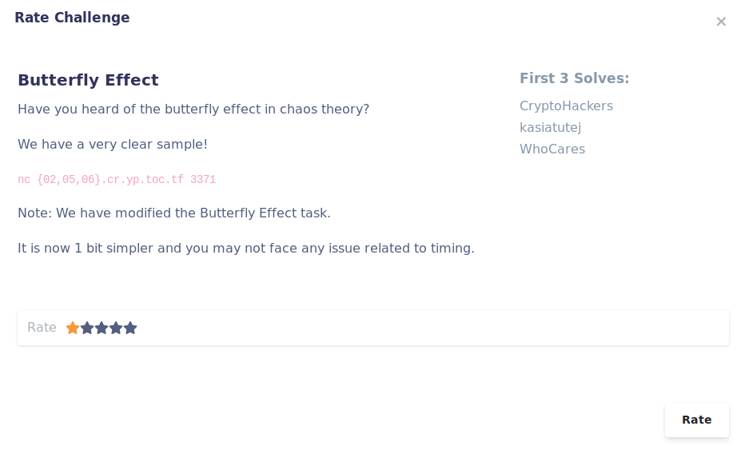
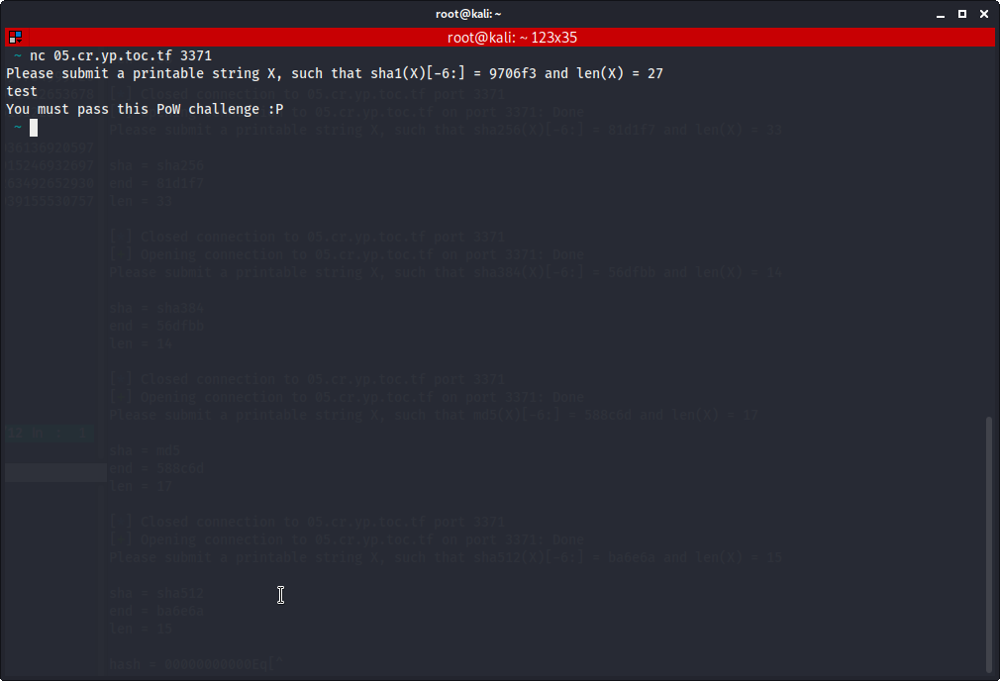
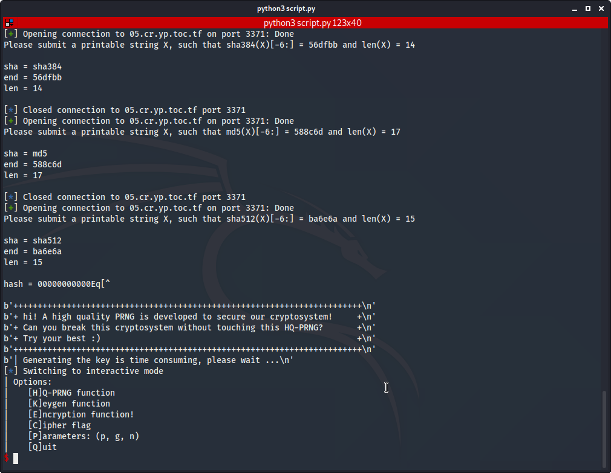
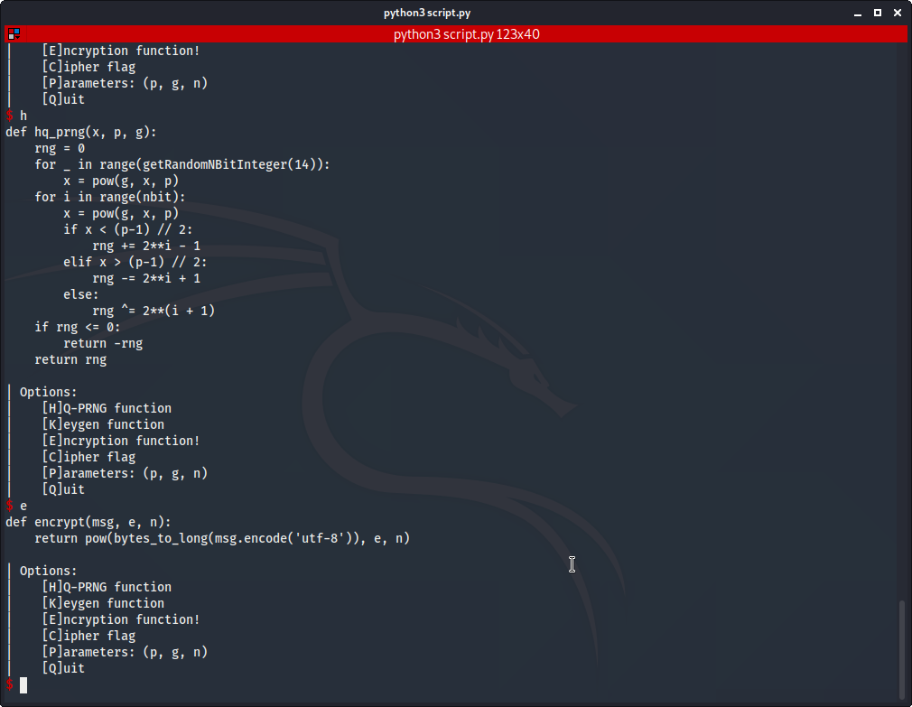
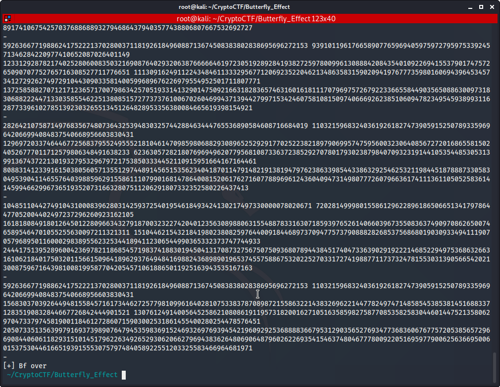

**Butterfly Effect**

Author: Ewaël



Let's `nc 05.cr.yp.toc.tf 3371`:



The asked hash and length are random. Let's automate the process with a dirty script:

```python
#!/usr/bin/env python3

from pwn import *
import string
import hashlib

host = "05.cr.yp.toc.tf"
port = 3371

def puzzle(cry, end, l):
    fun = print
    if cry == 'sha256':
        fun = hashlib.sha256
    elif cry == 'sha1':
        fun = hashlib.sha1
    elif cry == 'md5':
        fun = hashlib.md5
    elif cry == 'sha512':
        fun = hashlib.sha512
    elif cry == 'sha384':
        fun = hashlib.sha384
    elif cry == 'sha224':
        fun = hashlib.sha224
    else:
        print("Impossible case")
        return "dslMeansSorry"

    if l == 10:
        for i in string.printable:
            for j in string.printable:
                for k in string.printable:
                    for l in string.printable:
                        for a in string.printable:
                            for b in string.printable:
                                for c in string.printable:
                                    for d in string.printable:
                                        for e in string.printable:
                                            for h in string.printable:
                                                ch = i+j+k+l+a+b+c+d+e+h
                                                if fun(ch.encode('utf-8')).hexdigest()[-6:] == end:
                                                    return ch

    elif l == 15:
        for i in string.printable:
            for j in string.printable:
                for k in string.printable:
                    for l in string.printable:
                        for a in string.printable:
                            for b in string.printable:
                                for c in string.printable:
                                    for d in string.printable:
                                        for e in string.printable:
                                            for h in string.printable:
                                                for o in string.printable:
                                                    for m in string.printable:
                                                        for p in string.printable:
                                                            for z in string.printable:
                                                                for r in string.printable:
                                                                    ch = i+j+k+l+a+b+c+d+e+h+o+m+p+z+r
                                                                    if fun(ch.encode('utf-8')).hexdigest()[-6:] == end:
                                                                        return ch

l = 0
while l != 10 and l != 15:
    r = remote(host, port)
    line = r.recvuntil("\n").decode()
    print(line)
    offset = line.find('(')
    cry = line[46:offset]
    end = line[offset+11:offset+17]
    l = int(line[-3:-1])
    print("sha = {}\nend = {}\nlen = {}\n".format(cry, end, l))
    if l != 10 and l != 15:
        r.close()

h = puzzle(cry, end, l)
print("hash = {}\n".format(h))
r.sendline(h)
print(r.recvuntil('\n'))
print(r.recvuntil('\n'))
print(r.recvuntil('\n'))
print(r.recvuntil('\n'))
print(r.recvuntil('\n'))
print(r.recvuntil('\n'))
r.interactive()
```

I just connect to the service until the asked length is 10 or 15 because I was too bored to handle all the cases considering that this is not the challenge itself, then I bruteforce a correct string.



I finally reach a menu where I can see the functions that were used to generate the encrypted flag:

```python
encrypt(flag, e, n) = 200223285109652020165546770365814034187841527478683546166727009282455088390942896977349997209468575783850390427387059172789143734529286290476716622660404272472872333720431213356961748869487809614326536783488878762743882468995004292785418471373100709375827529858596608268324440927577879001009696668085935161223

n = 205073351356399791693739890764794535983691524693269769394542196092925368888366795312903565276934773683606767757205385657296690844060611829315101451796226349265293062066279694383626480690648796026226935415463748046777800922051695977900625636695006015375304461665193915553075797484058922551203325583466964681971
p = 61483164831860035611846458714537337654584085300116025823041281871467564805491
g = 45618612503613692059726072494986148855689165381102680970120801089756210634857
```



Considering that `n` was generated with a lot of restrictions, I can now write my script that will bruteforce the factors of `n`. To do so, I generate keys until I find one that equals `n` and I try decrypting the flag with the private key built with the found factors.

```python
#!/usr/bin/env python3

import gmpy2
from Crypto.Util.number import *

def hq_prng(x, p, g):
    rng = 0
    for _ in range(getRandomNBitInteger(14)):
        x = pow(g, x, p)
    for i in range(nbit):
        x = pow(g, x, p)
        if x < (p-1) // 2:
            rng += 2**i - 1
        elif x > (p-1) // 2:
            rng -= 2**i + 1
        else:
            rng ^= 2**(i + 1)
    if rng <= 0:
        return -rng
    return rng

def keygen(p, g):
    r, s = hq_prng(getRandomNBitInteger(nbit), p, g), hq_prng(getRandomNBitInteger(nbit), p, g)
    print(r, s)
    u, v = gmpy2.next_prime(r**2 + s**2), gmpy2.next_prime(2*r*s)
    print(u, v)
    e, n = 0x10001, u * v
    return e, n

def encrypt(msg, e, n):
    return pow(bytes_to_long(msg.encode('utf-8')), e, n)

#encrypt(flag, e, n) = 200223285109652020165546770365814034187841527478683546166727009282455088390942896977349997209468575783850390427387059172789143734529286290476716622660404272472872333720431213356961748869487809614326536783488878762743882468995004292785418471373100709375827529858596608268324440927577879001009696668085935161223

nbit = 256
n = 205073351356399791693739890764794535983691524693269769394542196092925368888366795312903565276934773683606767757205385657296690844060611829315101451796226349265293062066279694383626480690648796026226935415463748046777800922051695977900625636695006015375304461665193915553075797484058922551203325583466964681971
e = 65537
p = 61483164831860035611846458714537337654584085300116025823041281871467564805491
g = 45618612503613692059726072494986148855689165381102680970120801089756210634857

nt = 0
while nt != n:
    et, nt = keygen(p, g)
    nt = int(nt)
    print(nt)
    print('-')

print("[+] Bf over")
```



Let's try with

```python
p = 13076124914005645258621080861911957318200162710516358598275877085358258304460144752135806297047337974581900118461272860715903002531861455400280254478576451
q = 15683037039264494815584571617344627257798109961640281075338378708987215586322143832696221447782497471485854538538145168833712835190832844667726842444901521
```

`CCTF{r341Ly_v3ryYyyyYY_s3cUrE___PRNG___}`
