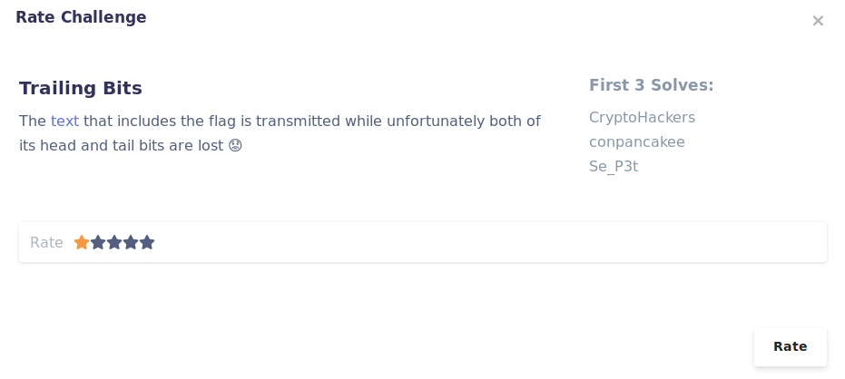
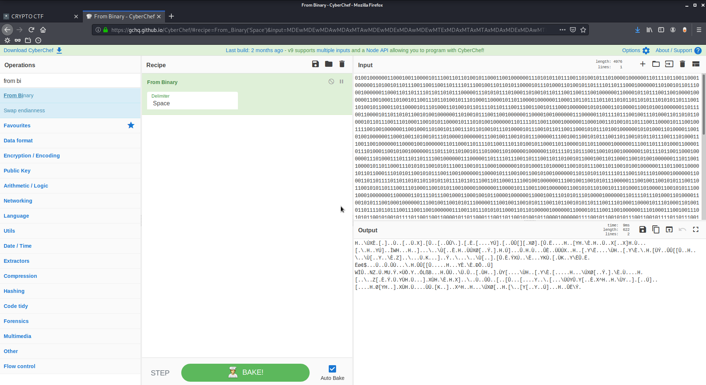
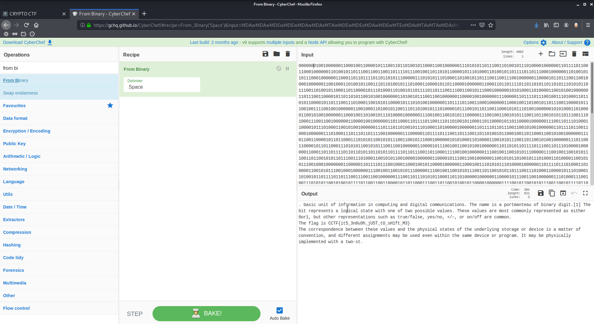

**Trailing Bits**

Author: Ewaël

Apparently some bits are missing at the beginning and / or at the end of the message. Let's use [CyberChef](https://gchq.github.io/CyberChef).

I see that nothing changes if I add bits at the end but it does change if I add some at the beginning. Let's add `0` until I see something...

Here is the flag:

`CCTF{it5_3n0u9h_jU5T_tO_sH1ft_M3}`
