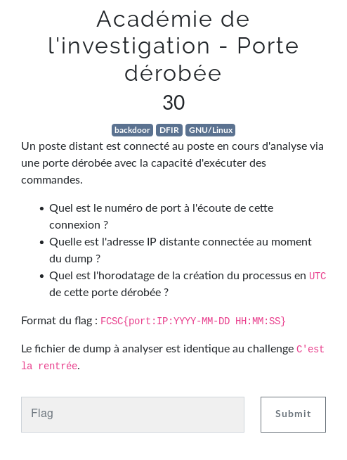
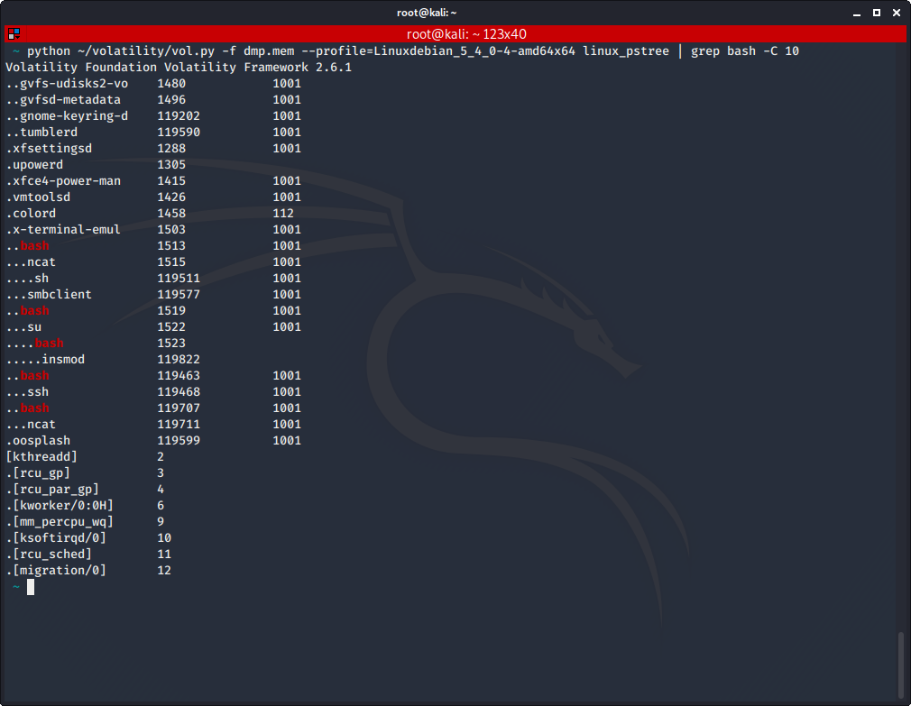
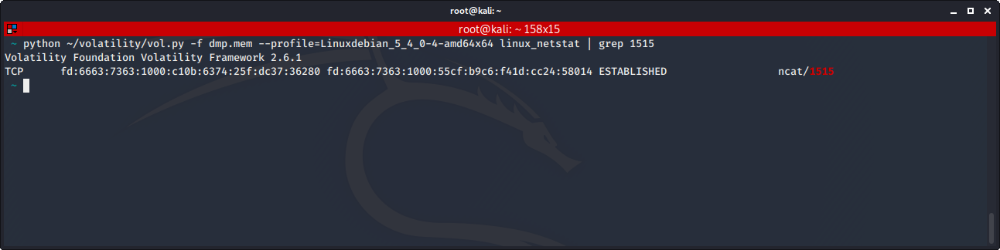
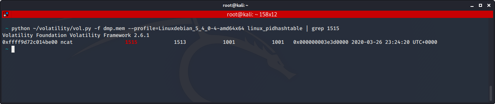

# Académie de l'investigation - Porte dérobée

Auteur: Ewaël

**Académie de l'investigation - Porte dérobée** est un des challenges forensics du FCSC 2020. Il valait 30 points à la fin du FCSC.



Je tourne d'abord un peu en rond avant de réaliser que la première chose qu'un attaquant utilise est simplement `bash`, afin d'intéragir avec son host. J'utlilise donc

```
python ~/volatility/vol.py -f dmp.mem --profile=Linuxdebian_5_4_0-4-amd64x64 linux_pstree | grep bash -C 10
```



Je trouve `ncat` au PID 1515 qui parait plus qu'intéressant, surtout qu'il appelle lui-même sh, dans le contexte d'une backdoor. Je regarde s'il a un lien avec une potentielle connection avec `netstat`:

```
python ~/volatility/vol.py -f dmp.mem --profile=Linuxdebian_5_4_0-4-amd64x64 linux_netstat | grep 1515
```



J'obtiens alors le port et l'IP demandés, il ne me reste plus qu'à trouver la date de création, ce qui se fait facilement comme j'ai le PID du process:

```
python ~/volatility/vol.py -f dmp.mem --profile=Linuxdebian_5_4_0-4-amd64x64 linux_pidhashtable | grep 1515
```



Ainsi je peux construire mon flag:

`FCSC{36280:fd:6663:7363:1000:55cf:b9c6:f41d:cc24:2020-03-26 23:24:20}`
