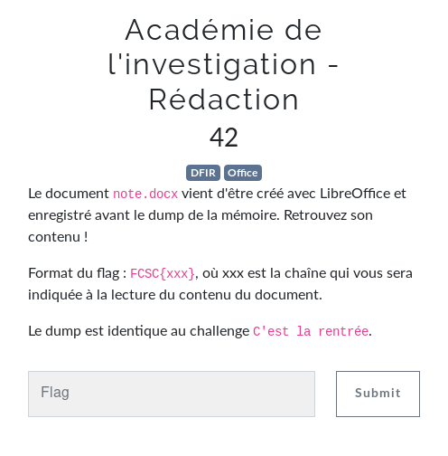
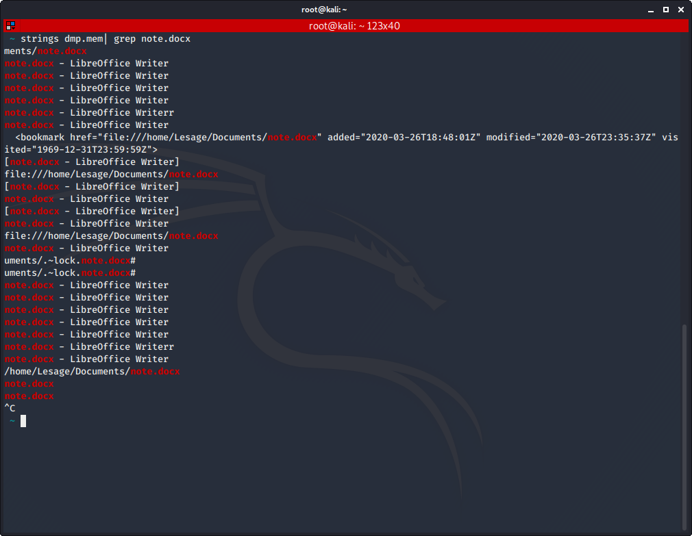
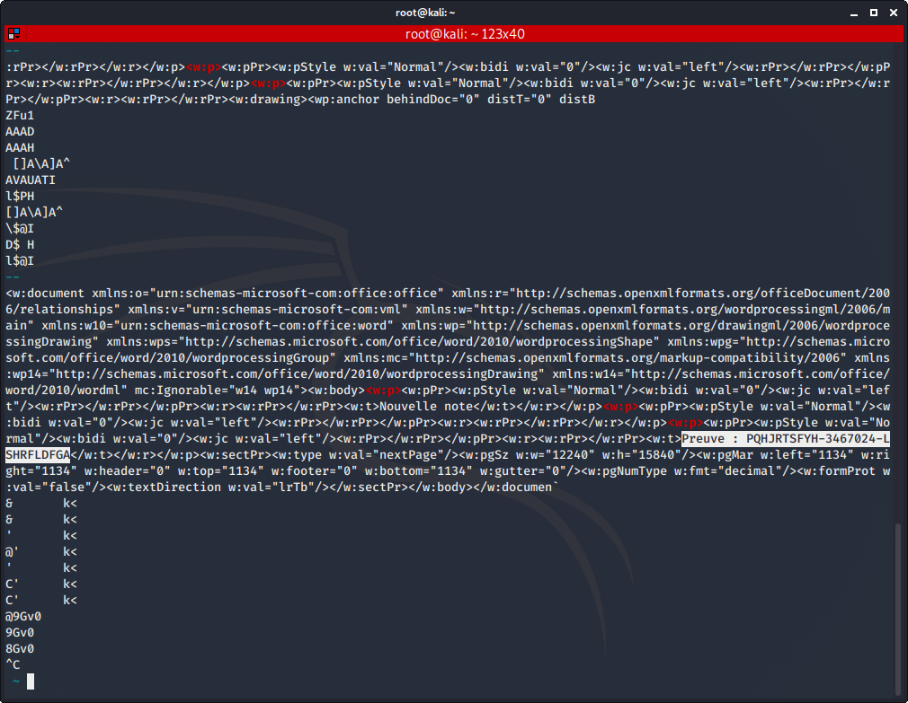

# Académie de l'investigation - Rédaction

Auteur: Ewaël

**Académie de l'investigation - Rédaction** est un des challenges forensics du FCSC 2020. Il valait 42 points à la fin du CTF.



Le but est de retrouver le document `note.docx`. Je commence déjà par regarder s'il existe dans le dump: `strings dmp.mem | grep note.docx` et je récupère son path: `/home/Lesage/Documents/note.docx`. 



Pour récupérer son adresse et pouvoir l'extraire, j'utilise `linux_find_file -L`, qui a le même output que `linux_enumerate_file` au passage, et... Mauvaise surprise, il ne s'y trouve pas.

Je décide alors de me renseigner sur des possibles backups ou saves automatiques générées par Libreoffice Writer que je puisse récupérer, mais je ne trouve rien. Je décide donc revenir sur mes résultats du `strings dmp.mem | grep note.docx` et une ligne capte mon attention:

```html
<bookmark href="file:///home/Lesage/Documents/note.docx" added="2020-03-26T18:48:01Z" modified="2020-03-26T23:35:37Z" visited="1969-12-31T23:59:59Z">
```

Je comprends qu'il existe des informations sur le document que je cherche directement dans le dump. En fouillant sur le format *.docx* je tombe sur ce lien:

[https://wiki.fileformat.com/word-processing/docx](https://wiki.fileformat.com/word-processing/docx)

J'essaie donc de grep des termes spécifiques comme `Relationship` ou `</document>`, et je finis par obtenir ce que je cherche avec `strings dmp.mem | grep '<w:p>' -A 10`:



La preuve est le flag:

`FCSC{PQHJRTSFYH-3467024-LSHRFLDFGA}`
