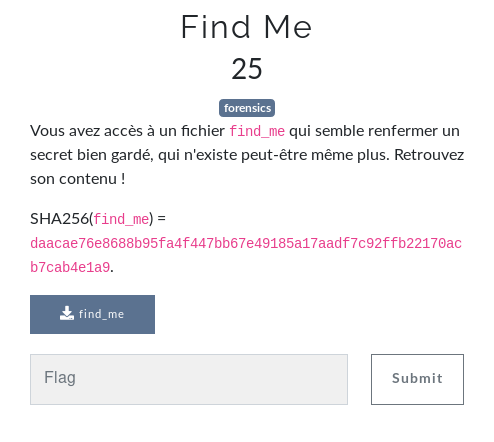
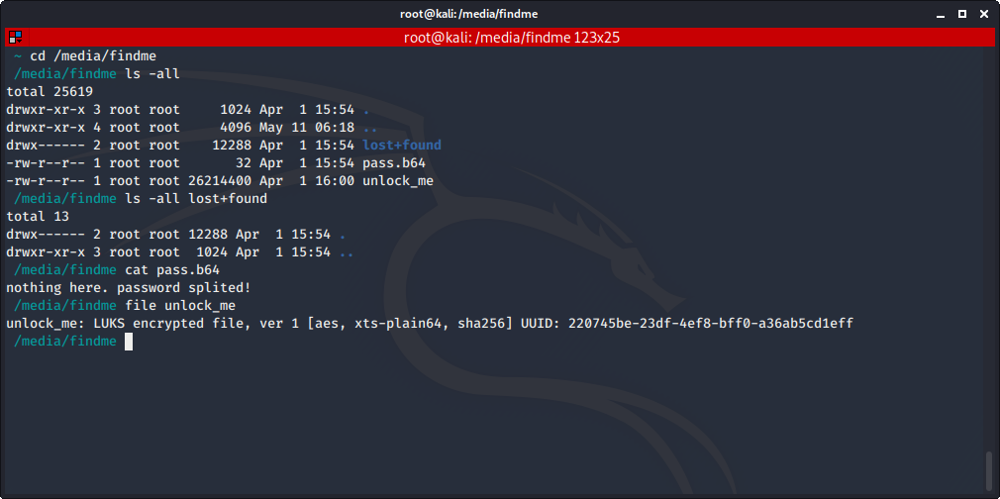
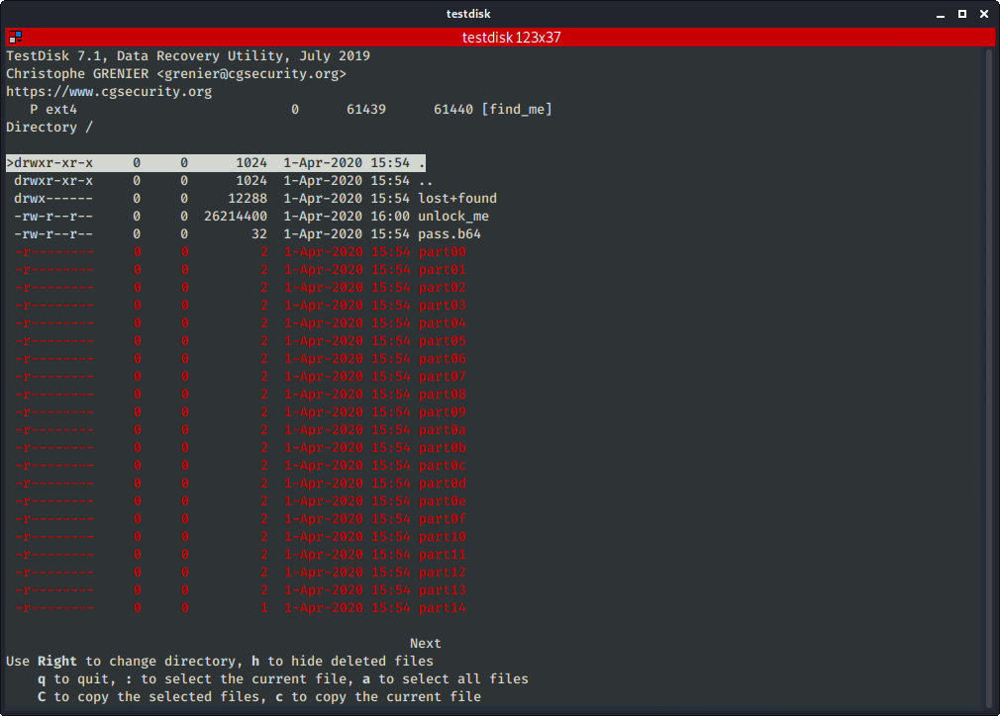
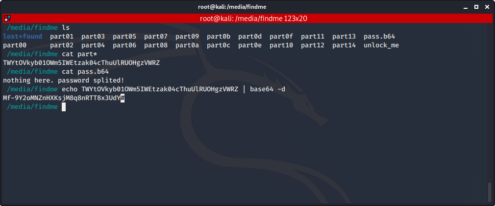
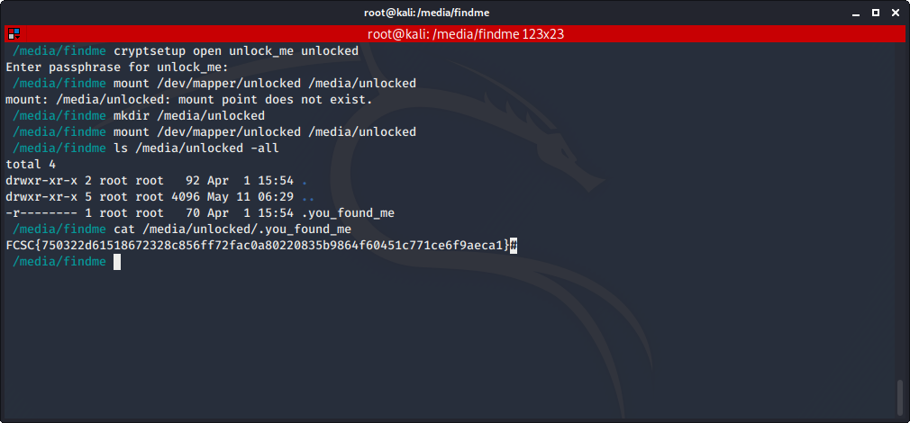

# Find Me

Auteur: Ewaël

**Find Me** est un des challenges forensics à 25 points du FCSC 2020 et dont voici l'énoncé:



Un simple `file` me donne le format du fichier: 

```
Linux rev 1.0 ext4 filesystem data, UUID=9c0d2dc5-184c-496a-ba8e-477309e521d9, volume name "find_me" (needs journal recovery) (extents) (64bit) (large files) (huge files)
```

Je mount donc le fichier avec `mount find_me /media/findme`. Voilà ce que j'y trouve:



Il faut donc retrouver le password pour décrypter le fichier `unlock_me`. Comme souvent dans les challenges forensics avec un fichier à mount, il s'agit de fichiers effacés qu'il faut retrouver. J'ai utilisé `testdisk`:



Intéressant... Je copie ces files et les affiche dans l'ordre. Puis, avec l'information de `pass.b64`, je retrouve le mot de passe:



Enfin, avec le mot de passe récupéré, je peux finir le challenge en décryptant `unlock_me` avec l'outil cryptsetup:



`FCSC{750322d61518672328c856ff72fac0a80220835b9864f60451c771ce6f9aeca1}`
