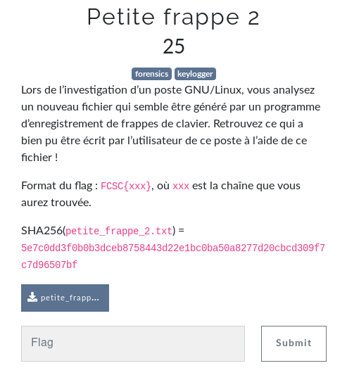

# Petite frappe 2

Auteur: Ewaël

**Petite frappe 2** est un des challenges forensics à 25 points du FCSC 2020.



Le *.txt* fourni, les tirets étant des marques ajoutées par moi pour ne pas me perdre:

```
key press   46
key release 46
key press   24
key press   65
key release 24
key release 65
key press   39
key release 39
key press   32
key release 32
key press   46
key release 46
key press   30
key release 30
key press   28
key release 28
key press   31
key release 31
key press   32
key release 32
key press   57
key release 57
key press   65
key release 65
 -------------------------------------- 1
key press   24
key release 24
key press   55
key release 55
key press   26
key release 26
key press   54
key press   65
key release 54
key release 65
key press   53
key release 53
key press   31
key release 31
key press   57
key release 57
key press   33
key release 33
key press   30
key release 30
key press   28
key release 28
key press   65
key release 65
key press   57
key release 57
key press   26
key press   65
key release 26
key release 65
 -------------------------------------- 2
key press   39
key release 39
key press   26
key release 26
key press   47
key release 47
key press   56
key release 56
key press   46
key release 46
key press   26
key press   65
key release 26
key release 65
key press   33
key release 33
key press   24
key release 24
key press   39
key press   65
key release 39
key release 65
 -------------------------------------- 3
key press   39
key release 39
key press   30
key release 30
key press   33
key release 33
key press   26
key release 26
key press   27
key release 27
key press   65
key release 65
key press   33
key release 33
key press   27
key release 27
key press   24
key release 24
key press   28
key release 28
key press   31
key release 31
key press   38
key release 38
key press   30
key release 30
key press   26
key release 26
key press   65
key release 65
 -------------------------------------- 4
key press   24
key press   65
key release 24
key release 65
key press   40
key press   26
key release 40
key release 26
key press   54
key release 54
key press   32
key release 32
key press   40
key release 40
key press   26
key release 26
key press   27
key release 27
key press   62
key press   59
key release 59
key release 62
key press   65
key release 65
 -------------------------------------- 5
key press   46
key release 46
key press   26
key press   65
key release 26
key release 65
key press   41
key release 41
key press   46
key release 46
key press   24
key release 24
key press   42
key release 42
key press   65
key release 65
key press   26
key release 26
key press   39
key release 39
key press   28
key release 28
key press   65
key release 65
 -------------------------------------- 6
key press   30
key release 30
key press   57
key release 57
key press   17
key release 17
key press   54
key release 54
key press   46
key release 46
key press   24
key release 24
key press   55
key release 55
key press   31
key release 31
key press   26
key release 26
key press   27
key release 27
key press   17
key release 17
key press   24
key release 24
key press   25
key release 25
key press   26
key release 26
key press   27
key release 27
key press   28
key release 28
key press   29
key release 29
 -------------------------------------- 7 fin de 'azerty'
key press   17
key release 17
key press   26
key release 26
key press   57
key release 57
key press   17
key release 17
key press   55
key release 55
key press   24
key release 24
key press   30
key release 30
key press   28
key release 28
key press   17
key release 17
key press   40
key release 40
key press   26
key release 26
key press   30
key release 30
key press   53
key release 53
```

Il s'agit de la capture d'un *keylogger*. Je comprends donc qu'il va falloir trouver la lettre correspondant à chaque nombre pour reconstituer ce qui a été tapé. Après quelques recherches et avec l'énoncé, je trouve ce lien:

[https://gist.github.com/rickyzhang82/8581a762c9f9fc6ddb8390872552c250](https://gist.github.com/rickyzhang82/8581a762c9f9fc6ddb8390872552c250)

En utilisant les codes x11 comme c'est un poste Linux, et en convertissant en azerty, j'obtiens:

`FCSC{UN_CLAVIER_AZERTY_EN_VAUT_DEUX}`
