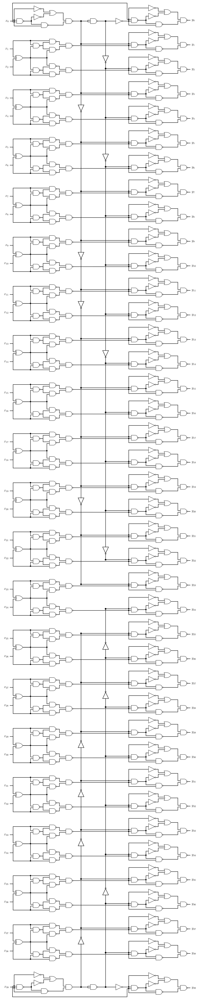

# Quarantaine

Auteur: Ewaël

**Quarantaine** est un des challenges hardware à 25 points du FCSC 2020 et dont voici l'énoncé:

Le circuit fourni était le suivant:

Il s'agit simplement d'une succession de portes logiques prenant 40 bits en input et renvoyant 40 bits en retour. Selon l'énoncé, c'est en réalité une fonction `f` qui est appliquée au nombre formé par les bits d'entrée. Ainsi, avec `x` l'input, ce circuit renvoie `f(x)`. 

Je commence alors par construire ce circuit sur [http://logic.ly/demo](http://logic.ly/demo) et vérifie si, en entrant 19 en binaire, je reçois bien 581889079277 en binaire. Après quelques tests, ça finit par fonctionner avec `x0` le bit de poids faible. Le circuit n'étant pas très compliqué à manipuler, il est facile de jouer avec les inputs afin de construire le `y` correspondant à `f(y) = 454088092903` en binaire. Je trouve donc:

`FCSC{1061478808711}`

(À noter que le script python présent dans le dossier ne m'a servi qu'à faire des tests et à ne pas me perdre pendant ceux-ci avec les 0 et les 1...)
