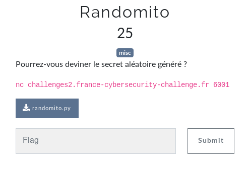
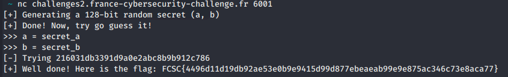

# Randomito

Auteur: Ewaël

**Randomito** est un des challenges misc du FCSC 2020. Il valait 25 points à la fin du CTF.



Il était fourni le script suivant qui tournait sur l'hôte distant:

```python
#!/usr/local/bin/python2

import sys
import signal
from random import randint

# Time allowed to answer (seconds)
DELAY = 10

def handler(signum, frame):
   raise Exception("Time is up!\n")

def p(s):
	sys.stdout.write(s)
	sys.stdout.flush()

def challenge():

	for _ in range(10):
		p("[+] Generating a 128-bit random secret (a, b)\n")
		secret_a = randint(0, 2**64 - 1)
		secret_b = randint(0, 2**64 - 1)
		secret   = "{:016x}{:016x}".format(secret_a, secret_b)
		p("[+] Done! Now, try go guess it!\n")
                p("[+] The secret is {}\n".format(secret))
		p(">>> a = ")
		a = int(input())
		p(">>> b = ")
		b = int(input())
		check = "{:016x}{:016x}".format(a, b)
		p("[-] Trying {}\n".format(check))
		if check == secret:
			flag = open("flag.txt").read()
			p("[+] Well done! Here is the flag: {}\n".format(flag))
			break
		else:
			p("[!] Nope, it started by {}. Please try again.\n".format(secret[:5]))

if __name__ == "__main__":
	signal.alarm(DELAY)
	signal.signal(signal.SIGALRM, handler)
	try:
		challenge()
	except Exception, e:
		exit(0)
	else:
		exit(0)
```

Je suis donc supposé envoyer les deux parties de 64 bits générées aléatoirement pour former un secret de 128 bits qui me donnera le flag s'il est correct. Si c'est évidement impossible à mon échelle, il est en revanche possible d'exploiter l'input qui n'est absolument pas traité par le code avant d'être utlisé. Ainsi, en entrant `secret_a` et `secret_b`, j'obtiens le comportement suivant lors de l'exécution:

```python
...
p(">>> a = ")
a= int(input()) -> a= secret_a
p(">>> b = ")
b = int(input()) -> b= secret_b
...
```

Et j'obtiens donc le flag, `check` étant composé des deux parties de `secret`:



`FCSC{4496d11d19db92ae53e0b9e9415d99d877ebeaeab99e9e875ac346c73e8aca77}`
