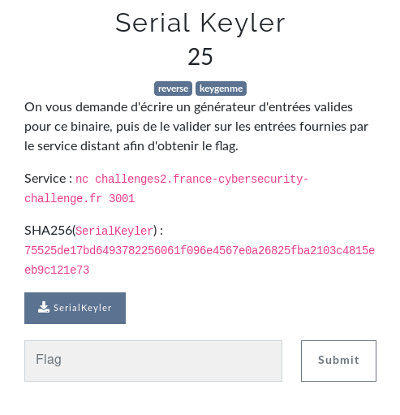
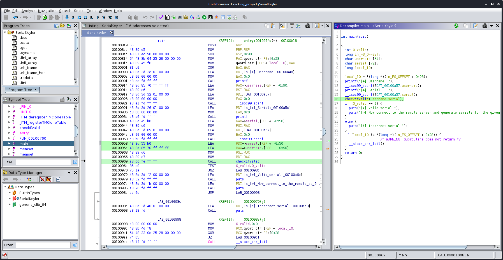
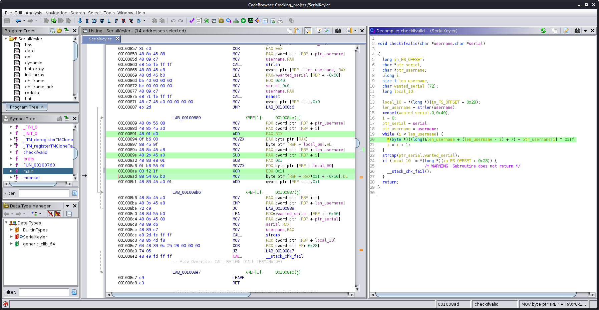
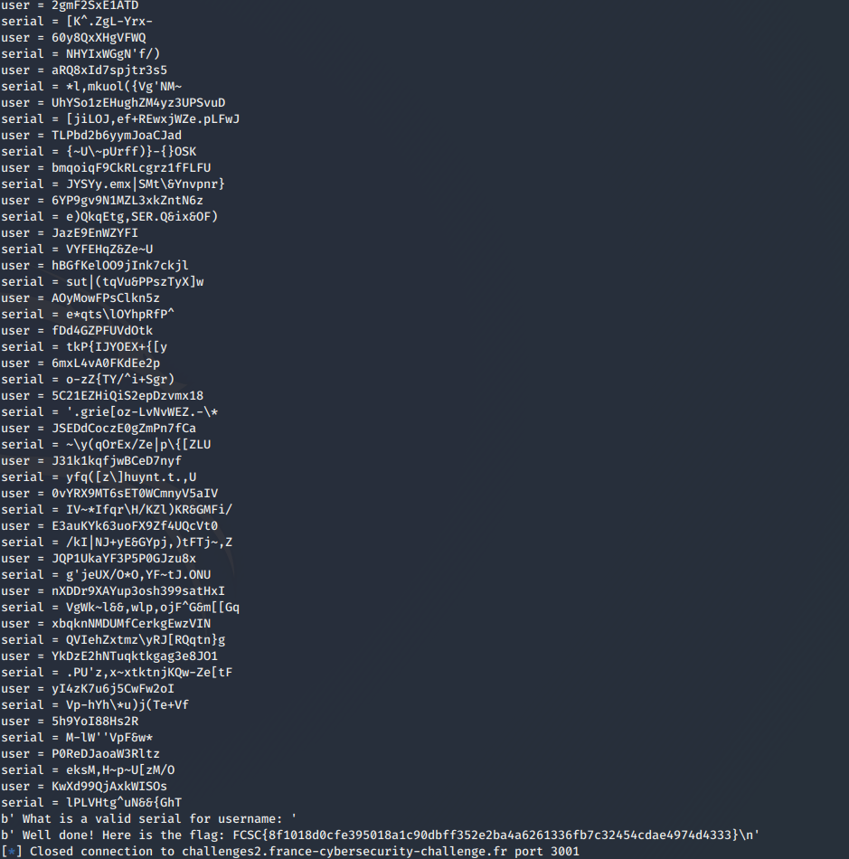

# Serial Keyler

Auteur: Ewaël

**Serial Keyler** est un des challenges reverse à 25 points du FCSC 2020. Voici l'énoncé:



Le binaire fourni attend un username et son serial correspondant pour tester tandis que l'hôte distant demande directement le serial d'un username donné.


J'ouvre d'abord le binaire dans Ghidra afin d'analyser le lien entre le username et son serial.



J'y trouve une fonction intéressante qui prend en input le username et le serial, que je suppose être à l'origine de la vérification. Et, en effet, j'y trouve le lien entre le username et le serial:



J'ai donc `serial[i] = username[i] XOR 1f` puis `serial = reversed(serial)`. Je code donc un script rapide pour automatiser le processus, et j'obtiens mon flag.

```python
#!/usr/bin/env python3

from pwn import *

host = "challenges2.france-cybersecurity-challenge.fr"
port = 3001

r = remote(host, port)

while True:
    try:
        resp = r.recvuntil("name: ", timeout = 1)
    except EOFError:
        print(resp)
        print(r.clean())
        break
    user = r.recvuntil(">>>").decode()[:-4]
    print("user = {}".format(user))
    serial = ""
    for i in user:
        serial += chr(ord(i) ^ int('1f', 16))
    serial = ''.join(reversed(serial))
    print("serial = {}".format(serial))
    r.sendline(serial)
```



`FCSC{8f1018d0cfe395018a1c90dbff352e2ba4a6261336fb7c32454cdae4974d4333}`
