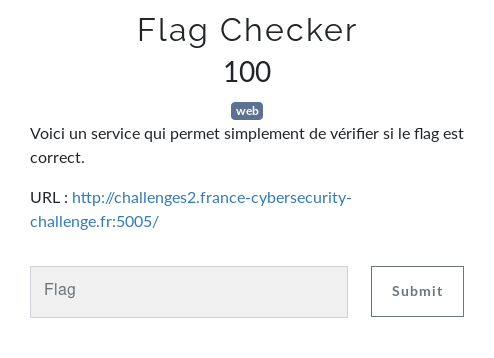
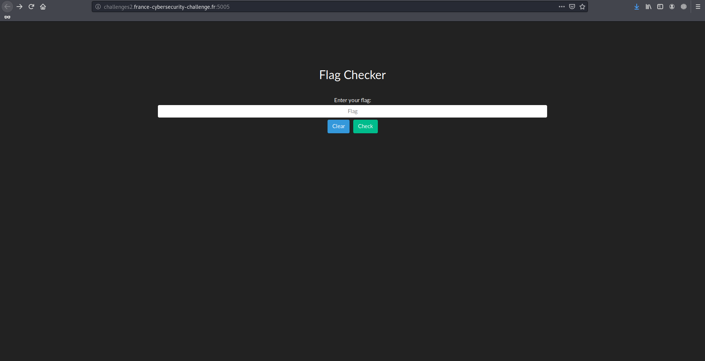
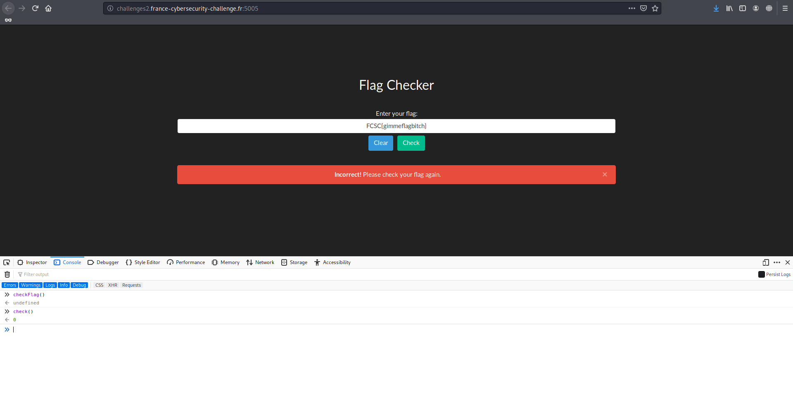

# Flag Checker

**Flag Checker** est un des challenges web à 100 points du FCSC 2020 et dont voici l'énoncé:



Le lien menant à la page suivante, vérifiant si le flag entré est bien celui du challenge.



J'ai d'abord constaté qu'aucune requête n'était envoyée lorsque je cliquais sur le *Check*, Burp n'interceptait rien. Je suis donc allé fouiller dans les documents stockés sur la page et suis tombé sur une fonction `checkFlag` dans le code source.

```php
function checkFlag(){check=Module.cwrap("check","number",["string"]),flag=$("#flag").val(),check(flag)?($("#feedback").html('<div id="alert" class="alert alert-dismissible alert-success"><button type="button" class="close" data-dismiss="alert">&times;</button><strong>Congratulations!</strong> You can enter this flag in the CTFd.</div>'),$("#feedback").show()):($("#feedback").html('<div id="alert" class="alert alert-dismissible alert-danger"><button type="button" class="close" data-dismiss="alert">&times;</button><strong>Incorrect!</strong> Please check your flag again.</div>'),$("#feedback").show())}$("#btn-clear").on("click",(function(e){e.preventDefault(),$("#flag").val(""),$("#feedback").hide()})),$("#btn-check").on("click",(function(e){checkFlag()})),$(document).keyup((function(e){"Escape"===e.key?$("#feedback").html(""):"Enter"===e.key&&checkFlag()}))
```

Cette fonction se contente en réalité d'appeler la fonction `check` avec la valeur entrée dans le champ `#flag`. Cette fonction quant à elle renvoie 1 si le flag est bon, 0 sinon. Après pas mal de temps à essayer de décortiquer cette fonction à la base elle-même une fonction C, j'ai compris que ce n'était pas la bonne piste.



Je suis donc retourné voir les fichiers dont je disposais et ai découvert `index.wasm` qu'il fallait refresh pour afficher.

```asm
(module
  (type $type0 (func (param i32) (result i32)))
  (type $type1 (func))
  (type $type2 (func (param i32)))
  (type $type3 (func (result i32)))
  (import "a" "memory" (memory (;0;) 256 256))
  (global $global0 (mut i32) (i32.const 5244480))
  (export "a" (func $func5))
  (export "b" (func $func4))
  (export "c" (func $func2))
  (export "d" (func $func1))
  (export "e" (func $func0))
  (func $func0 (param $var0 i32)
    get_local $var0
    set_global $global0
  )
  (func $func1 (param $var0 i32) (result i32)
    get_global $global0
    get_local $var0
    i32.sub
    i32.const -16
    i32.and
    tee_local $var0
    set_global $global0
    get_local $var0
  )
  (func $func2 (result i32)
    get_global $global0
  )
  (func $func3 (param $var0 i32) (result i32)
    (local $var1 i32) (local $var2 i32) (local $var3 i32) (local $var4 i32) (local $var5 i32)
    i32.const 70
    set_local $var3
    i32.const 1024
    set_local $var1
    block $label0
      get_local $var0
      i32.load8_u
      tee_local $var2
      i32.eqz
      br_if $label0
      loop $label2
        block $label1
          get_local $var2
          get_local $var1
          i32.load8_u
          tee_local $var4
          i32.ne
          br_if $label1
          get_local $var3
          i32.const -1
          i32.add
          tee_local $var3
          i32.eqz
          br_if $label1
          get_local $var4
          i32.eqz
          br_if $label1
          get_local $var1
          i32.const 1
          i32.add
          set_local $var1
          get_local $var0
          i32.load8_u offset=1
          set_local $var2
          get_local $var0
          i32.const 1
          i32.add
          set_local $var0
          get_local $var2
          br_if $label2
          br $label0
        end $label1
      end $label2
      get_local $var2
      set_local $var5
    end $label0
    get_local $var5
    i32.const 255
    i32.and
    get_local $var1
    i32.load8_u
    i32.sub
  )
  (func $func4 (param $var0 i32) (result i32)
    (local $var1 i32) (local $var2 i32)
    get_local $var0
    i32.load8_u
    tee_local $var2
    if
      get_local $var0
      set_local $var1
      loop $label0
        get_local $var1
        get_local $var2
        i32.const 3
        i32.xor
        i32.store8
        get_local $var1
        i32.load8_u offset=1
        set_local $var2
        get_local $var1
        i32.const 1
        i32.add
        set_local $var1
        get_local $var2
        br_if $label0
      end $label0
    end
    get_local $var0
    call $func3
    i32.eqz
  )
  (func $func5
    nop
  )
  (data (i32.const 1024)
    "E@P@x4f1g7f6ab:42`1g:f:7763133;e0e;03`6661`bee0:33fg732;b6fea44be34g0~"
  )
)
```

En réalité à partir de là c'est allé assez vite, après avoir essayé de jouer un peu avec le code, je me suis concentré sur cette cette chaine étrange que j'ai analysée avec CyberChef:

[https://gchq.github.io/CyberChef](https://gchq.github.io/CyberChef)

Avec le paramètre `Magic` en mode intensif, CyberChef tourne un peu puis me renvoie parmi les propositions un joli flag décodé en `XOR({'option':'Hex','string':'3'},'Standard',false)`:

`FCSC{7e2d4e5ba971c2d9e944502008f3f830c5552caff3900ed4018a5efb77af07d3}`
