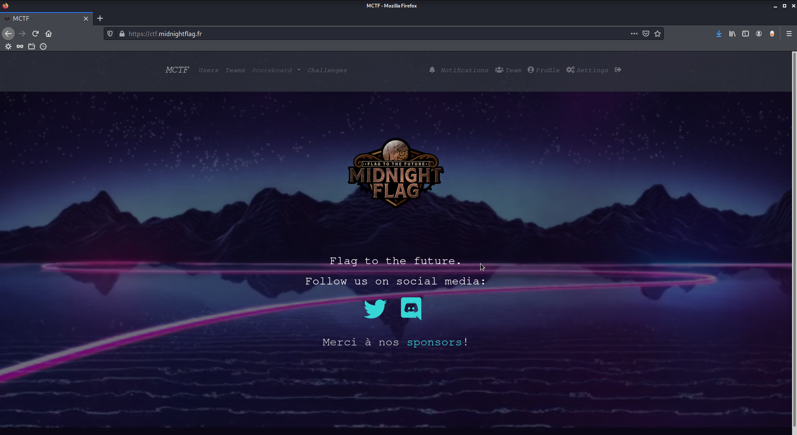
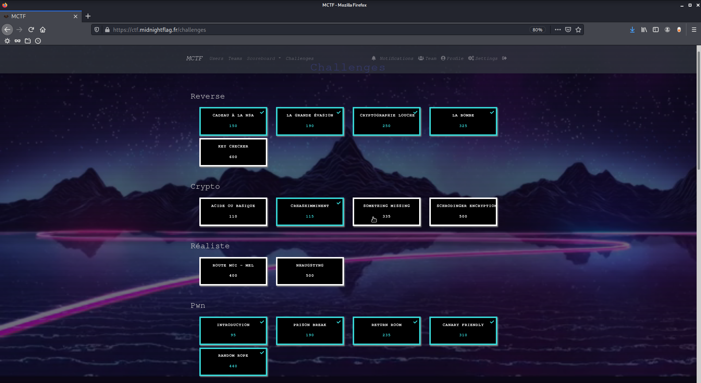
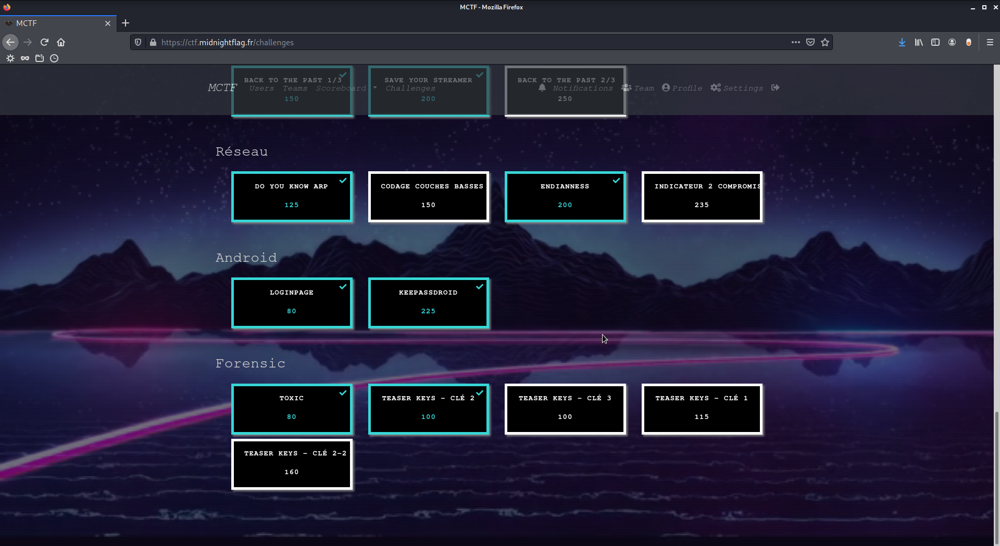
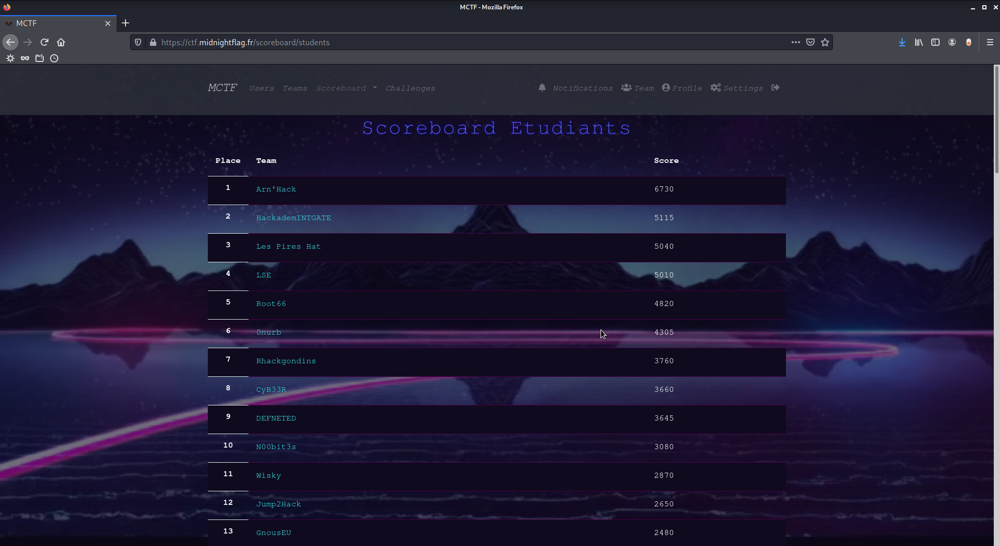
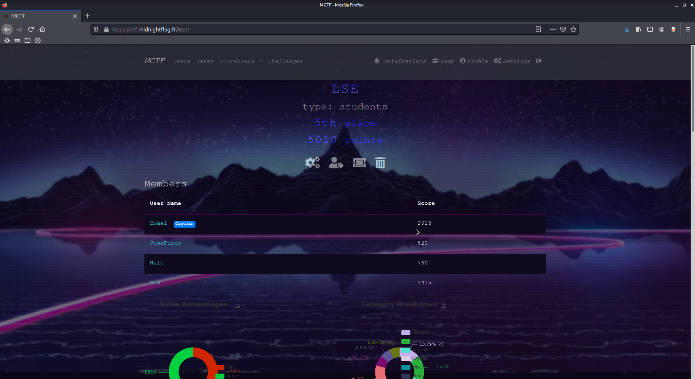

# MidnightFlag

**MidnightFlag** was organized by the Midnight team, a group of french student from ESNA. *sat, 10 apr. 2021, 10:00 PM CEST — sun, 11 apr. 2021, 6:00 AM CEST*

The idea is really nice, the CTF is only 8 hours long during a night. This forces the team to be really organized and everyone to be in a good mood for 8 hours straight when the brain is used to sleep at this time (at least mine is). We managed to grab the 4th place after being 2nd during the whole event, ending those nice challenges in an atrocious frustration, but still happy with the work we've done overall.

