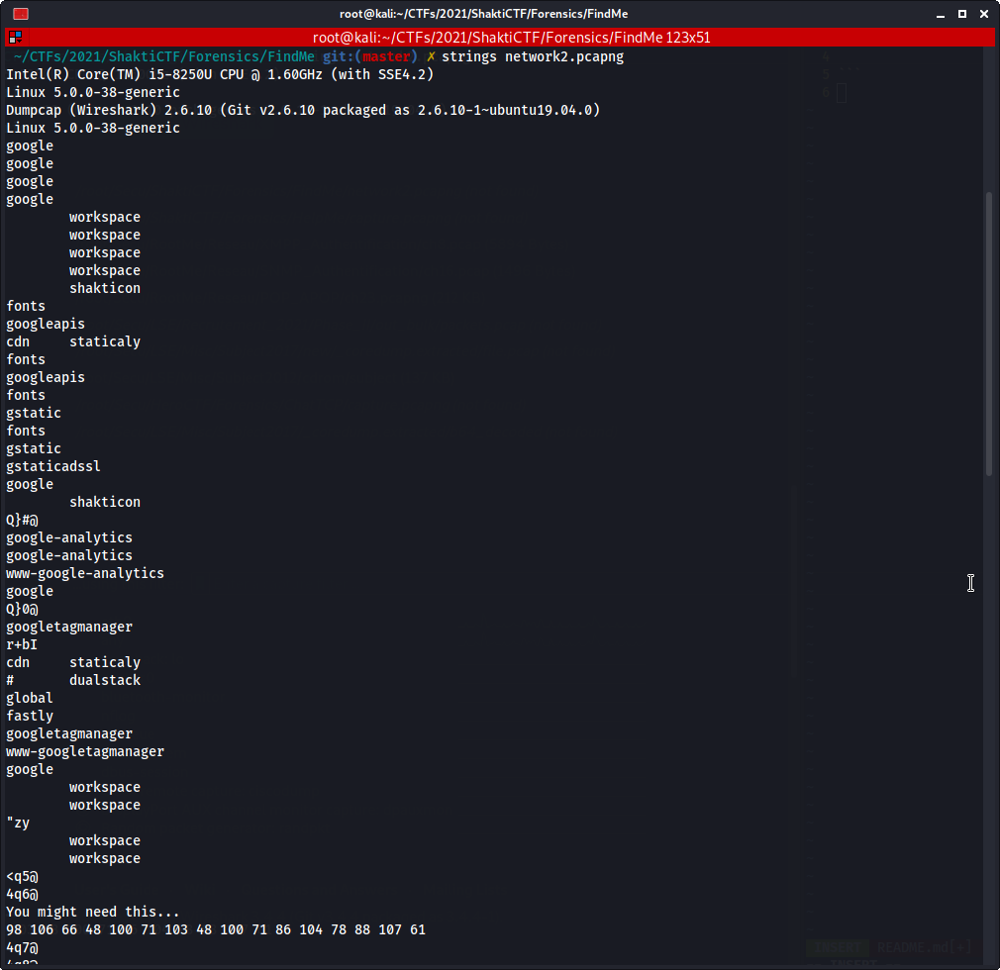
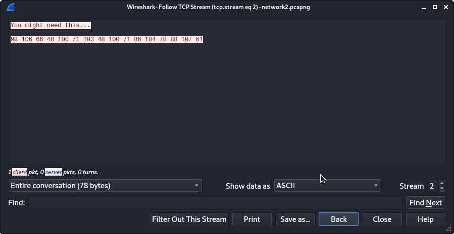
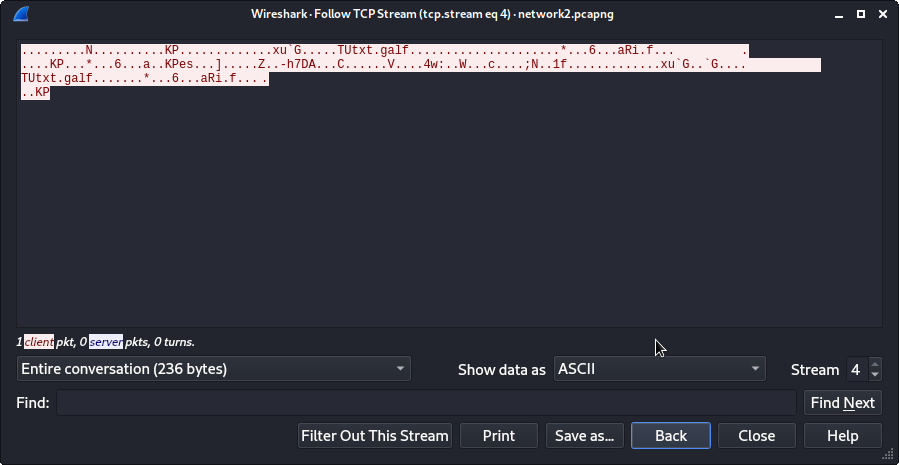
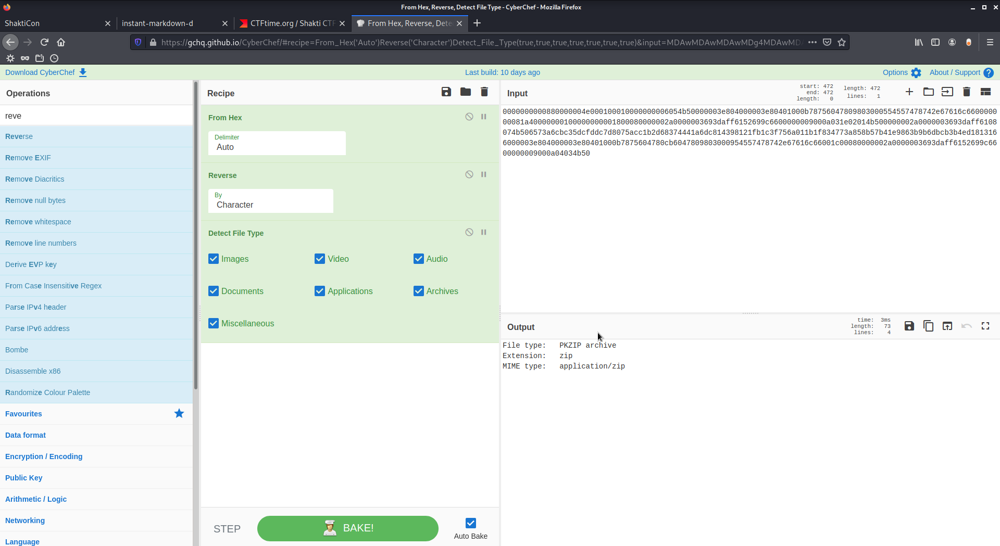

# Find Me

The given file was a PCAP capture. The first thing we do is `strings` to have easy informations.



We see this interesting part:

```
You might need this...
98 106 66 48 100 71 103 48 100 71 86 104 78 88 107 61
```

Let's decode this:

```python
>>> print(''.join([chr(int(a)) for a in '98 106 66 48 100 71 103 48 100 71 86 104 78 88 107 61'.split(' ')]))
bjB0dGg0dGVhNXk=
```

```
$ echo bjB0dGg0dGVhNXk= | base64 -d
n0tth4tea5y
```

Ok, let's keep this and dive into the capture file. Following the TCP streams gives us 2 streams, the first one being what we just decoded, let's dig the second one.





We can clearly see a reversed `flag.txt` string in that capture, let's reverse it and see we get as a file.



A ZIP file! It's password protected, opening it with our `n0tth4tea5y` works like a charm, and we get out beloved `flag.txt`:

```
shaktictf{g00d_lUcK_4_tH3_n3xT_cH411eNg3}
```
