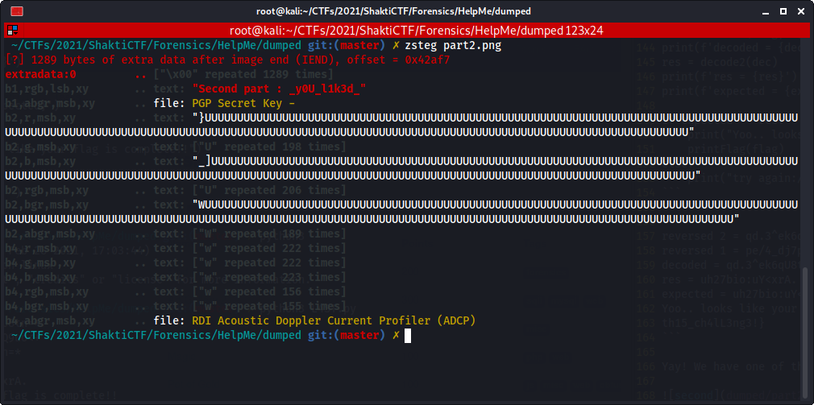

# Help Me

The given memory dump contains the flag which is splitted in 3 parts. Let's analyse it with `volatility`:

```
python2 /opt/volatility/vol.py -f Challenge.vmem imageinfo
```

We see `Win7SP1x64` being a possible profile so we'll use this one. I often start my analysis by saving the output of `filescan` while checking the `iehistory`:

```
python2 /opt/volatility/vol.py --profile=Win7SP1x64 -f Challenge.vmem iehistory
...
C:/Users/alexander/Downloads/L4ST.py.txt
C:/Users/alexander/Documents/Part%20II.png
C:/Users/alexander/Downloads/L4ST.py
...
```

It shows some interesting files that seemed to be downloaded on the machine, as `filescan` confirms.

```
0x000000007e269310     12      0 R--r-d \Device\HarddiskVolume1\Users\alexander\Documents\Part II.png
0x000000007ec2c970      2      0 R--r-- \Device\HarddiskVolume1\Users\alexander\Downloads\L4ST.py.zip
0x000000007f07b740     13      0 R--r-d \Device\HarddiskVolume1\Users\alexander\Downloads\DumpIt.exe
```

We also see that strange `DumpIt.exe` that we'll check after. Let's dump both part 2 and part 3 with

```
python2 /opt/volatility/vol.py --profile=Win7SP1x64 -f Challenge.vmem dumpfiles -D dumped -Q [addr]
```

I started with the third part in the Python script. In the order:

- it waits for an input
- it calls a first decoding function on this input
- it calls a second decoding function on the decoded result
- it checks if the final decoded string is equal to the expected one
- if yes, then it prints the flag from a decoding function, else it just returns.

Here are those functions, after cleaning the code and renaming functions properly:

```python
#!/usr/bin/env python3

s = 4
y = []
Z = []
res = []
expected="uh27bio:uY<xrA."

def decode1(text, s):
    result = ""
    for i in range(len(text)):
        char = text[i]
        if char.isnumeric():
            result += chr(ord(char) - 1)
        elif char.isupper():
            result += chr((ord(char) + s - 65) % 26 + 65)
        else:
            result += chr(ord(char) ^ 1)
    return result

def decode2(inp):
    for i in range(len(inp)):
        if len(inp) < 8:
            Z.append(chr(ord(inp[i]) - 1 + i))
        else:
            Z.append(chr(ord(inp[i]) + 4))
    return ''.join(Z)

def printFlag(inp):
    st = []
    for i in range(len(inp)):
        st.append(chr(ord(inp[i]) - i + 4))
    print(''.join(st) + "}")

flag = input()
dec = decode1(flag, s)
res = decode2(dec)

if expected == res:
    print("Yoo.. looks like your flag is complete!!")
    printFlag(flag)
else:
    print("try again:/ ")
```

So we need to reverse the `decode2` function from the `expected` string. Then we'll do the same thing with the expected decoded string and the `decode1` function. Fun right? Let's go!

```python
def decode2(inp):
    for i in range(len(inp)):
        if len(inp) < 8:
            Z.append(chr(ord(inp[i]) - 1 + i))
        else:
            Z.append(chr(ord(inp[i]) + 4))
    return ''.join(Z)

# we know the expected input is more than 8 chars long
def reverse2(inp):
    res = ''
    for i in range(len(inp)):
        res += chr(ord(inp[i]) - 4)
    return res
```

```python
def decode1(text, s):
    result = ""
    for i in range(len(text)):
        char = text[i]
        if char.isnumeric():
            result += chr(ord(char) - 1)
        elif char.isupper():
            result += chr((ord(char) + s - 65) % 26 + 65)
        else:
            result += chr(ord(char) ^ 1)
    return result

def reverse1(text, s):
    result = ""
    for i in range(len(text)):
        char = text[i]
        if char.isnumeric():
            result += chr(ord(char) + 1)
        elif char.isupper():
            result += chr((ord(char) - s - 65) % 26 + 65)
        else:
            result += chr(ord(char) ^ 1)
    return result
```

The whole process was pretty easy so I'm going into details here, and we can see the result:

```python
x2 = reverse2(expected)
print(f'reversed 2 = {x2}')
x1 = reverse1(x2, s)
print(f'reversed 1 = {x1}')

flag = x1
dec = decode1(flag, s)
print(f'decoded = {dec}')
res = decode2(dec)
print(f'res = {res}')
print(f'expected = {expected}')

if expected == res:
    print("Yoo.. looks like your flag is complete!!")
    printFlag(flag)
else:
    print("try again:/ ")
```

```
reversed 2 = qd.3^ek6qU8tn=*
reversed 1 = pe/4_dj7pQ9uo<+
decoded = qd.3^ek6qU8tn=*
res = uh27bio:uY<xrA.
expected = uh27bio:uY<xrA.
Yoo.. looks like your flag is complete!!
th15_ch4lL3ng3!}
```

Yay! We have one of the three required parts. We can move on the second part: the PNG file.


This one was actually really fast to get, because the first thing I always do in steganography challenges after the usual `strings` is using `zsteg`:



There we have:

```
_y0U_l1k3d_
```

So the flag currently looks like this: `_y0U_l1k3d_th15_ch4lL3ng3!}`. The fun thing I actually thought I could guess it with the meaning of the sentence, so I tried `shaktictf{1_h0pe_y0U_l1k3d_th15_ch4lL3ng3!}`, but I was wrong... Anyway, what about that `DumpIt.exe` that should contain the last part?

```
$ file dumpit.exe
dumpit.exe: PE32 executable (console) Intel 80386, for MS Windows
```

I could not reverse it statically, so I launched it in a Windows virtual machine and checked the connections with *Wireshark*. Unfortunately all I saw were certificates exchanges, I even dumped them from the binary with *binwalk* to crack them without success. After loosing 2 to 3 hours on this enormous bait, I decided to come back on the dump analysis and... A single command was enough to give me the flag, resulting in a *bruh* moment understanding I had been baited as the noob I am.

```
python2 /opt/volatility/vol.py --profile=Win7SP1x64 -f Challenge.vmem cmdscan
```

It returns the first part of the flag base 64 encoded. Anyway this was a really great challenge mixing categories, I absolutly loved it, props to the creator!

```
shaktictf{H0p3_y0U_l1k3d_th15_ch4lL3ng3!}
```

*(I was not that far with my guess, was I? :P)*
