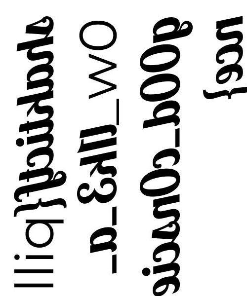
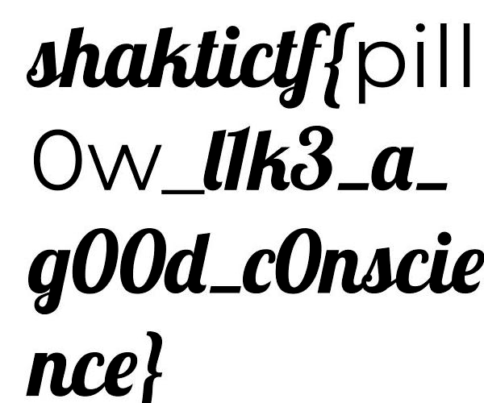

# Pillow

This challenge is about image manipulation. I chose to do it in Python because I'm kinda used to it. A directory named `60x50` containing 3000 10x10 images was given, providing the information about the flag dimensions.

```python
from PIL import Image

def printBlock(pix, i):
    print(f'block {i}')
    for x in range(10):
        for y in range(10):
            print(str(pix[y, x]).ljust(3), end=' ')
        print('')
    print('---')

def placeBlock(flagpix, impix, i):
    printBlock(impix, i)
    i -= 1
    y = (i // 50) * 10
    x = (i % 50) * 10
    for u in range(x, x + 10):
        for v in range(y, y + 10):
            pix = impix[v % 10, u % 10]
            flagpix[u, v] = (pix, pix, pix)

doss = './60x50/'
flag = Image.new('RGB', (500, 600), 'red')
flagpix = flag.load()

for i in range(1, 3001):
    im = Image.open(f'{doss}{i}.jpg')
    impix = im.load()
    placeBlock(flagpix, impix, i)

flag.save('flag.png')
```



Mirror and rotate... And there we are!



```
shaktictf{pill0w_l1k3_a_g00d_c0nscience}
```
