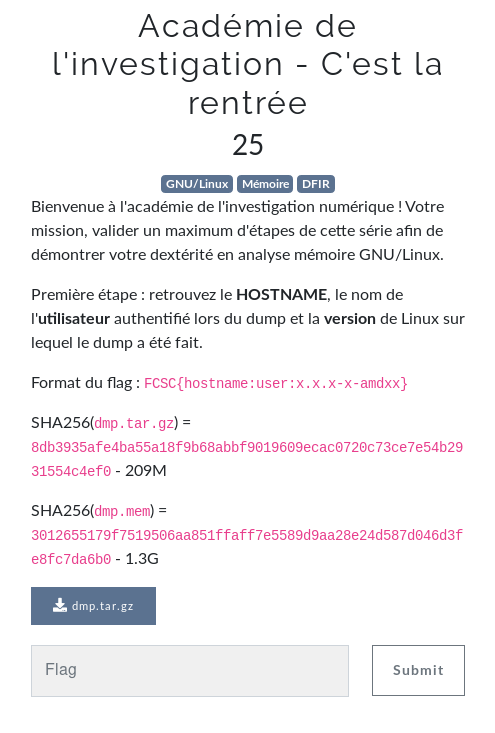

# Académie de l'investigation - C'est la rentrée

Auteur: Ewaël

**Académie de l'investigation - C'est la rentrée** est un des challenges forensics à 25 points du FCSC 2020. C'est également le premier de la série **Académie de l'investigation** qu'il fallait compléter pour avoir accès aux autres.



Pas besoin de profil pour ce challenge car en réalité c'est une introduction pour donner les informations nécessaires pour build le profil Volatility. En effet, j'utilise simplement:

```
strings dmp.mem | grep HOST
strings dmp.mem | grep /home
strings dmp.mem | grep amd64
```

et j'obtiens

`FCSC{challenge.fcsc:Lesage:5.4.0-4-amd64}`
