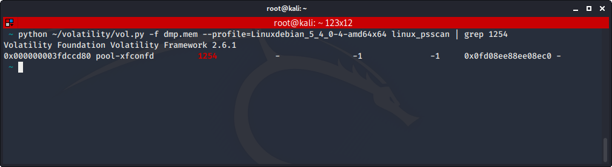
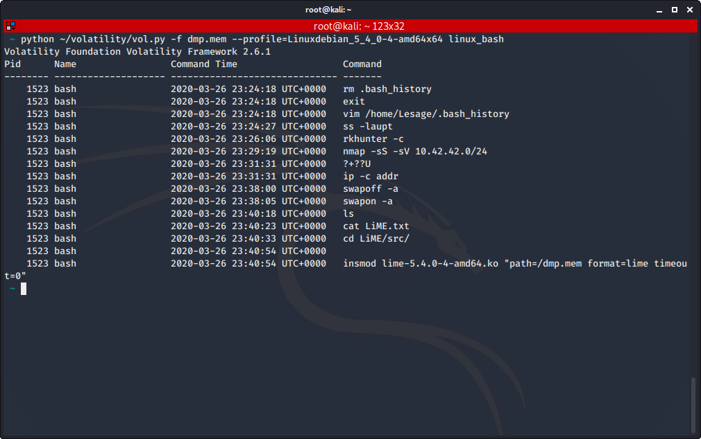
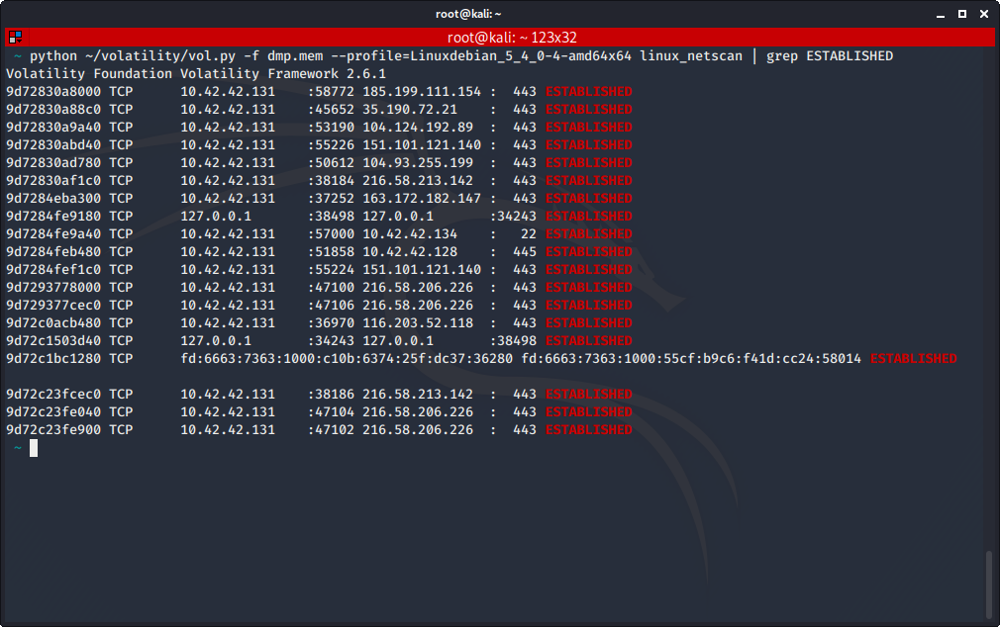

# Académie de l'investigation - Premiers artéfacts

Auteur: Ewaël

**Académie de l'investigation - Premiers artéfacts** est un des challenges forensics à 100 points du FCSC 2020 et dont voici l'énoncé.

Je commence par chercher le processus au PID 1254 avec `linux_psscan`:

Je trouve `pool-xfconfd`. Ensuite, la commande éxécutée à la date donnée se retrouve avec `linux_bash`:

Je trouve `nmap -sS -sV 10.42.42.0/24`. Enfin, il suffit d'utiliser `linux_netscan` et grep pour avoir les connections `ESTABLISHED` et les compter.

J'obtiens alors:

`FCSC{pool-xfconfd:nmap -sS -sV 10.42.42.0/24:13}`
