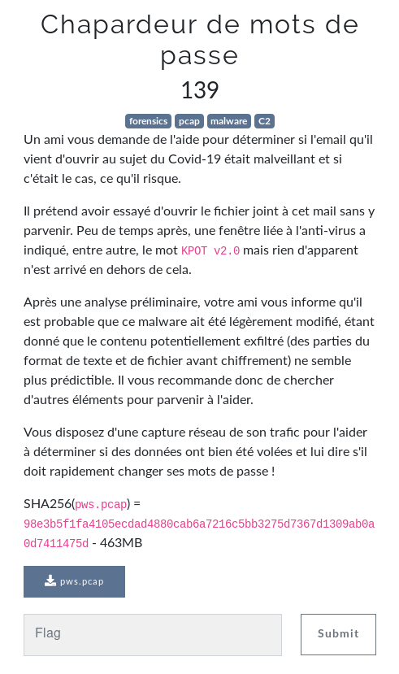
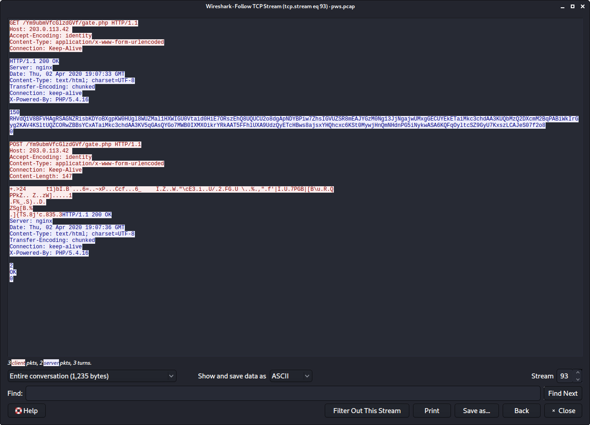
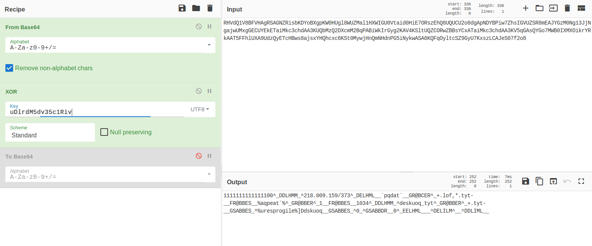
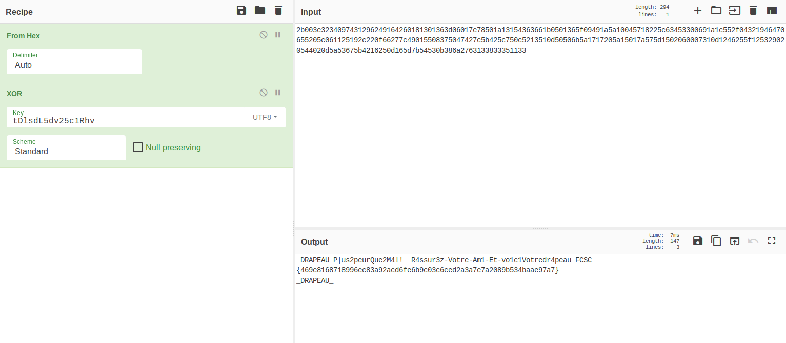

# Chapardeur de mots de passe

Auteur: Ewaël

**Chapardeur de mots de passe** est un des challenges forensics du FCSC 2020. Il valait 139 points à la fin du CTF et en voici l'énoncé:



J'ouvre directement la capture réseau dans Wireshark et décide de follow les échanges TCP. Je réalise assez vite qu'il est impensable de regarder manuellement les 300+ streams, alors je décide de me renseigner sur le `KPOT v2.0` de l'énoncé. Je trouve mon bonheur sur ce lien:

[https://www.proofpoint.com/us/threat-insight/post/new-kpot-v20-stealer-brings-zero-persistence-and-memory-features-silently-steal](https://www.proofpoint.com/us/threat-insight/post/new-kpot-v20-stealer-brings-zero-persistence-and-memory-features-silently-steal)

Je comprends qu'il s'agit d'un stealer et vois que le moyen d'intéragir avec le C&C panel est une request finissant par "gate.php". Je décide de voir ce que je peux en tirer en recherchant les request contenant ce terme dans Wireshark. Après quelques streams sans intérêt ou avec des *403 Forbidden*, j'en trouve une que je vais pouvoir exploiter.



En effet, il ressemble beaucoup à celui présent dans le lien, avec une première request en `GET` pour recevoir l'instruction et une deuxième en `POST` pour envoyer les données volées. Comme expliqué sur le lien, la réponse du C&C et les données envoyées sont encodées en base 64 et XOR'd avec la même clé. Il suffit donc de retrouver cette clé grâce à la première request pour lire la deuxième, qui m'intéresse puisqu'elle contient les données sensibles.

Pour cela, j'utilise ce à quoi ressemble normalement la réponse du C&C:

```
1111111111111100__DELIMM__A.B.C.D__DELIMM__appdata__GRABBER__*.log,*.txt,__GRABBER__%appdata%__GRABBER__0__GRABBER__1024__DELIMM__desktop_txt__GRABBER__*.txt,__GRABBER__%userprofile%\Desktop__GRABBER__0__GRABBER__150__DELIMM____DELIMM____DELIMM__
```

Je commence par faire un XOR entre la chaine décodée en base 64 et le début du plaintext, qui ne dépend pas de l'IP `A.B.C.D` que je ne connais pas:


Je sais que la key fait 16 caractères, je prends donc les 16 premiers caractères de l'output et je XOR la clé obtenue avec la même chaine décodée:



Intéressant, je vois que je suis sur la bonne piste puisqu'un début d'instruction est visible. Je décide de bruteforce la key avec les 0 et les 1 placés dans le bon ordre. Je commence par générer mon dictionnaire avec

```
crunch 16 16 01 > crunch_01
```

Puis je build une liste de keys possibles avec ce script:

```python
#!/usr/bin/env python3

import base64

get = open("GET.enc", "r").read()
get = base64.b64decode(get).decode()

dico = open("crunch_01")
keys = open("keys", "w")

key = ""
for word in dico:
    word = word[:-1]
    key = ""
    for i in range(16):
        key += chr(ord(word[i]) ^ ord(get[i]))
    keys.write(key + '\n')
    print("[+] Trying: {}".format(word))

print("[+] Bruteforce over")
```

Le fichiers `keys` contient alors 65536 keys que je vais tester. Je modifie donc le script pour build une liste de plaintexts correspondant à chaque key:

```python3
#!/usr/bin/env python3

import base64

get = open("GET.enc", "r").read()
get = base64.b64decode(get).decode()

dico = open("keys")
plaintexts = open("plaintexts", "w")

plain = ""
for word in dico:
    word = word[:-1]
    plain = ""
    for i in range(len(get)):
        plain += chr(ord(word[i%16]) ^ ord(get[i]))
    plaintexts.write('key = {} =>\n{}\n---\n'.format(word, plain))
    print("[+] Trying: {}".format(word))

print("[+] Bruteforce over")
```

La liste `plaintexts` obtenue comporte les 65536 plaintexts possibles. Comme je sais quel plaintext je veux obtenir mais que je ne connaissais pas l'IP, je grep simplement un mot pour voir la clé qui l'a bien formé:


Je trouve la key `tDlsdL5dv25c1Rhv` qui forme une requête parfaite. C'est donc gagné, je n'ai plus qu'à utiliser cette key pour afficher le contenu de la requête POST, dont j'ai récupéré l'hexa sur Wireshark:



`FCSC{469e8168718996ec83a92acd6fe6b9c03c6ced2a3a7e7a2089b534baae97a7}`

Ce challenge est celui qui m'a posé le plus de difficultés, mais également celui qui m'a procuré le plus grand plaisir à réussir. Merci aux concepteurs!
