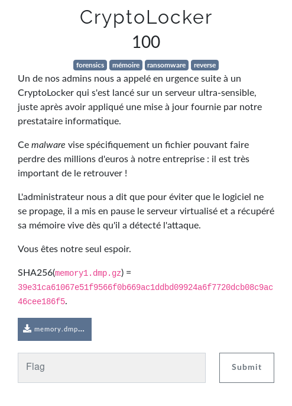
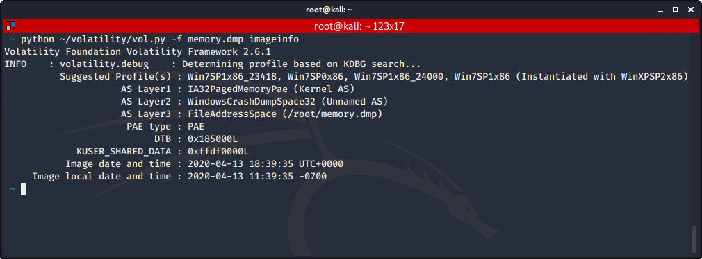
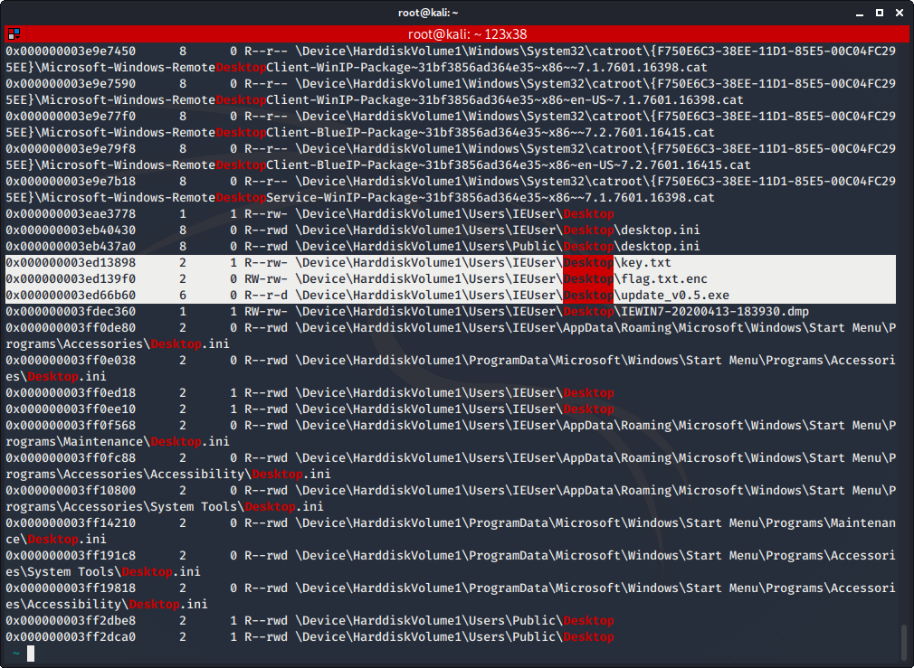
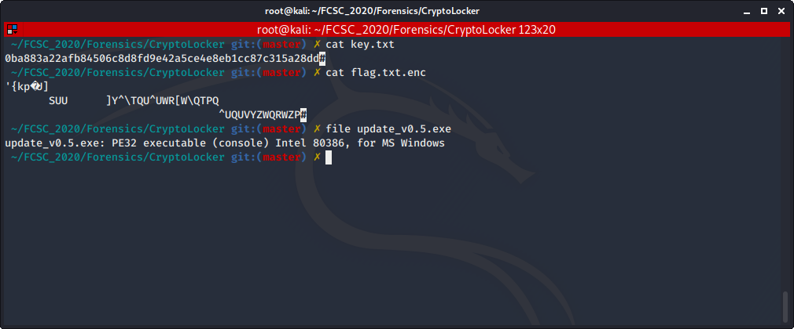
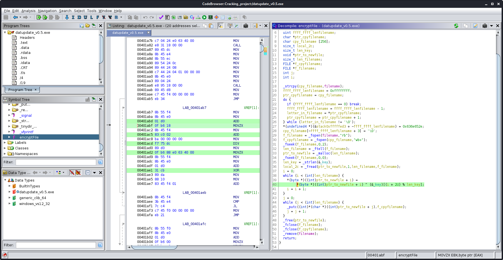

# CryptoLocker

Auteur: Ewaël

**CryptoLocker** est un des challenges forensics du FCSC 2020. Il valait 100 points à la fin du CTF.



Je commence par voir si Volatility connait le profil, et coup de change, c'est le cas.



Le but est d'abord de retrouver le processus malveillant qui a lancé le cryptolocker. Pour ça, je sais qu'il a été lancé après l'update. Je commence d'abord par fouiller avec `pstree` et `psscan` avant de réaliser que j'oublie une chose essentielle: regarder sur le Desktop. En effet c'est souvent là que se trouvent les fichiers intéressants dans les challenges, et celui-ci n'échappe par à la règle.

```
python ~/volatility/vol.py -f memory.dmp --profile=Win7SP1x86_23418 filescan | grep Desktop
```



Je trouve trois fichiers intéressants: `flag.txt.enc`, `key.txt` et `update_v0.5.exe`. Je les dump avec `dumpfiles -Q [addresse]` et commence à les analyser.



J'ai ce qui semble être la key d'encryption, le flag encrypté et je suspecte ce binaire d'être le malware, ce qui fait sens puisque le cryptolocker a été lancé suite à la prétendue update. Je l'ouvre donc sur Ghidra.



Je trouve une fonction intéressante donc l'opération de base est le XOR. La propriété intéressante du XOR ici est celle-ci:

```
    A XOR B = C
<=> C XOR B = A
```

En réencryptant le `flag.txt.enc` avec la même key, je devrais donc retrouver le flag. Pour cela, je télécharge une VM Windows, je mets ces trois files sur le Desktop, lance l'update, et récupère mon nouveau fichiher, qui contient indeed le flag:

`FCSC{324cee8fe3619a8bea64522eadf05c84df7c6df9f15e4cab4d0e04c77b20bb47}`
