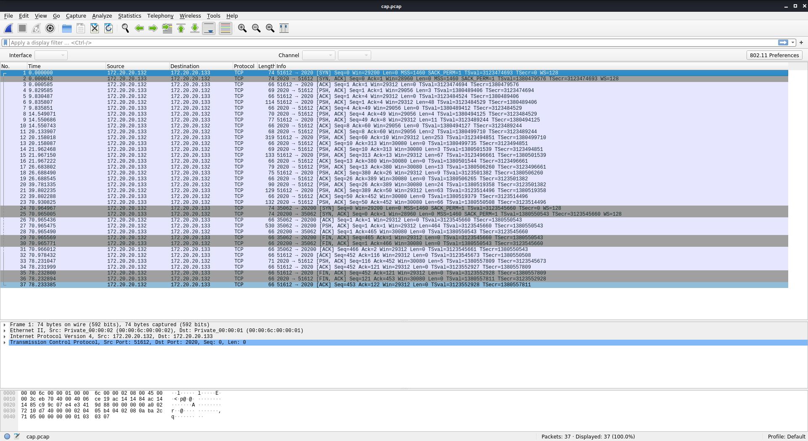
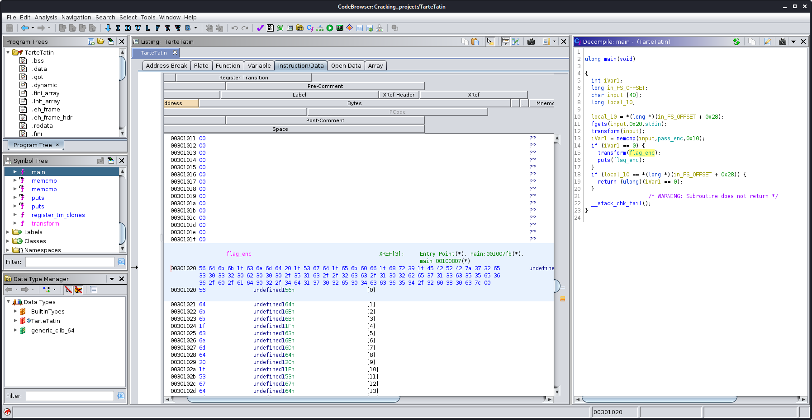

# Catégorie intro

Auteur: Ewaël

Les challenges de cette catégorie valaient 20 points chacun, et servaient à introduire les différentes catégories du FCSC avec des challenges rapides et faciles, d'où ce seul writeup pour tous les expliquer.


---

## Babel Web


Le lien menant sur une page en cours de développement.


Un petit tour par le code source et j'y trouve un lien intéressant: `<!-- <a href="?source=1">source</a> -->`


Je vois qu'il existe un moyen d'exécuter directement notre code sur la page. Ainsi j'envoie `?code=ls` pour trouver `flag.php` puis `?code=cat flag.php` pour l'afficher dans le code source:


`FCSC{5d969396bb5592634b31d4f0846d945e4befbb8c470b055ef35c0ac090b9b8b7}`

---

## Poney


Le binaire fourni attend simplement un input. Après quelques essais je découvre un overflow à partir de 33 caractères et en désassemblant avec `objdump -d poney` je trouve une fonction `shell` déjà présente dans le binaire:


Je peux donc créer mon payload que je pipe dans netcat avec l'host et le port donnés, selon un buffer overflow très classique sur du 64 bits, c'est-à-dire en ajoutant un offset de 8 après le buffer, le `cat -` servant ici à garder le shell ouvert.


`FCSC{725dd45f9c98099bcca6e9922beda74d381af1145dfce3b933512a380a356acf}`

---

## Cap ou Pcap


J'ouvre d'abord la capture réseau dans Wireshark.



Pour l'analyser, je follow l'échange tcp et tombe sur une chaine intéressante en hexadécimal:


Je l'analyse avec CyberChef, qui me renvoie mon flag après deux `From Hex` puis en unzipant le fichier récupéré nommé `flag.txt`:

`FCSC{6ec28b4e2b0f1bd9eb88257d650f558afec4e23f3449197b4bfc9d61810811e3}`

---

## Le Rat Conteur


Le fichier fourni était encrypté comme précisé dans l'énoncé. Pour le décrypter, j'utilise la commande

```
openssl enc -aes-128-ctr -d -K 00112233445566778899aabbccddeeff -iv 0 -in flag.jpg.enc > flag.png
```

Et Yoda me délivre mon flag avec un très bon conseil:


`FCSC{879C2FEE3B9EFBC651050F881841D209}`

---

## Tarte Tatin


Le binaire fourni semble attendre un input. Je commence par le désassembler avec Ghidra.


Je trouve rapidement la fonction `transform` qui reçoit le flag encrypté en argument. Je vais voir ce que fait cette fonction `transform`:


Elle se contente d'ajouter `\x01` à chaque byte du flag encrypté pour de le décrypter et le renvoyer si l'input correspond au mot de passe. Deux pistes s'offrent à moi: patcher le binaire pour qu'il renvoie ce flag si l'input est incorrect et non l'inverse, ou décrypter le flag moi-même avec cette transformation. Comme j'avais la chaine encryptée directement dans Ghidra, j'ai choisi l'option 2:



```python
#!/usr/bin/env python3

chaine = "56 64 6b 6b 1f 63 6e 6d 64 20 1f 53 67 64 1f 65 6b 60 66 1f 68 72 39 1f 45 42 52 42 7a 37 32 65 33 30 33 32 30 62 30 30 30 2f 35 31 63 2f 2f 32 63 63 2f 31 30 32 62 65 37 31 33 63 35 35 65 36 36 2f 60 2f 61 64 30 32 2f 34 64 31 37 30 32 65 30 34 63 63 36 35 34 2f 32 60 38 30 63 7c 00"

arr = chaine.split(" ")

for k in range(len(arr)):
    arr[k] = chr(int(arr[k], 16) + 0x01)

print(''.join(arr))
```

Je lance mon script, et je reçois mon flag:

`Well done! The flag is: FCSC{83f41431c111062d003dd0213cf824d66f770a0be1305e2813f15dd76503a91d}`

---

## SMIC 1


Pour ce challenge il suffit de calculer `c` avec l'aglorithme RSA naïf et l'exponentiation modulaire pour optimiser le calcul:

```python
#!/usr/bin/env python3

m = 29092715682136811148741896992216382887663205723233009270907036164616385404410946789697601633832261873953783070225717396137755866976801871184236363551686364362312702985660271388900637527644505521559662128091418418029535347788018938016105431888876506254626085450904980887492319714444847439547681555866496873380
n = 115835143529011985466946897371659768942707075251385995517214050122410566973563965811168663559614636580713282451012293945169200873869218782362296940822448735543079113463384249819134147369806470560382457164633045830912243978622870542174381898756721599280783431283777436949655777218920351233463535926738440504017
e = 65537

print(pow(m, e, n))
```

J'obtiens alors le flag suivant:

`FCSC{43038584369552603099759673610132404954603129182365447300530480398332322363741719021427218282885888340427764617212360258625034642827465292074914623418386094167402748099928035759712951543068670333972608099203444196434250100760907677561414593941829935308834430903916897564884969367373487895789351212840634163159}`

---

## Sbox


Le circuit suivant est donné:


En suivant le circuit avec l'input de l'énoncé et les règles logiques de chaque porte, on trouve:

`FCSC{0101}`

---

## SMIC 2


Pour ce challenge, le point important est de factoriser `n` en deux facteurs premiers `p` et `q` afin de retrouver la clé privée `d`. Coup de chance, cette décomposition est déjà connue et je l'ai trouvée ici:

[http://factordb.com/index.php](http://factordb.com/index.php)

J'obtiens alors le script suivant:

```python
#!/usr/bin/env python3

import gmpy2

import math

def getModInverse(a, m):
    if math.gcd(a, m) != 1:
        return None
    u1, u2, u3 = 1, 0, a
    v1, v2, v3 = 0, 1, m

    while v3 != 0:
        q = u3 // v3
        v1, v2, v3, u1, u2, u3 = (
            u1 - q * v1), (u2 - q * v2), (u3 - q * v3), v1, v2, v3
    return u1 % m

def main():

    e = 65537
    ct = 63775417045544543594281416329767355155835033510382720735973
    p = 650655447295098801102272374367
    q = 972033825117160941379425504503

    # compute n
    n = p * q

    # Compute phi(n)
    phi = (p - 1) * (q - 1)

    # Compute modular inverse of e
    d = getModInverse(e, phi)

    print("n:  " + str(d))

    # Decrypt ciphertext
    pt = pow(ct, d, n)
    print("pt: " + str(pt))

if __name__ == "__main__":
    main()
```

Ainsi on obtient le flag:

`FCSC{563694726501963824567957403529535003815080102246078401707923}`

---

## SuSHi


Je me connecte avec les identifiants fournis avec `ssh ctf@challenges2.france-cybersecurity-challenge.fr -p 6000` et le mot de passe `ctf`. Il me suffit alors de lister les documents avec `ls -all` et d'afficher le flag:

`FCSC{ca10e42620c4e3be1b9d63eb31c9e8ffe60ea788d3f4a8ae4abeac3dccdf5b21}`

---

## Petite frappe 1


Le fichier suivant était fourni:

```
Event: time 1584656705.424839, -------------- SYN_REPORT ------------
Event: time 1584656706.404214, type 4 (EV_MSC), code 4 (MSC_SCAN), value 16
Event: time 1584656706.404214, type 1 (EV_KEY), code 22 (KEY_U), value 1
Event: time 1584656706.404214, -------------- SYN_REPORT ------------
Event: time 1584656706.508350, type 4 (EV_MSC), code 4 (MSC_SCAN), value 16
Event: time 1584656706.508350, type 1 (EV_KEY), code 22 (KEY_U), value 0
Event: time 1584656706.508350, -------------- SYN_REPORT ------------
Event: time 1584656706.674591, type 4 (EV_MSC), code 4 (MSC_SCAN), value 31
Event: time 1584656706.674591, type 1 (EV_KEY), code 49 (KEY_N), value 1
Event: time 1584656706.674591, -------------- SYN_REPORT ------------
Event: time 1584656706.774463, type 4 (EV_MSC), code 4 (MSC_SCAN), value 31
Event: time 1584656706.774463, type 1 (EV_KEY), code 49 (KEY_N), value 0
Event: time 1584656706.774463, -------------- SYN_REPORT ------------
Event: time 1584656706.926206, type 4 (EV_MSC), code 4 (MSC_SCAN), value 12
Event: time 1584656706.926206, type 1 (EV_KEY), code 18 (KEY_E), value 1
Event: time 1584656706.926206, -------------- SYN_REPORT ------------
Event: time 1584656707.023728, type 4 (EV_MSC), code 4 (MSC_SCAN), value 12
Event: time 1584656707.023728, type 1 (EV_KEY), code 18 (KEY_E), value 0
Event: time 1584656707.023728, -------------- SYN_REPORT ------------
Event: time 1584656707.262381, type 4 (EV_MSC), code 4 (MSC_SCAN), value 22
Event: time 1584656707.262381, type 1 (EV_KEY), code 34 (KEY_G), value 1
Event: time 1584656707.262381, -------------- SYN_REPORT ------------
Event: time 1584656707.358058, type 4 (EV_MSC), code 4 (MSC_SCAN), value 22
Event: time 1584656707.358058, type 1 (EV_KEY), code 34 (KEY_G), value 0
Event: time 1584656707.358058, -------------- SYN_REPORT ------------
Event: time 1584656707.490764, type 4 (EV_MSC), code 4 (MSC_SCAN), value 12
Event: time 1584656707.490764, type 1 (EV_KEY), code 18 (KEY_E), value 1
Event: time 1584656707.490764, -------------- SYN_REPORT ------------
Event: time 1584656707.574470, type 4 (EV_MSC), code 4 (MSC_SCAN), value 12
Event: time 1584656707.574470, type 1 (EV_KEY), code 18 (KEY_E), value 0
Event: time 1584656707.574470, -------------- SYN_REPORT ------------
Event: time 1584656707.608236, type 4 (EV_MSC), code 4 (MSC_SCAN), value 31
Event: time 1584656707.608236, type 1 (EV_KEY), code 49 (KEY_N), value 1
Event: time 1584656707.608236, -------------- SYN_REPORT ------------
Event: time 1584656707.707004, type 4 (EV_MSC), code 4 (MSC_SCAN), value 31
Event: time 1584656707.707004, type 1 (EV_KEY), code 49 (KEY_N), value 0
Event: time 1584656707.707004, -------------- SYN_REPORT ------------
Event: time 1584656707.759770, type 4 (EV_MSC), code 4 (MSC_SCAN), value 14
Event: time 1584656707.759770, type 1 (EV_KEY), code 20 (KEY_T), value 1
Event: time 1584656707.759770, -------------- SYN_REPORT ------------
Event: time 1584656707.840425, type 4 (EV_MSC), code 4 (MSC_SCAN), value 14
Event: time 1584656707.840425, type 1 (EV_KEY), code 20 (KEY_T), value 0
Event: time 1584656707.840425, -------------- SYN_REPORT ------------
Event: time 1584656707.923631, type 4 (EV_MSC), code 4 (MSC_SCAN), value 17
Event: time 1584656707.923631, type 1 (EV_KEY), code 23 (KEY_I), value 1
Event: time 1584656707.923631, -------------- SYN_REPORT ------------
Event: time 1584656708.029116, type 4 (EV_MSC), code 4 (MSC_SCAN), value 17
Event: time 1584656708.029116, type 1 (EV_KEY), code 23 (KEY_I), value 0
Event: time 1584656708.029116, -------------- SYN_REPORT ------------
Event: time 1584656708.207446, type 4 (EV_MSC), code 4 (MSC_SCAN), value 26
Event: time 1584656708.207446, type 1 (EV_KEY), code 38 (KEY_L), value 1
Event: time 1584656708.207446, -------------- SYN_REPORT ------------
Event: time 1584656708.273697, type 4 (EV_MSC), code 4 (MSC_SCAN), value 26
Event: time 1584656708.273697, type 1 (EV_KEY), code 38 (KEY_L), value 0
Event: time 1584656708.273697, -------------- SYN_REPORT ------------
Event: time 1584656708.390800, type 4 (EV_MSC), code 4 (MSC_SCAN), value 26
Event: time 1584656708.390800, type 1 (EV_KEY), code 38 (KEY_L), value 1
Event: time 1584656708.390800, -------------- SYN_REPORT ------------
Event: time 1584656708.458067, type 4 (EV_MSC), code 4 (MSC_SCAN), value 26
Event: time 1584656708.458067, type 1 (EV_KEY), code 38 (KEY_L), value 0
Event: time 1584656708.458067, -------------- SYN_REPORT ------------
Event: time 1584656708.540949, type 4 (EV_MSC), code 4 (MSC_SCAN), value 12
Event: time 1584656708.540949, type 1 (EV_KEY), code 18 (KEY_E), value 1
Event: time 1584656708.540949, -------------- SYN_REPORT ------------
Event: time 1584656708.624457, type 4 (EV_MSC), code 4 (MSC_SCAN), value 12
Event: time 1584656708.624457, type 1 (EV_KEY), code 18 (KEY_E), value 0
Event: time 1584656708.624457, -------------- SYN_REPORT ------------
Event: time 1584656709.244644, type 4 (EV_MSC), code 4 (MSC_SCAN), value 17
Event: time 1584656709.244644, type 1 (EV_KEY), code 23 (KEY_I), value 1
Event: time 1584656709.244644, -------------- SYN_REPORT ------------
Event: time 1584656709.340086, type 4 (EV_MSC), code 4 (MSC_SCAN), value 17
Event: time 1584656709.340086, type 1 (EV_KEY), code 23 (KEY_I), value 0
Event: time 1584656709.340086, -------------- SYN_REPORT ------------
Event: time 1584656709.474963, type 4 (EV_MSC), code 4 (MSC_SCAN), value 31
Event: time 1584656709.474963, type 1 (EV_KEY), code 49 (KEY_N), value 1
Event: time 1584656709.474963, -------------- SYN_REPORT ------------
Event: time 1584656709.590218, type 4 (EV_MSC), code 4 (MSC_SCAN), value 31
Event: time 1584656709.590218, type 1 (EV_KEY), code 49 (KEY_N), value 0
Event: time 1584656709.590218, -------------- SYN_REPORT ------------
Event: time 1584656709.590407, type 4 (EV_MSC), code 4 (MSC_SCAN), value 14
Event: time 1584656709.590407, type 1 (EV_KEY), code 20 (KEY_T), value 1
Event: time 1584656709.590407, -------------- SYN_REPORT ------------
Event: time 1584656709.692163, type 4 (EV_MSC), code 4 (MSC_SCAN), value 14
Event: time 1584656709.692163, type 1 (EV_KEY), code 20 (KEY_T), value 0
Event: time 1584656709.692163, -------------- SYN_REPORT ------------
Event: time 1584656709.775366, type 4 (EV_MSC), code 4 (MSC_SCAN), value 13
Event: time 1584656709.775366, type 1 (EV_KEY), code 19 (KEY_R), value 1
Event: time 1584656709.775366, -------------- SYN_REPORT ------------
Event: time 1584656709.858065, type 4 (EV_MSC), code 4 (MSC_SCAN), value 13
Event: time 1584656709.858065, type 1 (EV_KEY), code 19 (KEY_R), value 0
Event: time 1584656709.858065, -------------- SYN_REPORT ------------
Event: time 1584656709.890584, type 4 (EV_MSC), code 4 (MSC_SCAN), value 18
Event: time 1584656709.890584, type 1 (EV_KEY), code 24 (KEY_O), value 1
Event: time 1584656709.890584, -------------- SYN_REPORT ------------
Event: time 1584656709.991261, type 4 (EV_MSC), code 4 (MSC_SCAN), value 18
Event: time 1584656709.991261, type 1 (EV_KEY), code 24 (KEY_O), value 0
Event: time 1584656709.991261, -------------- SYN_REPORT ------------
Event: time 1584656710.071776, type 4 (EV_MSC), code 4 (MSC_SCAN), value 20
Event: time 1584656710.071776, type 1 (EV_KEY), code 32 (KEY_D), value 1
Event: time 1584656710.071776, -------------- SYN_REPORT ------------
Event: time 1584656710.140715, type 4 (EV_MSC), code 4 (MSC_SCAN), value 16
Event: time 1584656710.140715, type 1 (EV_KEY), code 22 (KEY_U), value 1
Event: time 1584656710.140715, -------------- SYN_REPORT ------------
Event: time 1584656710.140908, type 4 (EV_MSC), code 4 (MSC_SCAN), value 20
Event: time 1584656710.140908, type 1 (EV_KEY), code 32 (KEY_D), value 0
Event: time 1584656710.140908, -------------- SYN_REPORT ------------
Event: time 1584656710.241554, type 4 (EV_MSC), code 4 (MSC_SCAN), value 16
Event: time 1584656710.241554, type 1 (EV_KEY), code 22 (KEY_U), value 0
Event: time 1584656710.241554, -------------- SYN_REPORT ------------
Event: time 1584656710.292262, type 4 (EV_MSC), code 4 (MSC_SCAN), value 2e
Event: time 1584656710.292262, type 1 (EV_KEY), code 46 (KEY_C), value 1
Event: time 1584656710.292262, -------------- SYN_REPORT ------------
Event: time 1584656710.376851, type 4 (EV_MSC), code 4 (MSC_SCAN), value 2e
Event: time 1584656710.376851, type 1 (EV_KEY), code 46 (KEY_C), value 0
Event: time 1584656710.376851, -------------- SYN_REPORT ------------
Event: time 1584656710.591074, type 4 (EV_MSC), code 4 (MSC_SCAN), value 14
Event: time 1584656710.591074, type 1 (EV_KEY), code 20 (KEY_T), value 1
Event: time 1584656710.591074, -------------- SYN_REPORT ------------
Event: time 1584656710.640977, type 4 (EV_MSC), code 4 (MSC_SCAN), value 14
Event: time 1584656710.640977, type 1 (EV_KEY), code 20 (KEY_T), value 0
Event: time 1584656710.640977, -------------- SYN_REPORT ------------
Event: time 1584656710.674514, type 4 (EV_MSC), code 4 (MSC_SCAN), value 17
Event: time 1584656710.674514, type 1 (EV_KEY), code 23 (KEY_I), value 1
Event: time 1584656710.674514, -------------- SYN_REPORT ------------
Event: time 1584656710.773591, type 4 (EV_MSC), code 4 (MSC_SCAN), value 17
Event: time 1584656710.773591, type 1 (EV_KEY), code 23 (KEY_I), value 0
Event: time 1584656710.773591, -------------- SYN_REPORT ------------
Event: time 1584656710.857087, type 4 (EV_MSC), code 4 (MSC_SCAN), value 18
Event: time 1584656710.857087, type 1 (EV_KEY), code 24 (KEY_O), value 1
Event: time 1584656710.857087, -------------- SYN_REPORT ------------
Event: time 1584656710.976040, type 4 (EV_MSC), code 4 (MSC_SCAN), value 18
Event: time 1584656710.976040, type 1 (EV_KEY), code 24 (KEY_O), value 0
Event: time 1584656710.976040, -------------- SYN_REPORT ------------
Event: time 1584656711.026258, type 4 (EV_MSC), code 4 (MSC_SCAN), value 31
Event: time 1584656711.026258, type 1 (EV_KEY), code 49 (KEY_N), value 1
Event: time 1584656711.026258, -------------- SYN_REPORT ------------
Event: time 1584656711.107580, type 4 (EV_MSC), code 4 (MSC_SCAN), value 31
Event: time 1584656711.107580, type 1 (EV_KEY), code 49 (KEY_N), value 0
```

Il est précisé qu'il s'agit du résultat obtenu avec un *keylogger*, c'est-à-dire les touches pressées par l'utilisateur dans l'ordre. En alignant les lettres, on trouve:

`FCSC{UNEGENTILLEINTRODUCTION}`

---

## NES Forever


Le lien menant à ce magnifique site...


... dont le code source me donne le flag:


`FCSC{a1cec1710b5a2423ae927a12db174337508f07b470fc0a29bfc73461f131e0c2}`
