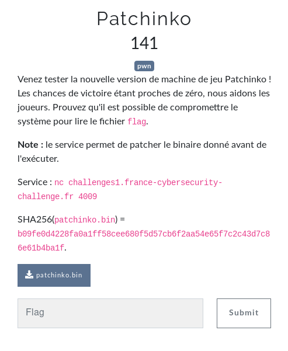
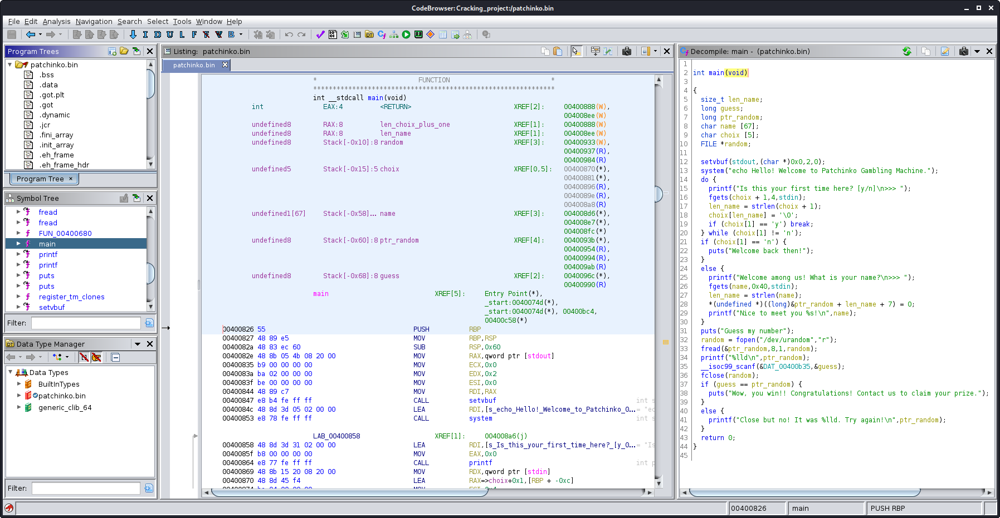
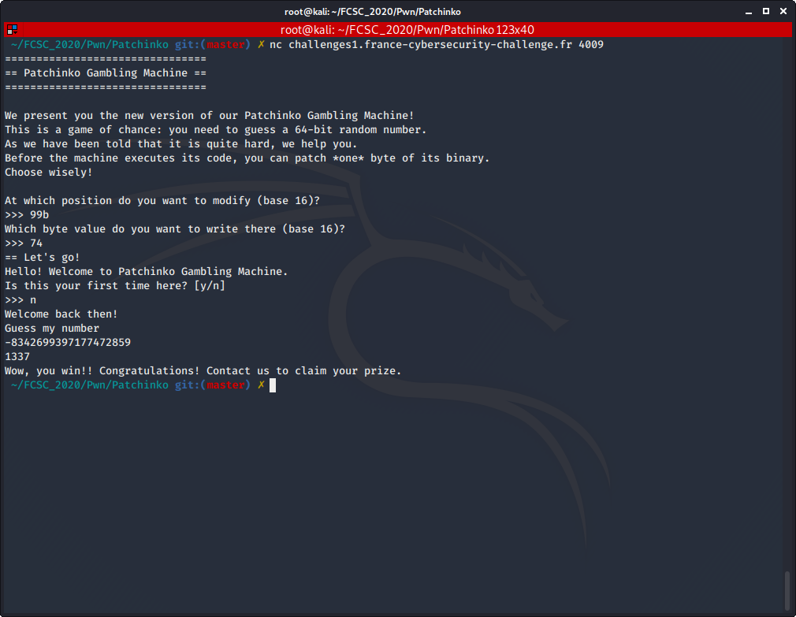

# Patchinko

Auteur: Ewaël

**Patchinko** est un des challenges pwn du FCSC 2020. Il valait 141 points à la fin du CTF, et en voici l'énoncé:



En lisant l'énoncé je comprends que le service me permet de changer un seul byte dans le binaire pour pouvoir l'exploiter. Mon premier réflexe est donc d'ouvrir le binaire dans Ghidra et de voir où il peut y avoir une faille à exploiter en changeant un byte.



Ma première idée est un peu naïve, mais j'essaye quand même. Elle consiste à changer:

```
     0040099b 75 0e                                   JNZ           LAB_004009ab
```

en

```
     0040099b 74 0e                                   JZ           LAB_004009ab
```

afin d'inverser la condition et d'afficher le message de victoire en cas d'échec. Et effectivement, ça fonctonne, mais ça n'a aucun intérêt à part... Afficher un gentil message au lieu de'un méchant message.



Je remarque aussi qu'il faut retirer 40 00 00 à l'addresse affichée sur Ghidra pour que ça fonctionne, la programme commençant à cette adresse pour une raison inconnue. Ma prochaine idée est de m'intéresser à la fonction `fopen` dans cette partie du code:

```C
  ...
  puts("Guess my number");
  random = fopen("/dev/urandom","r");
  fread(&ptr_random,8,1,random);
  printf("%lld\n",ptr_random);
  __isoc99_scanf(&DAT_00400b35,&guess);
  fclose(random);
  if (guess == ptr_random) {
    puts("Wow, you win!! Congratulations! Contact us to claim your prize.");
  }
  else {
    printf("Close but no! It was %lld. Try again!\n",ptr_random);
  }
  return 0;
}
```

Je me demande s'il y a moyen de modifier

```
     00400927 48 8d 3d f4 01 00 00    LEA    RDI,[s_/dev/urandom_00400b22]    = "/dev/urandom"
     0040092e e8 dd fd ff ff          CALL   fopen                            FILE * fopen(char * __filename,
```

pour que l'addresse dans RDI pointe vers une chaine "flag" afin que, lors de l'echec, `ptr_random` pointe vers le contenu du fichier `flag`. Malheureusement, en ne modifiant qu'un seul byte et sachant que les inputs ne sont pas stockés dans le binaire il est impossible de pointer une chaine "flag" pour ouvrir `flag` de cette manière.

Ma troisième idée est donc d'exploiter l'appel à `system` au début de la fonction main:

```C
  setvbuf(stdout,(char *)0x0,2,0);
  system("echo Hello! Welcome to Patchinko Gambling Machine.");
  do {
    printf("Is this your first time here? [y/n]\n>>> ");
    ...
```

Je me dis qu'en changeant un byte il existe peut-être un moyen de garder l'appel à `system` ouvert à la manière d'un `cat -`, mais encore une fois, mauvaise piste car je n'arrive à rien en un seul byte. 
