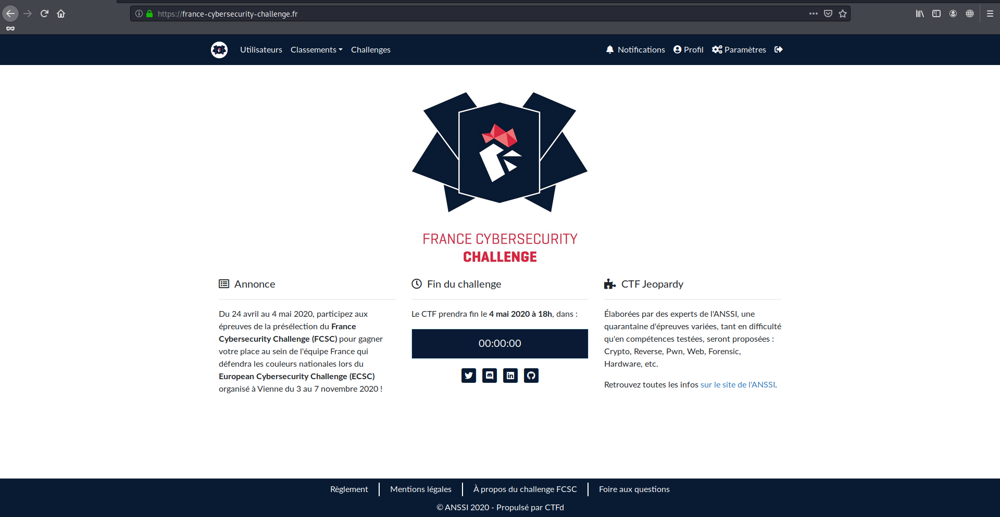

# FCSC 2020

Le **France Cybersecurity Challenge 2020** est la préselection de l'équipe de France pour participer aux finales, qui détermineront ceux qui représenteront la France lors du **European Cybersecurity Challenge 2020**. Il s'est déroulé du 24 avril au 4 mai 2020.

C'était mon premier CTF, et j'ai pris un plaisir immense à accomplir chaque challenge. Je suis allé beaucoup plus loin que ce que je pensais et je remercie les concepteurs comme les organisateurs de ce CTF d'une qualité parfaite. J'espère faire mieux l'année prochaine.

Ce repo contient, pour chaque challenge:

- `writeup.md` qui est le writeup que j'ai rédigé **post** CTF, qui explique la résolution du challenge à ma manière.

- `notes` qui sont les notes que je prends **pendant** le CTF, elles me servent à garder une trace du raisonnement mais ne sont destinées qu'à moi, donc sont beaucoup moins claires qu'un writeup.

- Le reste, images pour le writeup, scripts pour la résolution, traces...

Le dossier `Results` contient des screens avec ma performance individuelle et me sert simplement d'archive.

Je finis donc **95ème** au classement **général** sur 1591 participants, et **60ème** de ma catégorie, **senior**, sur 633.

~ *Ewaël*
