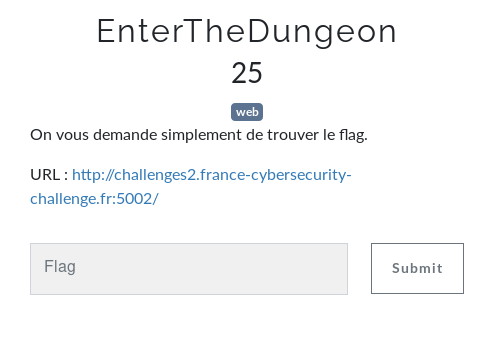
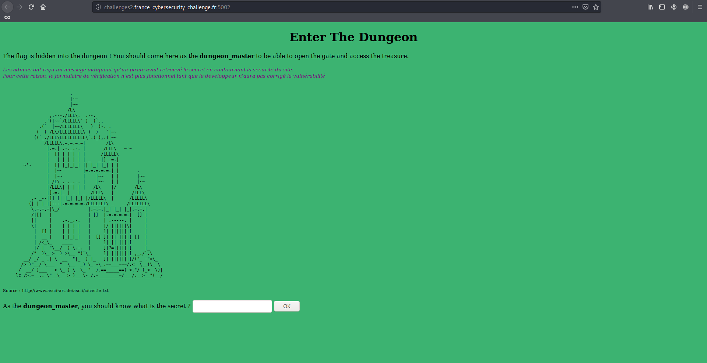
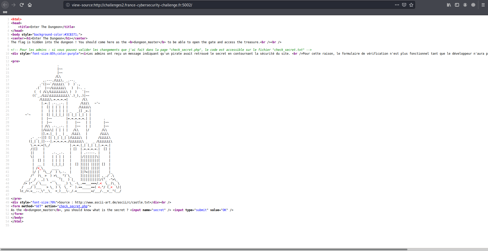
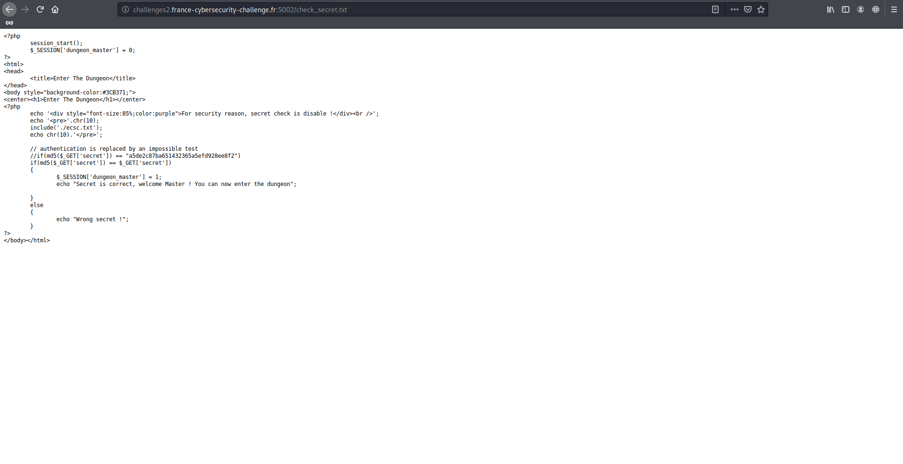
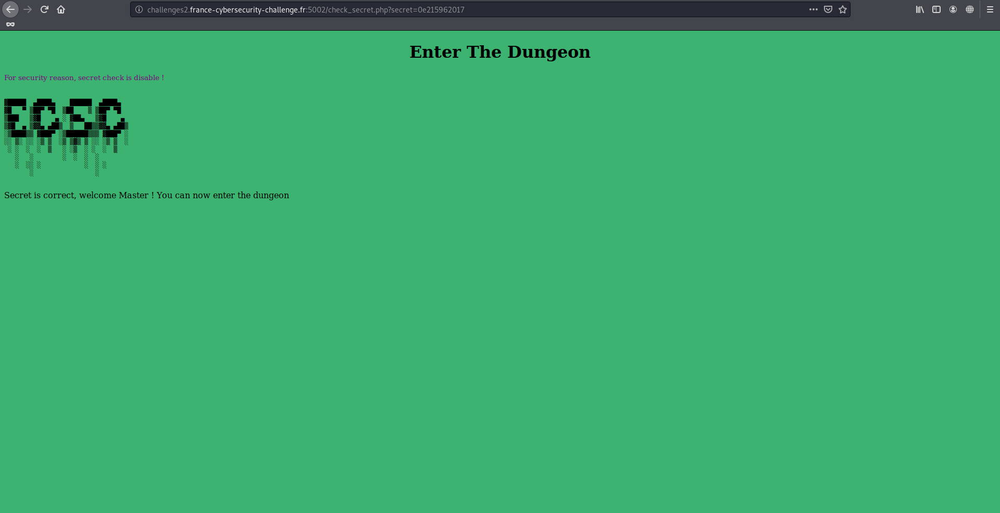
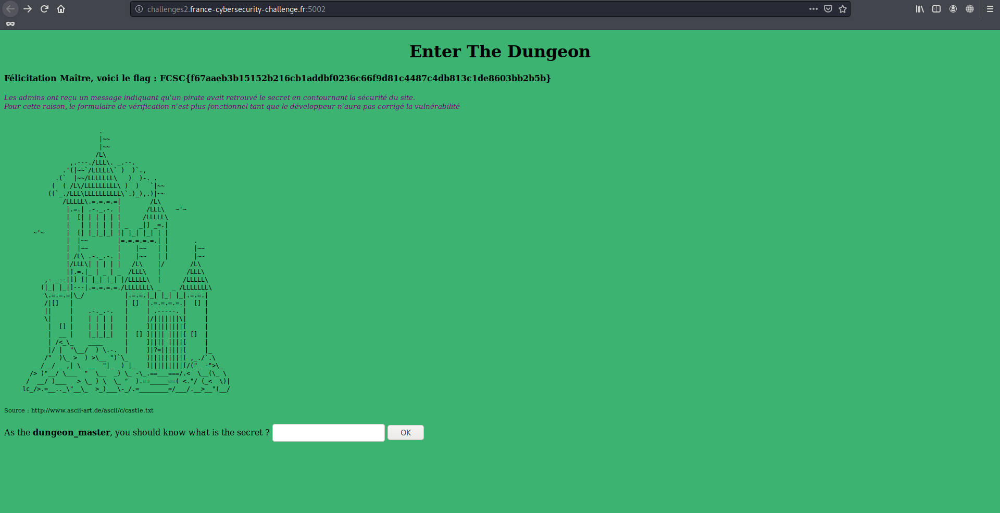

# EnterTheDungeon

Auteur: Ewaël

**EnterTheDungeon** est un des challenges web à 25 points du FCSC 2020 et dont voici l énoncé:



Le lien menant sur une page demandant un secret afin de devenir le maître du dongeon et ainsi récupérer le précieux flag.



Première chose à faire: regarder le code source.



J'y trouve une note intéressante sur une page à destination des administrateurs nommée `check_secret.txt`, un joli nom pour moi.



Je comprends que pour accéder au trésor, il va falloir passer ce test supposé impossible:

```php
if(md5($_GET['secret']) == $_GET['secret'])
{
        $_SESSION['dungeon_master'] = 1;
        echo "Secret is correct, welcome Master ! You can now enter the dungeon";
}
```

Mathématiquement peut-être, mais en php impossible n'existe pas, surtout lorsqu'on utilise **==** au lieu de **===**. En effet, je peux exploiter la loose comparison afin  obtenir à droite et à gauche deux chaines que php va interpréter comme des nombres, car elles commenceront par *0eXX* i.e. *0\*10^XX*, ce qui renverra bien évidement `True`, 0 étant égal à 0, même en php. C'est d'ailleurs très bien expliqué ici:

[https://owasp.org/www-pdf-archive/PHPMagicTricks-TypeJuggling.pdf](https://owasp.org/www-pdf-archive/PHPMagicTricks-TypeJuggling.pdf)

Il s'agit alors de trouver une chaine `z = 0eX` telle que `md5(z) = 0eY`, `X` et `Y` étant un nombre indéterminé de chiffres. On trouvait facilement cette chaine en cherchant les "hash magiques" sur Google mais il était également possible de faire un script comme celui-ci, trouvé ici:

[https://github.com/bl4de/ctf/blob/master/2017/HackDatKiwi_CTF_2017/md5games1/md5games1.md](https://github.com/bl4de/ctf/blob/master/2017/HackDatKiwi_CTF_2017/md5games1/md5games1.md)

```python
#!/usr/bin/env python
import hashlib
import re

prefix = '0e'


def breakit():
    iters = 0
    while 1:
        s = prefix + str(iters)
        hashed_s = hashlib.md5(s).hexdigest()
        iters = iters + 1
        r = re.match('^0e[0-9]{30}', hashed_s)
        if r:
            print "[+] found! md5( {} ) ---> {}".format(s, hashed_s)
            print "[+] in {} iterations".format(iters)
            exit(0)

        if iters % 1000000 == 0:
            print "[+] current value: {}       {} iterations, continue...".format(s, iters)

breakit()
```

Je trouve alors `z = 0e215962017`, qui valide bien la condition.



Je retourne alors sur la page principale pour récupérer le flag qui m'attend.



`FCSC{f67aaeb3b15152b216cb1addbf0236c66f9d81c4487c4db813c1de8603bb2b5b}`
