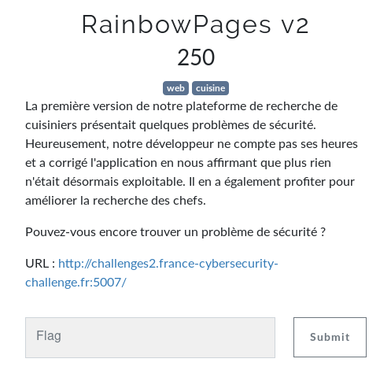
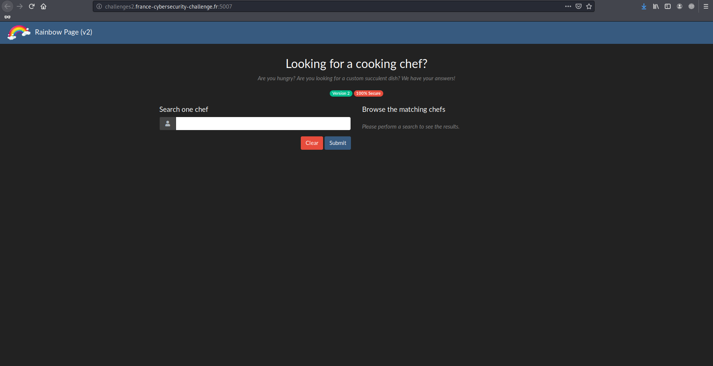
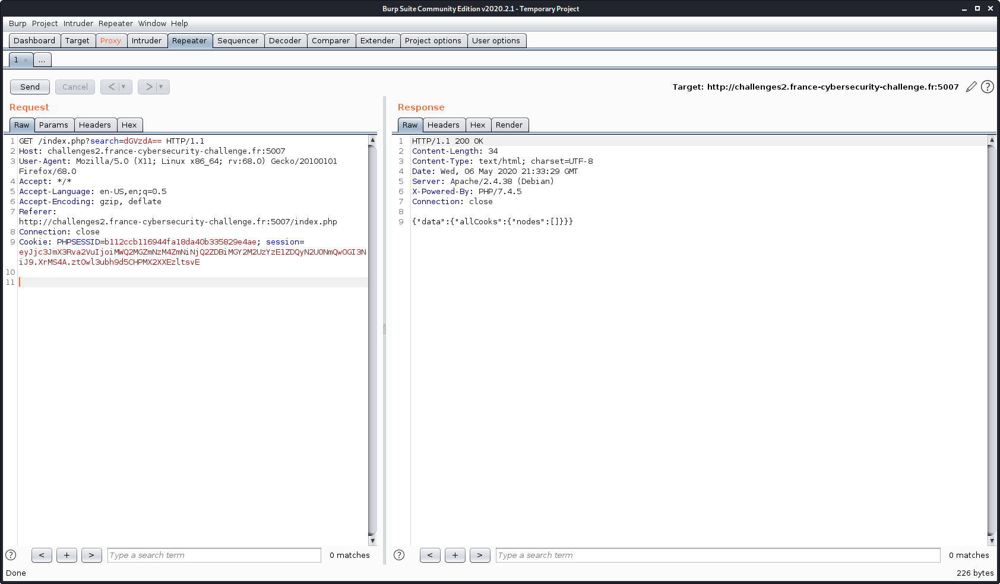
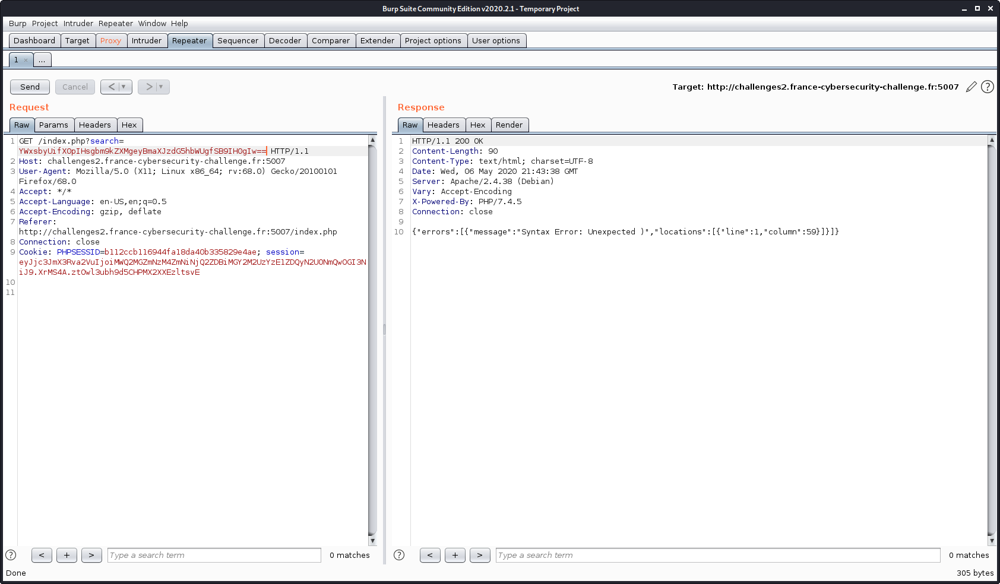
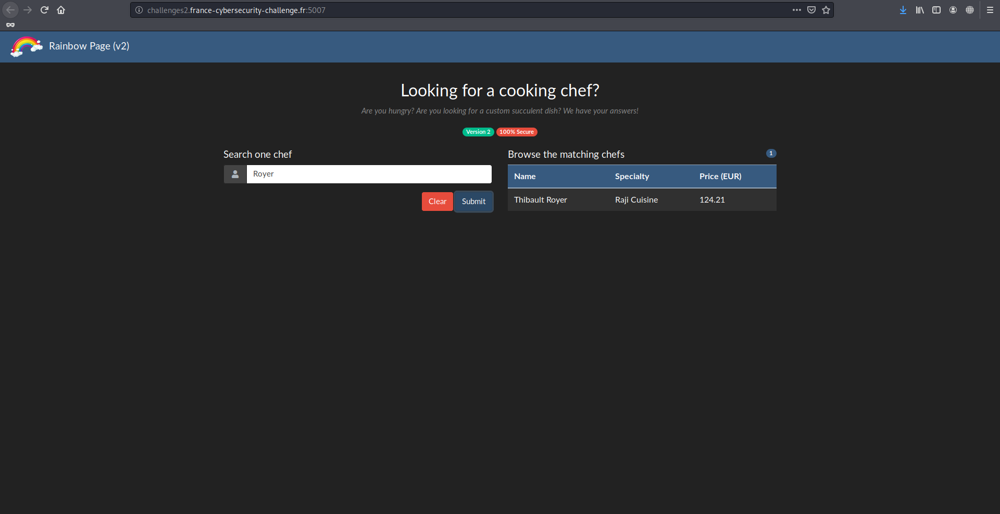
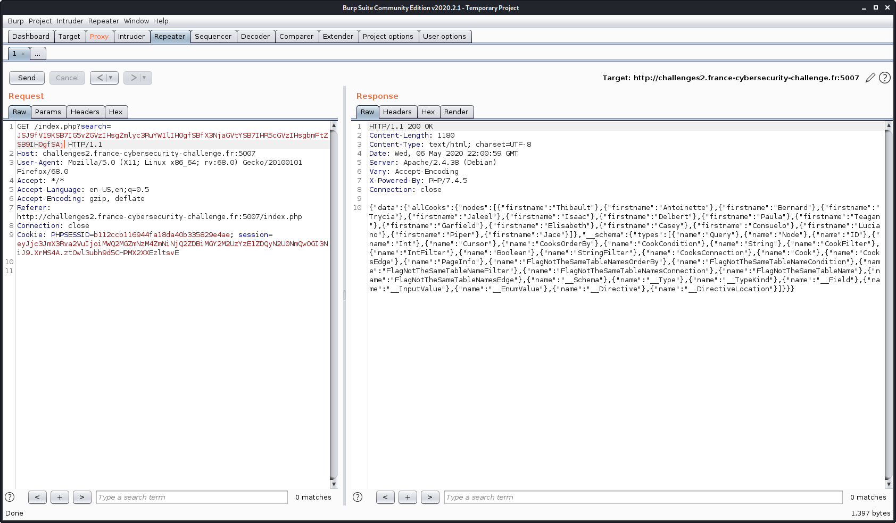

# RainbowPages v2

**RainbowPages v2** est un des challenges web du FCSC 2020. Il valait 250 points et voici l'énoncé:



Le lien menant à la même page que la première version, une recherche pour cuisiniers.



Première chose à faire: regarder la différence dans la requête envoyée, qui était la faille de la première version.



Cette fois, seul l'input est envoyé encodé en base 64. Pour autant ça ne veut pas dire que la query en GraphQL est différente, je reprends alors celle de la première version pour voir comment l'exploiter: 

`{ allCooks (filter: { firstname: {like: "%allo%"}}) { nodes { firstname, lastname, speciality, price }}}`.

La première idée que j'ai est de fermer moi-même le filtre dans l'input afin de pouvoir contrôler la fin de la requête puis de commenter pour ignorer la fin de la requête originale, pour donner quelque chose comme ça:

```
{ allCooks (filter: { firstname: {like: "%allo%"}}) { nodes { firstname } } } # %"}}) { nodes { firstname, lastname, speciality, price }}}
```

En théorie, cela devrait renvoyer seulement les prénoms des cuisiners au lieu des tous les nodes. Mais à la place de ça je reçois une erreur de syntaxe:



En regardant cette erreur de plus près, je constate un problème avec la requête que je pensais avoir envoyée. En effet, le caractère 59 ne correspond absolument pas à un endroit où j'attends autre chose que ce que j'ai envoyé. C'est là que je comprends que la requête n'est pas la même que dans la première version, ce qui correspond à l'énoncé qui précise que la recherche est améliorée. Il faut donc absolument reconstruire cette requête avant d'espérer l'exploiter.

Tout d'abord j'affiche tous les cuisiniers en envoyant `%` pour facilement tester chaque node, et, très vite, je constate que le nom de famille est aussi testé là où seul le prénom était regardé dans la première version. Je continue un peu mais rien de concluant pour les nodes restants.



Ainsi après une recherche pénible sur comment faire pour tester un node OU un autre, je finis par avoir la résultat espéré avec la requête supposée suivante:

```
{ allCooks (filter: {or: [{firstname: {like: "%input%"}}, {lastname: {like: "%input%"}}]}) { nodes { firstname, lastname, speciality, price }}}
```

Je décide alors d'utiliser mon idée originale pour dump la database comme dans la première version, avec l'introspection. Or, comme il est impossible de fermer cette query pour en faire une autre car elle est anonyme, et que GraphQL n'accepte pas plusieurs query si au moins une n'est pas nommée, je suis obligé de trouver un moyen d'aller "questionner" une autre table que `allCooks` dans la même query, ce que je parviens à faire en imaginant ce schéma, où la query irait chercher à la fois dans `dog` et dans `cat`:

```
query {
  dog {
    name
  }
  cat {
    name
  }
}
```

Suivant cette idée, j'envoie `%"}}]}) { nodes { firstname } } __schema { types { name } } } #` et... Ça marche!



Enfin, j'envoie la requête finale trouvée grâce aux suggestions dans les erreurs.

```
%"}}]}) { nodes { firstname } } allFlagNotTheSameTableNames { nodes { flagNotTheSameFieldName } } } #
```

Et je récupère le flag:

`FCSC{70c48061ea21935f748b11188518b3322fcd8285b47059fa99df37f27430b071}`
