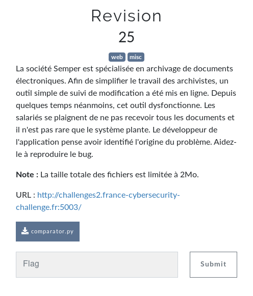
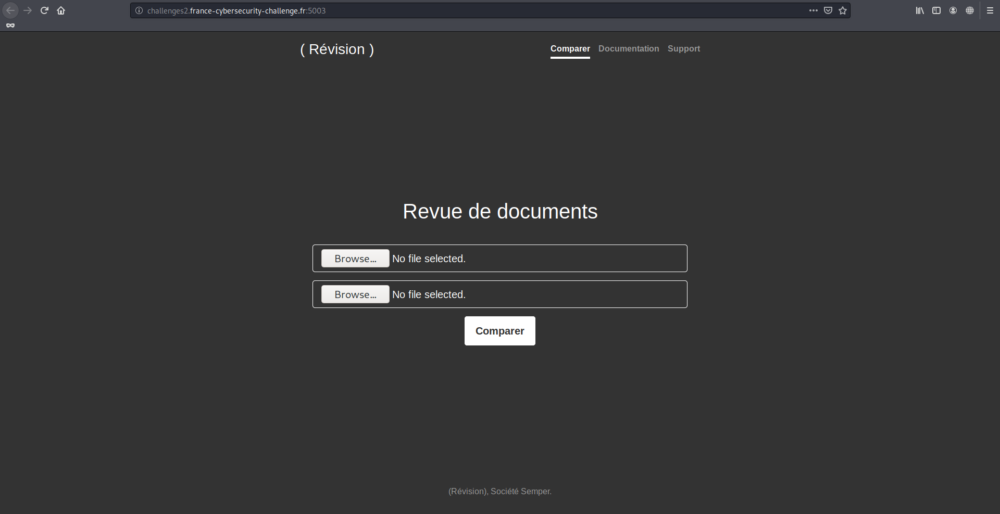

# Revision

Auteur: Ewaël

**Revision** est un des challenges à 25 points du FCSC 2020 et dont voici l'énoncé:



Le lien menant sur un comparateur de pdf.



Le code executé par la serveur était fourni:

```python
# coding: utf-8
import hashlib
from web.services.database import Database
from web.services.mailer import Mailer


class ComparatorError(Exception):
    """Base class for all Comparator exceptions"""
    pass


class DatabaseError(ComparatorError):
    """Exception raised for errors in database operations."""


class StoreError(ComparatorError):
    """Exception raised for errors in store function.

    Attributes:
        message -- explanation of the error
    """

    def __init__(self, files, message):
        self.files = files
        self.message = message


class Comparator(object):
    """A class for Comparator"""

    BLOCK_SIZE = 8*1024

    def __init__(self, f1=None, f2=None):
        """
        Set default parameters

        Required parameters :
            f1: open file handler
            f2: open file handler
            db: database
            m : mailer

        """
        self.f1 = f1
        self.f2 = f2
        self.db = Database()
        self.m = Mailer()

    def compare(self):
        self._reset_cursor()
        return self.f1.read() == self.f2.read()

    def store(self):
        self._reset_cursor()
        f1_hash = self._compute_sha1(self.f1)
        f2_hash = self._compute_sha1(self.f2)

        if self.db.document_exists(f1_hash) or self.db.document_exists(f2_hash):
            raise DatabaseError()

        attachments = set([f1_hash, f2_hash])
        # Debug debug...
        if len(attachments) < 2:
            raise StoreError([f1_hash, f2_hash], self._get_flag())
        else:
            self.m.send(attachments=attachments)

    def _compute_sha1(self, f):
        h = hashlib.sha1()
        buf = f.read(self.BLOCK_SIZE)
        while len(buf) > 0:
            h.update(buf)
            buf = f.read(self.BLOCK_SIZE)
        return h.hexdigest()

    def _reset_cursor(self):
        self.f1.seek(0)
        self.f2.seek(0)

    def _get_flag(self):
        with open('flag.txt', 'r') as f:
            flag = f.read()
        return flag
```

On en déduit avec l'énoncé à côté que le but est d'envoyer deux fichiers différents, mais qui ont le même *sha1sum*. Il existe plein d'outils capables de générer de tels fichiers qui provoqueront une collision à l'origine du problème de l'énoncé. J'ai utilisé

[http://alf.nu/SHA1](http://alf.nu/SHA1)

Après avoir suivi les instructions, j'upload les deux fichiers générés et je récupère le flag.

[flag](flag.png)

`FCSC{8f95b0fc1a793e102a65bae9c473e9a3c2893cf083a539636b082605c40c00c1}`
